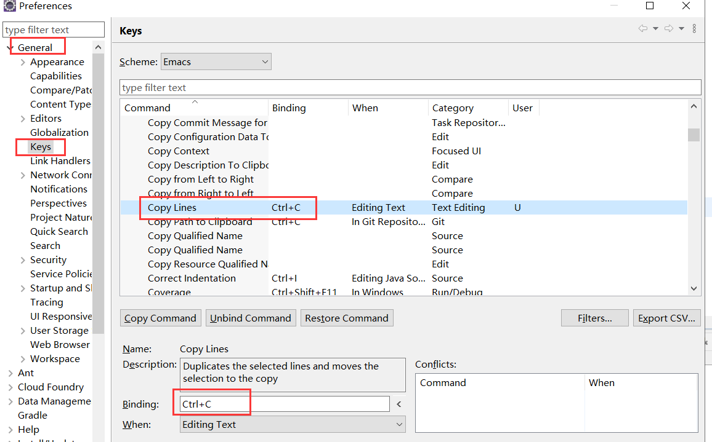
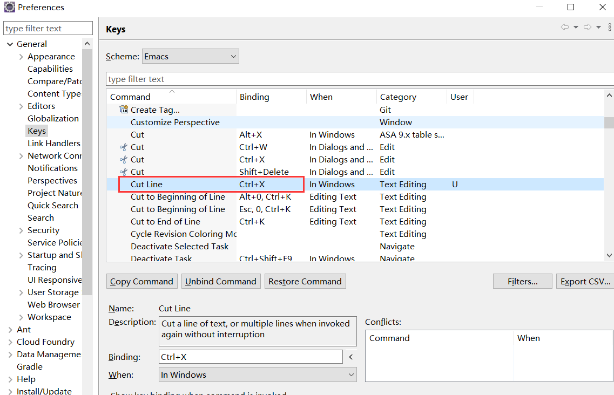
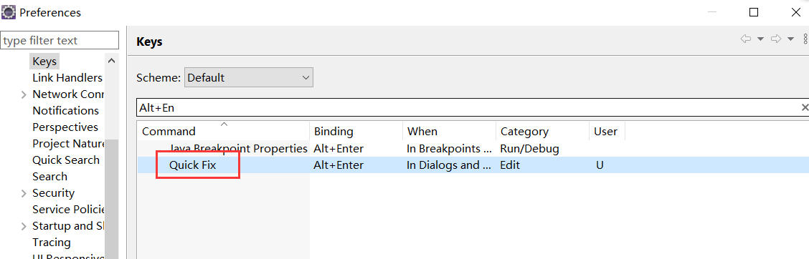
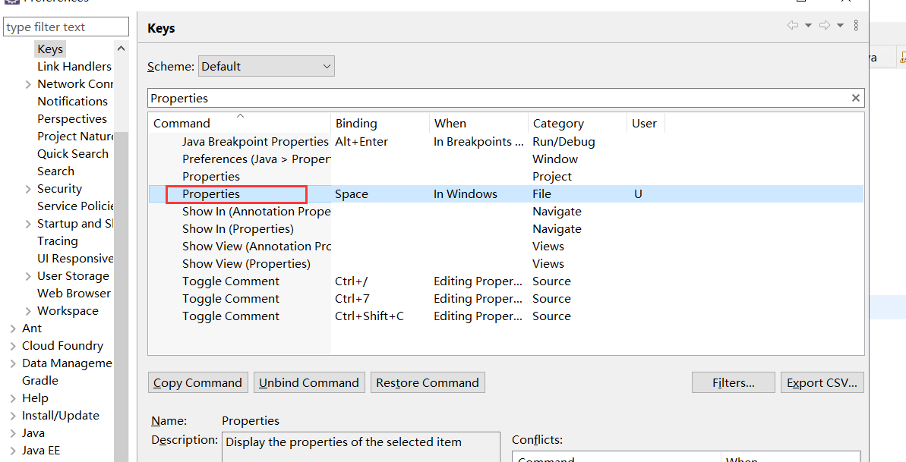
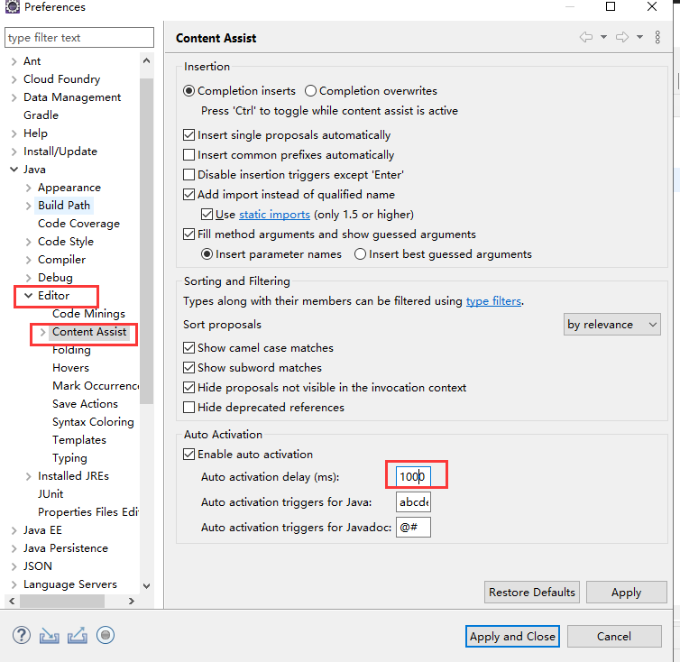

# Eclipse调整

## 比赛思路

- 设置任意字母提示，并设置间隔1s
- 设置返回值快捷键alt +enter
- 字体大小

## 编译器设置

### 单行复制、剪切

### 生成返回值

搜索Ctrl + 2 L 找到生成返回值的选项，将快捷键改成alt + enter

这里的alt+enter会被properties的快捷键干扰，所以把其他设置成alt+enter的命令取消掉，下图中，就将properties的快捷键修改成其他的了

### 开启代码提示（随时）

- 设置提醒的最小间隔：设置成1s，1s无输入才会提示

  

- 设置任意字母提醒

开启代码自动提示功能打开 Window -> Perferences -> Java ->Editor -> Content Assist，在右边最下面一栏找到 auto-Activation ，下面有三个选项，找到第二个“Auto activation triggers for Java：”选项在其后的文本框中会看到一个“.”存在。这表示：只有输入“.”之后才会有代码提示和自动补全，我们要修改的地方就是这。把该文本框中的“.”换掉，换成“abcdefghijklmnopqrstuvwxyz.”，这样，你在Eclipse里面写Java代码就可以做到按“abcdefghijklmnopqrstuvwxyz.”中的任意一个字符都会有代码提示。

> https://blog.csdn.net/qq_48596586/article/details/125133652

## 快捷键

常用快捷键

- ctrl+2，L：为本地变量赋值（可以自己改成其他的比如：alt+enter）
  注：ctrl和2同时按完以后释放，再快速按L。不能同时按！

- Alt+方向键
  这也是个节省时间的法宝。这个组合将当前行的内容往上或下移动。

- ctrl+m
  大显示屏幕能够提高工作效率是大家都知道的。Ctrl+m是编辑器窗口最大化的快捷键。

- ctrl+.及ctrl+1：下一个错误及快速修改
  ctrl+.将光标移动至当前文件中的下一个报错处或警告处。这组快捷键我一般与ctrl+1一并使用，即修改建议的快捷键。

- 代码助手:Alt+/（简体中文操作系统是）

- Ctrl+D: 删除当前行

- Ctrl+shift+F:格式化当前代码

- Alt+Shift+Z:包裹选中的代码

### 调试的相关快捷键

F5 单步跳入
F6 单步跳过
F7 单步返回
F8 继续
Ctrl+Shift+D 显示变量的值
Ctrl+Shift+B 在当前行设置或者去掉断点
Ctrl+R 运行至行(超好用，可以节省好多的断点)

## 小技巧

sout 加内容辅助快捷键：alt+/，System.out.println();
for或者foreach 加内容辅助快捷键：alt+/，快速构建for循环
main:加内容辅助快捷键：alt+/,快速构建主函数

