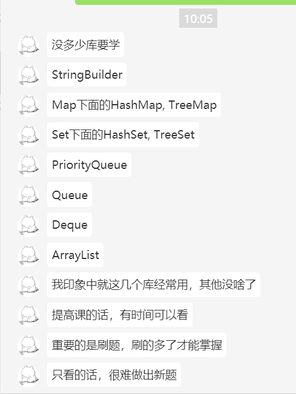
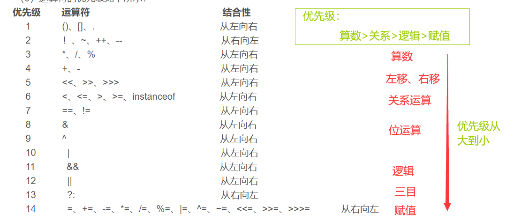
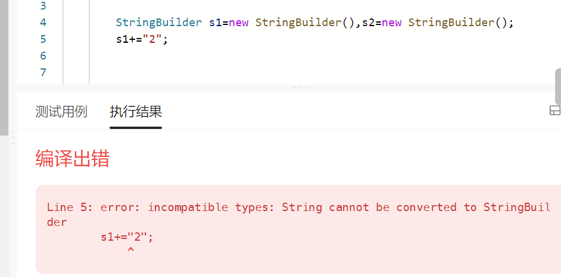
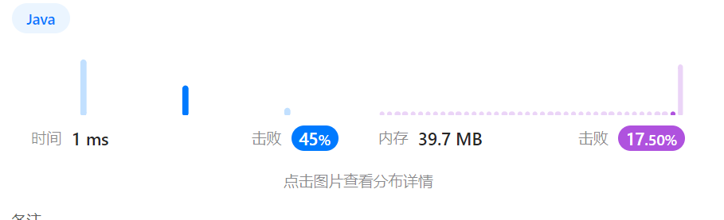
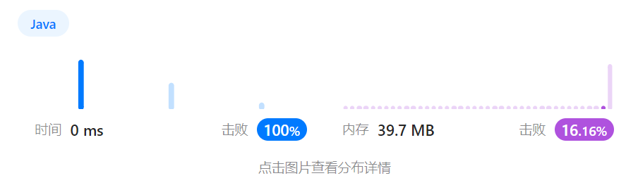

# Java语法



```
new int[]{L, R}
```

Arrays、SimpleDateFormat、Calendar、Pattern、Matcher等等，有些题调这些API能直接出结果！String、Map、List也是必会的

# 快读快写

当输入输出超过1e6的时候，就要用快读快写了。。

> https://www.cpe.ku.ac.th/~jim/java-io.html
>
> 在java中，Scanner读10^7个数据需要30s，快读10^7个数据需要3s
>
> 30/10^7 = 0.000003 , 读入10^5个数据时就要0.3s

### Java快读快写模板

#### 写法1

```java
Scanner sc = new Scanner(new BufferedReader(new InputStreamReader(System.in))); 
PrintWriter out = new PrintWriter(new OutputStreamWriter(System.out));
//。。。。。。。。。。。
out.flush();
```

#### 写法2

- 快读用BufferedReader、InputStreamReader

  String[] op = br.readLine().split();

  Integer.parseInt(op[0]);

- 快写用PrintWriter、OutputStreamWriter

  pr.write("")

  pr.flush();//必须要有

```Java
public class 亲戚 {

	public static void main(String[] args) throws IOException {
		BufferedReader br = new BufferedReader(new InputStreamReader(System.in));
		PrintWriter pr = new PrintWriter(new OutputStreamWriter(System.out));
		String[] op = br.readLine().split(" ");
		n = Integer.parseInt(op[0]);
		m = Integer.parseInt(op[1]);

		while(m-->0) {
			op = br.readLine().split(" ");
			a = Integer.parseInt(op[0]);
			b = Integer.parseInt(op[1]);
		}
		op = br.readLine().split(" ");
		q = Integer.parseInt(op[0]);
		while(q-->0) {
			op = br.readLine().split(" ");
			a = Integer.parseInt(op[0]);
			b = Integer.parseInt(op[1]);
			if(find(a)==find(b))
				pr.write("Yes\n");
			else pr.write("No\n");
		}
		pr.flush();
	}
}

```

### Java 的System.out.println到底有多慢

- 结论：println很慢！print的速度是println的十倍
  - 执行1e5次println需要1s
  - 执行1e6次print需要1s

```

public class Test{
    static int N = 2000;
//    public static void main(String[] args) {
//        long start = System.currentTimeMillis();
//        for(int i=0;i<N*N;i++){
//            System.out.print("1");
//            if(i%N==0) 
//                System.out.print("\n");
//        }
//        System.out.println("");
//        long end = System.currentTimeMillis();
//        System.out.println(end-start);
//    }
    public static void main(String[] args) {
        long start = System.currentTimeMillis();
        for(int i=0;i<N*N;i++){
            if(i%N!=0)
                System.out.print("1");
            else
                System.out.println("");
        }
        System.out.println("");
        long end = System.currentTimeMillis();
        System.out.println(end-start);
    }
    
    
    //1e5  println   要   1.2s
    //1e6  println   要   12s
    
    //1e5  print     要    0.1s
    //1e6  print     要    1s
    
    
    //1e6  print  + 1e3  println  yao     1.3s
    //1500^2 print + 1500 println  yao    2.2s
    //1700^2 print + 1700 println  yao    3s
    //1800^2 print + 1800 println  yao    3.3s
    //2000^2 print + 2000  println  yao   4.1s
}
```


### C++快读

加上这一句，就可以让cin,cout变得很快了。

此外，超过1e6的数据，可能会因为endl导致TLE，所以把endl换成\n

```c++
#define endl '\n'
ios::sync_with_stdio(0);cin.tie(0);cout.tie(0);
```


# 一、细节

## 数组的长度length是属性，不是方法

```
  String s="123";

  int n = s.length;
```


## String的长度length是方法，不是属性

```
    String s3 = "123";

​    // int n = s3.length;//报错

​    int n2 = s3.length();//正确
```


## 变量类型的定义用"基本数据类型"

比如定义长整型用long定义，不要用Long，用包装类型运算会报错

```
long[] dp = new long[N];
```

##  用邻接表数组的方式模拟高效的二维数组

模拟邻接表数组，建立一个二维数组

```
    static ArrayList<Integer>[] head = new ArrayList[M];
    //等价于C++中的vetcor<int> head[M];
```

在java中这里要注意语法小细节，是写成这样new ArrayList[M]，而不是new ArrayList<>()[M]

## 位运算要加括号

错误例子：

```
if(a&b==0)
```

报错：int & boolean

原因：&的优先级很低，所以上面相当于if(a &（b==0）)，所以报错了

正确写法：

```
if((a&b)==0)
```

## 循环读入

sc.hasNext()用来判断是否还有输入数据

```
输入包含多组测试数据。

每组数据占一行

例子：
1 9
1 19
```

```
    public static void main(String[] args) {
        Scanner sc =  new Scanner(System.in);
        while(sc.hasNext()){
            int a = sc.nextInt();
            int b = sc.nextInt();

        }
    }
```

## 运算符优先级



## 浮点数精度问题

- Java中浮点数一般用double

- 涉及浮点数类型的题目一般都出输出格式有要求，所以我们需要使用`printf`进行格式化输出。

  比如：System.out.printf("%.6f",ans);

**浮点数的麻烦就在于——你眼睛看到的不一定和计算机存储的是一样的。**

```
double a=6.6/3;
System.out.println(a);//2.1999999999999997
```

对上面的程序很多人就会觉得，a的值肯定是2.2啊。但当你打印出来时发现却是一个无限接近2.2 2.22.2的小数2.1999999999999997。这说明什么？说明6.6和3肯定有一个有问题！！3是一个整数类型肯定是没问题的，那就说明6.6有问题。
  计算机存储的小数都是近似值的，比如我们看到的是6.6，但计算机在存储这个值的时候，要考虑精度，所以它底层可能存储的是6.60000002。这就导致得到的答案就是很接近与我们理想中的答案。
  所以浮点数的比较我们不能直接使用==。通常是选定一个误差区间，也可以叫做精度，当实际答案与理想答案的绝对值小于误差区间，我们就可以说明两数相等。类似下图，m就作为一个精度判断。

```
public class Main {
    static double m=0.0000001;
    public static void main(String[] args) {
        double a=6.6/3;
        System.out.println(a-2.2<=m);//true
    }
}
```

————————————————
版权声明：本文为CSDN博主「执 梗」的原创文章，遵循CC 4.0 BY-SA版权协议，转载请附上原文出处链接及本声明。
原文链接：https://blog.csdn.net/m0_57487901/article/details/124998741

## Arrays.sort的参数左闭右开

给1~n的数排序，参数是1~n+1。原因：左闭右开

Arrays.sort(arr,1,n+1);

## nextLine()和next()不要一起使用

在读入时，若先读nextInt，再读入nextLine()，就会导致读入失败，nextLine读不到内容。

```
int n = sc.nextInt();
String n = sc.nextLine();
//读入失败
```

原因：next()或next Int()读取到空白符前的数据时结束了，然后把回车“\r”留给了nextLine();所以上面nextLine()没有输出,但不输出不代表没数据，是接到了空（回车“/r”）的数据。

> next()和nextInt()是接收空格前的数据
>
> nextLine()是接收回车前的数据

解决方法：

- 方法1：如果对输入的要求不是很高，比如说输入的内容不会出现空格等，直接将nextLine()改成next()即可。

- 方法2：在每一个 next（）、nextDouble()  、nextFloat()、nextInt() 等语句之后加一个nextLine（）语句，将被next（）去掉的Enter结束符过滤掉。如下

  ```
  int n = sc.nextInt();
  sc.nextLine();//读取回车符
  String n = sc.nextLine();
  //读取成功
  ```


## 自定义比较排序不要强制类型转换

自定义的排序规则不要强制类型转换，可以调用对应包装类型的compare方法

```java
	@Override
	public int compareTo(Edge o) {
		return Long.compare(w, o.w);//升序
        //不要写成 return (int)(w-o.w)
	}
```

否则，会报错：IllegalArgumentException: Comparison method violates its general contract!

在排序的时候，因为权值是取的long，所以排序的比较函数会错误的写成return (int)(w-o.w),就是强制类型装换了，有一个long to int 的强制类型转换，如此由于强转int可能出现溢出的情况，导致不满足自定义比较器的要求，从而报错。

## 如果输入时二维数组元素中间没有空格，那么下标一律从0开始

直接使用toCharArray转换，为了方便，统一标准，下标一律从0开始

```
        //输入数据
        3 12
        W........WW.
        .WWW.....WWW
        ....WW...WW.
        
        //代码
        n = sc.nextInt();
        m = sc.nextInt();
        for(int i=0;i<n;i++) {
            arr[i] = sc.next().toCharArray();
        }
```

## 字符数组转字符串

```java
char[] cs = new char[10];
String s = new String(cs);//正确
String s = cs.toString();//错误！！！
```

## 长度N是1000的二维数组的输出要用快写

输出二维数组。其中print执行1e6次需要1s，println会执行1e5次需要1s。太慢了，我们可以用PrintWriter快写。

记住：长度是1000的二维数组输出要用快写去输出

```java
	int[][] a = new int[1000][1000];
	//下面的代码print会执行1e6次，println会执行1000次
	for(int i=0;i<1000;i++){
        for(int j=0;j<1000;j++)
            System.out.print(a[i][j]);
        System.out.println();
    }
	

	//优化后
	PrintWriter out = new PrintWriter(new OutputStreamWriter(System.out));
	for(int i=0;i<1000;i++){
        for(int j=0;j<1000;j++)
            out.print(a[i][j]);
        out.println();
    }
	out.flush();
```

### 强转后面的值要用括号括起来

描述，val是long类型的，但是modify第三个参数是int类型的，所以需要 把第三个参数转成int。

错误代码：

```
modify(1, n, (int)(val+last)%p);
```

错误原因：上面的代码会先强转成Int，再取模

正确代码：

```
modify(1, n, (int)((val+last)%p));
```

## 如果题目给出的Arr[i]<0，那么需要特别当心

如果答案是求最大值，那么最大值变量mx一定要初始化成-INF。

## 遍历无向图时，防止重复遍历父节点，使用第二个参数fa表示父节点

例如dfs(int u，int father)

https://www.acwing.com/activity/content/code/content/5384490/

## 字典序最小的字符串倒过来不一定是字典序最大的

AcWing 12. 背包问题求具体方案

# 二、基本操作

### Java数组排序

默认只能升序，降序需要实现Comparator接口，返回return b-a

```
return a-b;//升序，当a-b>0,a>b时交换，所以是升序
return b-a;//降序
```

#### 基本数据类型都实现了升序排序方法

默认升序（int类型和包装类型都可）

        // int[] arr = {4,3,2,1};
        // Arrays.sort(arr);
        // for(int i:arr) 
        //     System.out.println(i);
降序，调用参数Collections.reverseOrder()，注意！！！这个方法必须是包装类型的数组

```
Integer[] integers = new Integer[] {6,4,5};

Arrays.sort(integers,0,cnt,Collections.reverseOrder());
```

#### 实现Comparator接口的匿名类

泛型必须是包装类型，数组类型也必须是包装类型（Character、Integer\..）,或者二维数组也可以（`int [ ][ ]`）

```
Integer[] integers = new Integer[] {6,4,5};

Arrays.sort(integers, 0, cnt, new Comparator<Integer>() {
    @Override
    public int compare(Integer o1, Integer o2) {
        return o1-o2;
    }
});
```

如果用int类型的数组，会报错，如下

```
int[] ints = new int[]{3,2,1};

//Arrays.sort(ints, 0, 3, new Comparator<int>() {//报错,不能这样
    @Override
    public int compare(Integer o1, Integer o2) {
        return o1-o2;
    }
});
```

二维数组可以直接用int

        //Comparator接口
        int[][] nums=new int[][]{{1,3},{1,2},{1,5},{2,7}};
         Arrays.sort(nums,new Comparator<int[]>(){
            @Override
             public int compare(int[] a,int[] b){
                 if(a[0]==b[0]){ 
                     return -(a[1]-b[1]);//降序
                 }else{
                     return -(a[0]-b[0]);//降序
                 }
             }
         });
         for (int[] num : nums) {
             System.out.println(Arrays.toString(num));
         }
#### 使用箭头函数

也可以使用箭头函数，简化代码,本质是实现Comparator接口

```
Integer[] integers = new Integer[] {6,4,5};//这里必须要用Integer
Arrays.sort(integers, 0, 3, (a,b)->(b-a));
System.out.println(Arrays.toString(integers));
```

二维数组

```
//箭头函数排序
Arrays.sort(
	nums,(a,b)->(a[0]-b[0]!=0?a[0]-b[0]:b[1]-a[1])
	//对[0]的升序，对[1]的降序
);
for (int[] num : nums) {
	System.out.println(Arrays.toString(num));
}
```

### Java高精度：BigInteger

Java高精度方法
```
(下列分别是 加 减 乘 除 两数取最小值，两数取最大值) 返回值为BigInteger类型：
add()，subtract()，multiply()，divide()，min()、max();

初始化：BigInteger a = new BigInteger("0");

输入：sc.nextBigInteger();

a+b: a.add(b)

min(a,b): a.min(b)

参考：https://www.acwing.com/solution/content/115491/
```

### 字符数组与字符串

- 字符串转字符数组

  ```
  String s = "123";
  char[] ans = s.toCharArray();
  ```

- 字符数组转字符串

  ```
  char[] a = s.toCharArray();
  //方法1
  String s = new String(a);
  //方法2
  String s = String.valueOf(a);
  ```


### 进制转换API

- n进制转十进制(秦九韶算法)

  Integer.parseInt

  ```
  int b = Integer.parseInt("1001", 2);    // 2进制转10进制
  ```

- 十进制转n进制（除n）

  Integer.toString

  ```
  String th = Integer.toString(1194684, 16);// 10进制转16进制
  ```

> https://blog.csdn.net/Archiea/article/details/125805740


# 三、集合容器

## Map

#### HashMap

无序的键值对（类似c++的unordered hashmap）

#### TreeMap

有序的键值对，因为有序，所以性能方面较差（不如hashmap）

```java
TreeMap<Integer, String> map = 
      new TreeMap(Comparator.reverseOrder());//降序
```

参考：https://www.jianshu.com/p/ec69ef098d71

##### treemap下的二分查找API

- ceilingEntry(K key)

  返回离key最近的大于等于key的元素

- floorEntry(K key)
  返回离key最近的小于等于key的元素

- higherEntry(K key)
  返回离key最近的大于key的元素

- lowerEntry(K key)
  返回离key最近的小于key的元素


## PriorityQueue

java默认是小根堆（c++默认大根堆）

    PriorityQueue<Integer> q  = new PriorityQueue();    
    堆顶：q.peek();
    入堆：q.add(x);
    堆顶出堆：q.poll();
    长度：q.size();
    堆顶出堆并删除：q.remove();


大根堆

```
PriorityQueue<Integer> q  = new PriorityQueue((a,b)->(b-a));  //大根堆
PriorityQueue<Integer> q  = new PriorityQueue();  //大根堆
```


## String

String的长度length是方法，不是属性


## StringBuilder

与String区别：

- String重写了equals方法，StringBuilder没有重写，所以比较要转换成String去比较

- StringBuilder有reverse函数，String没有

- StringBuilder有setCharAt函数，String没有

  ```
  StringBuilder s1=new StringBuilder("123456");
  s1.reverse();//将原串反转，并且有返回值，返回反转后的串
  System.out.println(s1);
  ```

### API

 StringBuilder方法：

1.append(String s) 

　　将指定字符串s追加到当前字符序列后面。

\2. reverse()

　　反转字符串。

\3. delete(int start, int end)

　　删除start -> end的字符。

4.　insert(int offset, int i ) 

　　insert(int offset, String s)

　　将int或String参数的字符串表示形式插入到字符串中。

\5. replace(int start, int end, Stinrg str)

　　使用指定字符串str替换start -> end的字符序列。

6.substring(int start, int end)

　substring(int start)

　　返回一个在该范围内的String。

\7. toString()

　　返回此字符序列中数据的字符串表示形式。

8.length()

　　返回长度（字符序列中字符的个数）。

9.setCharAt(int index, char ch)

　　将指定位置的字符修改为ch。


### String的+=对应于StringBuilder的append()

> leetcode 1662题

\```java

  //不报错

  String s3 = "";

  s3+="2";   

\```

报错：




这样写

\```java

StringBuilder s = new StringBuilder();

s.append("0");

\```


### 使用String的性能比StringBuilder差很多

使用String如下

\```java

class Solution {

  public boolean arrayStringsAreEqual(String[] word1, String[] word2) {

​     

​    String s1="",s2="";

​    for(int i=0;i<word1.length;i++)

​      s1+=(word1[i]);

​    for(int i=0;i<word2.length;i++)

​      s2+=(word2[i]);

​    return s1.equals(s2);

  }

}

\```




使用StringBuilder，如下




###  StringBuilder没有重写equals方法

如果要比较两个字符串（StringBuilder类型）是否相等，需要先变成String，再调用equals方法，本题中，下面这种写法不会报错，但是会ＷＡ


\```Java 

class Solution {

  public boolean arrayStringsAreEqual(String[] word1, String[] word2) {

​     StringBuilder s1 = new StringBuilder(),s2=new StringBuilder();

​    

​    for(int i=0;i<word1.length;i++)

​      s1.append(word1[i]);

​    for(int i=0;i<word2.length;i++)

​      s2.append(word2[i]);


​    return s1.equals(s2);//这样写会报错，必须要转换成String再去调用equals方法

  }

}

\```

## 工具类

### Arrays

#### Arrays.toString()

返回数组的所有元素，字符串形式

Arrays.toString(integers);

```
Integer[] integers = new Integer[] {6,4,5};

System.out.println(Arrays.toString(integers));
```

> 直接输出System.out.println(integers);会输出物理地址

####  Arraylist转int

```
List<int[]> ans = new ArrayList<>();

int[][] anss = ans.toArray(new int[1][1]);
```

### ArrayList反转

```
List<Integer> list = new ArrayList<Integer>();
Collections.reverse(list);
```

