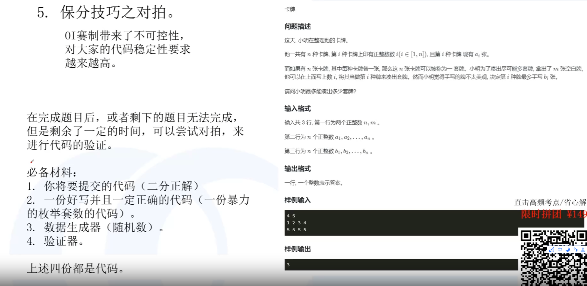

# LQB技巧

## 打表

### 打表找规律

会超时的代码，找数据少的答案，然后找规律


### 答案打表


## 分情况


30%的数据用暴力解

50%的数据用优化过的解

100%的数据用满分解法

- 验证

  用这种方法可以进行验证，比如，验证暴力方法和优化的方法计算的结果是否相等


## 对拍

自己写代码验证





### 对拍模版

- 思路

  四个文件check.java、data.java、force_code.java、new_code.java

  1. 比赛开始前先eclipse上写check文件，定义好四个文件
  2. 剩下的等到用的时候再写

- check.java

  验证函数

  注意点：

  - cmd、/c
  - 先定义数组，编译、再运行，
  - Runtime运行，最后waitfor
  - rp==0代表成功

```
public class check {
    public static void main(String[] args) throws Exception {
        int rp;
        String[] cp_data = { "cmd", "/c", "javac data.java" }; 
        String[] cp_force = { "cmd", "/c", "javac force_code.java" }; 
        String[] cp_new = { "cmd", "/c", "javac new_code.java" }; 
		
        String[] run_data = { "cmd", "/c", "java data > input.txt" }; 
        String[] run_force = { "cmd", "/c", "java force_code < input.txt > fout.txt" }; 
        String[] run_std = { "cmd", "/c", "java new_code < input.txt > nout.txt" }; 
		
        String[] to_fc = { "cmd", "/c", "fc fout.txt nout.txt" }; 
        
        Runtime.getRuntime().exec(cp_data).waitFor(); // 
        Runtime.getRuntime().exec(cp_force).waitFor();
        Runtime.getRuntime().exec(cp_new).waitFor();
        while (true) {
            Runtime.getRuntime().exec(run_data).waitFor();           
            Runtime.getRuntime().exec(run_force).waitFor();
            Runtime.getRuntime().exec(run_new).waitFor();
            rp = Runtime.getRuntime().exec(to_fc).waitFor();
            if (rp == 0) {
                System.out.println("AC");
            } else {
                System.out.println("WA");
				
                break;
            }
        }
    }
}

```

- data.java

```
import java.util.Random;

public class data {
    public static void main(String[] args) {
        Random random = new Random();
        int a = random.nextInt(1000);
        int b = random.nextInt(1000);
        int t;
        if (a > b) {
            t = a; a = b; b = t;
        }
        System.out.println(a + " " + b);
    }
}
```

- force_code.java

  暴力代码

```
import java.util.Scanner;

public class force_code {
    public static void main(String[] args) {
        Scanner in = new Scanner(System.in);
        int a = in.nextInt();
        int b = in.nextInt();
        int res = a+b;
        System.out.println(res);
    }
}
```

- new_code.java

  满分答案

```
import java.util.Scanner;

public class new_code {
    public static void main(String[] args) {
        Scanner in = new Scanner(System.in);
        int a = in.nextInt();
        int b = in.nextInt();
        int res = a+b;
        System.out.println(res);
    }
}
```


### 数据生成器

- 生成区间[l,r]随机数

```
int rd(l,r){
	Random random = new Random();
	return random.nextInt(r - l + 1) + l;
}

```

- 生成不同的数

  哈希表存

- 生成一棵树（无向树）

  n个节点n-1边，节点是1~n，那么枚举2~n，然后随机一个前面出现的点x，将x作为它的父节点，从而建边

  ```
  for(int i=2;i<=n;i++){
  	cout<<i<<" "<<rd(1,i-1);
  }
  ```

  这个树都是子节点指向父节点，理解成无向树，如果是有向树就随机顺序

- 生成一棵树（有向树）

  无向树基础上，如随机顺序

  ```
  for(int i=2;i<=n;i++){
  	int p = rd(0,1);
  	if(p==0)
  		cout<<i<<" "<<rd(1,i-1)<<endl;
  	else 
  		cout<<rd(1,i-1)<<" "<<i<<endl;
  }
  ```

  

- 图（无向图）

  先生成一个无向树，让节点连通，然后再随机生成边

  ```
  
  //先生成树，n-1个边
  for(int i=2;i<=n;i++){
  	int p = rd(0,1);
  	cout<<i<<" "<<rd(1,i-1)<<endl;
  }
  
  //再扩充m-n+1个边
  //m个边,树是n-1个边，所以从n开始
  for(int i=n;i<=m;i++){
  	int p = rd(0,1);
  	cout<<i<<" "<<rd(1,i-1)<<endl;
  }
  ```

- 图（有向图）

  有向树+有向边

  ```
  
  ```

  