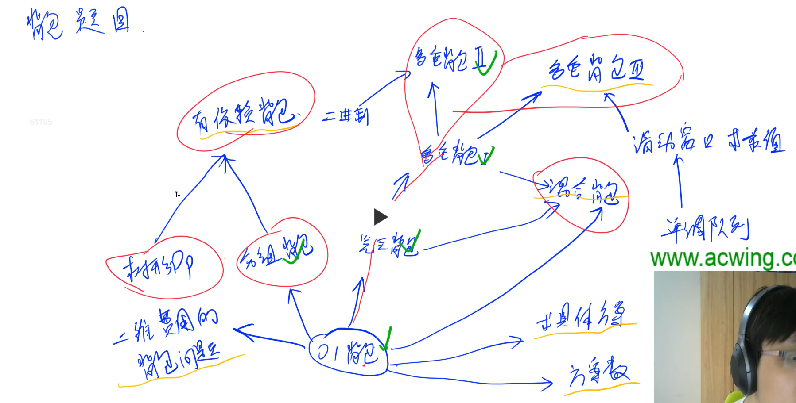
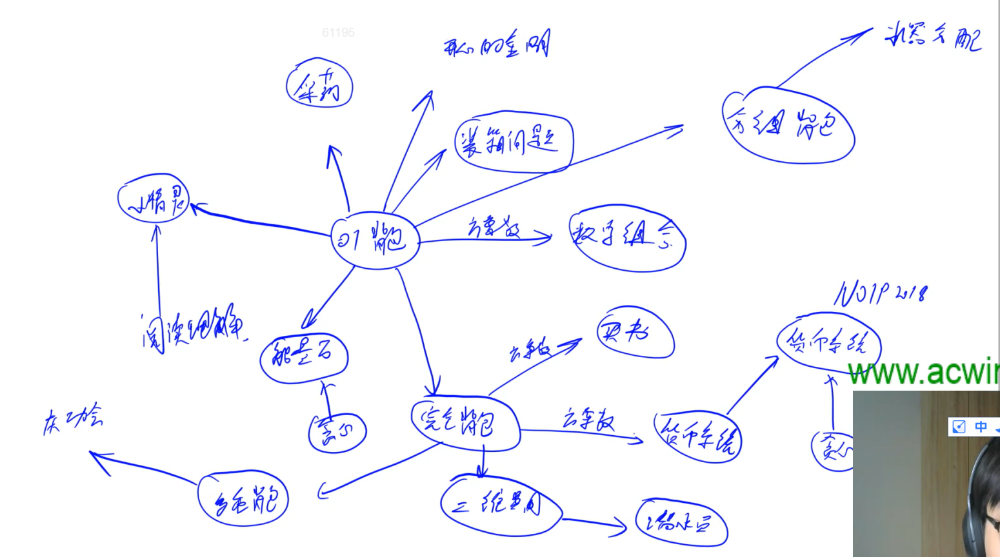
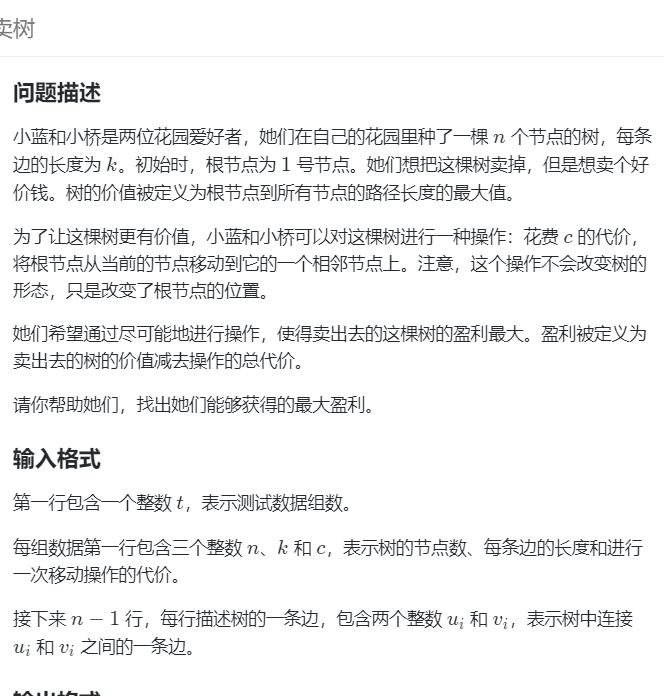
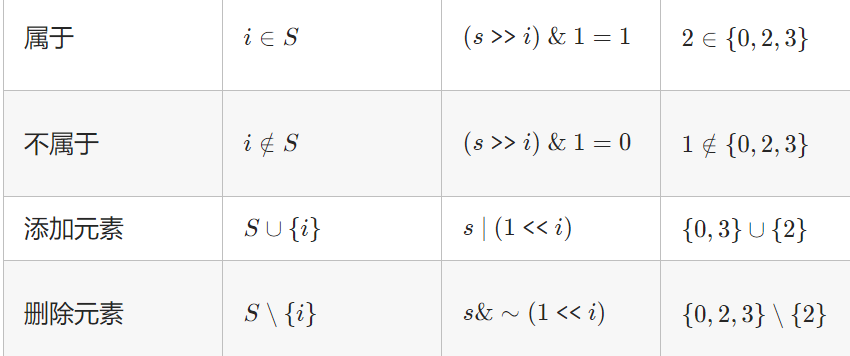
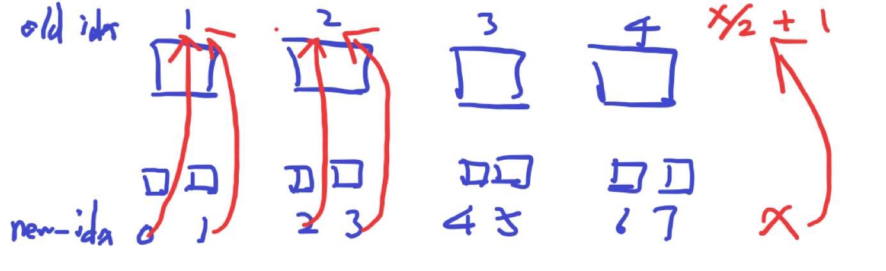
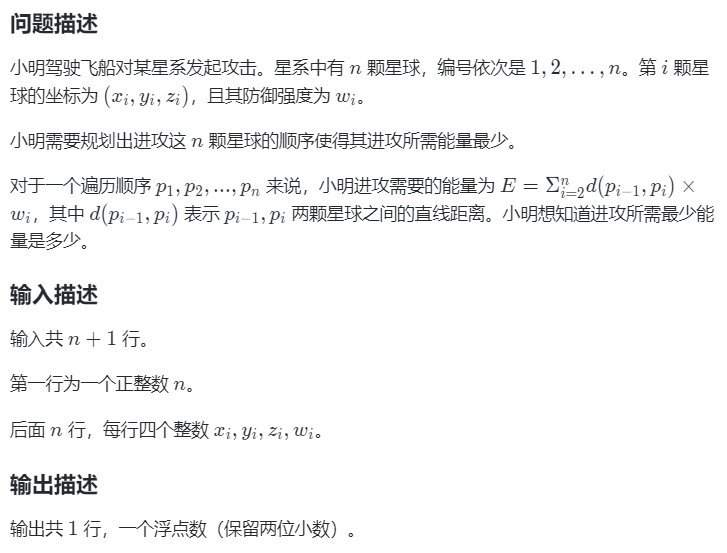
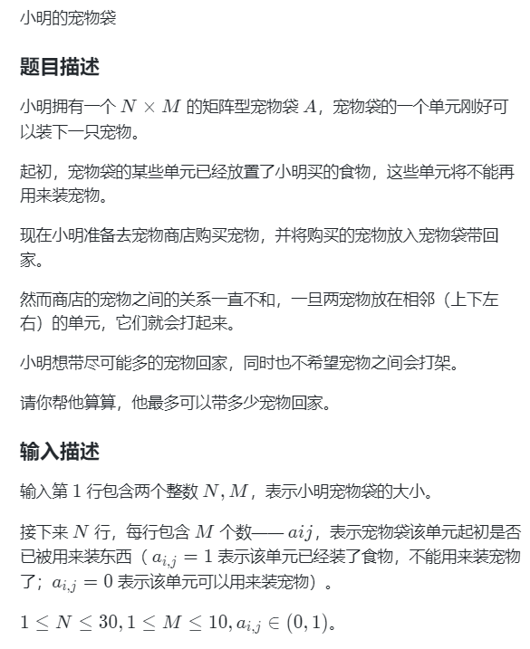
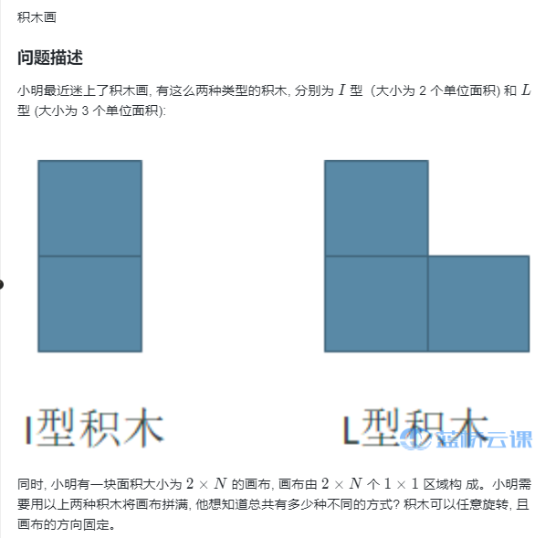
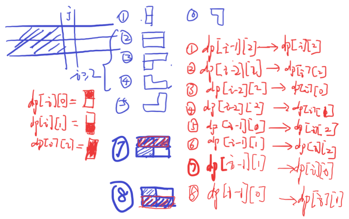
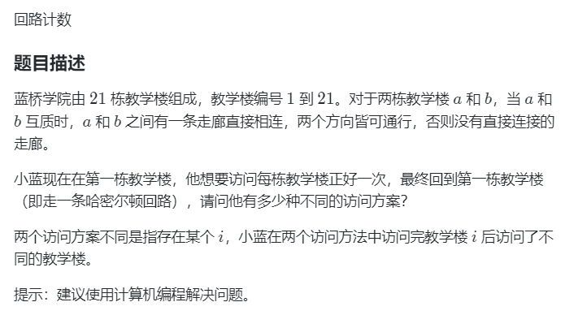

# 动态规划

超全DP题单：https://leetcode.cn/circle/discuss/tXLS3i/

关键点：

```
1.状态表示 
   1.1 集合dp[i]表示什么：
   1.2 属性是什么：个数、最大值
2.状态计算：状态方程
3.初始化

4.细节点：
	遍历顺序的重要性：先遍历背包还是先遍历物品
	打印dp数组
```


- 思路

  - 选还是不选

  - 枚举选哪个

    - 直接枚举O（n）

    - 二分枚举选哪个O（logn）

    - 单调栈枚举选哪个O（1）

    - 枚举最后一次分组O（n）

      


常见状态表示

- `f[i][j]表示前i个物品，体积不超过j的选法的最大值`
- `f[i][j]表示前i个数中选，和为j的选法的方案数`
- `f[i][j][k]表示前i个物品，限制1：不超过j，限制2：不超过k的选法`
- `f[i][j]表示总和为i，第一个数是j的选法序列的方案数`
- `f[i][k]，k=0,1。表示前i个数中选，第i个数的状态是k（选或不选）的选法集合的方案数`
- `f[i][j][k]，k=0,1。表示前i个数中选，限制：不超过j次，第i个数的状态是k（选或不选）的选法的方案数`
- `f[u][k]，k=0,1。表示以u为根节点的子树，根节点u选或不选的选法集合的属性`
- `f[i]表示以arr[i]结尾的子序列的属性`
- `f[i][j]表示s1从前i个字符中选，s2从前j个字符中选的方案数`
- `f[i][j]表示区间[l,r]内的合并问题的属性`
- `f[i][j]表示以arr[i]结尾的子数组中，共操作j次的最大值`

### 状态压缩

	dp的状态压缩
		1.正常写：2维
		2.优化空间
			方式1：每一轮定义新数组 f表示下一轮的dp值，最后dp = f
			方式2：使用变量t，在0和1之间来回切换，int dp[2][N], t^1
			方式3：逆序、分析后保证每个需要的状态之前没被更新过
			参考https://leetcode.cn/problems/number-of-dice-rolls-with-target-sum/solutions/2497280/qian-zhui-he-you-hua-dp-by-weiambt-wsar/


## 1.背包模型

> 至少、恰好、至多的背包模型总结：https://www.acwing.com/blog/content/458/

- 所有背包模型的一维优化中，只有《完全背包的一维优化》和《多重背包的单调队列优化》这种情况体积的循环是从小到大，其他所有的情况 体积都是从大到小枚举
- 所有的二维情况都是体积和物品的循环顺序可以随意。






## 2.数字三角形模型

需要注意边界的问题（求最小值时么要初始化成INF）。下标尽量从1开始。这样才能保证使用滚动数组


## 3.最长上升子序列模型

> dp[i]表示以arr[i]结尾的一类问题
>
> 如果是子数组的dp问题，也要想到i结尾模型

题目：

> lc300：最长上升子序列 
>
> lc53.：连续子数组最大和
>
> lc940：不同的子序列 II（计算一个串的所有不相等子序列的个数）
>
> AcWing 1017. 怪盗基德的滑翔翼

## 4.前i前j模型

> dp [i] [j]表示从A的前i个字符中选择，从B的前j个字符 的方案数


> 最长公共子序列
>
> lc115. 不同的子序列(寻找A串中与B相等的子序列的个数)
>
> acwing902：最短编辑距离


## 树形dp

O（n），n是节点总数

- 根节点在dp数组中，`dp[u][1]`表示以u为根节点的，并且选择根节点的情况，

  例子：没有上司的舞会

- 计算树的向下最大高度

### 没有上司的舞会

> 树上01背包问题

https://www.acwing.com/activity/content/code/content/5382741/

```java
	static void dfs(int root) {
        //dp[root][0] = 0;
        dp[root][1] = happy[root];
        for(int i = h[root];i!=-1;i = ne[i]){
            int j = e[i];
            dfs(j);//递归子树
            dp[root][0] += Math.max(dp[j][0],dp[j][1]);
            dp[root][1] += dp[j][0];
        }
    }
```

### 向下元素个数


### 树的重心

给定一颗树。请你找到树的重心，并输出将重心删除后，剩余各个连通块中点数的最大值。

重心定义：重心是指树中的一个结点，如果将这个点删除后，剩余各个连通块中元素的个数的最大值最小，那么这个节点被称为树的重心。

```java
//返回节点u的所有子树的节点总个数
static int dfs(int u,int fa) {
	int sum=0,mx=0;
	for(int i=h[u];i!=-1;i=ne[i]) {
		int j = e[i];
		if(j==fa) continue;
		int cnt = dfs(j,u);
		mx = Math.max(mx,cnt);
		sum += cnt;
	}
	mx = Math.max(mx,n-sum-1);
	if(mx < ans) {
		ans = mx;
		ansIdx = u;
	}
	return sum+1;
}
```


### 向下的最长路径

dfs(int u)函数返回u作为根节点时，向下的最长路径。

```java
	static int dfs(int u,int fa){
        int dist=0;
        for(int i=h[u];i!=-1;i=ne[i]){
            int j = e[i];
            if(j==fa) continue;
            int d = dfs(j,u) + w[i];
            dist = Math.max(dist,d);
        }
        return dist;
    }
```

### 树的直径

> AcWing 1072. 树的最长路径

计算向下的最长、第二长路径长度。

```java
	static int dfs(int u,int fa) {
		int d1 = 0,d2 = 0;
		for(int i=h[u];i!=-1;i=ne[i]) {
			int j = e[i];
			if(j==fa) continue;
			int len = dfs(j,u)+w[i];
			if(len>=d1) {
				d2 = d1;
				d1 = len;
			}else if(len>d2) {
				d2 = len;
			}
		}
		ans = Math.max(ans,d1+d2);
		return d1;
	}
```

### 树的中心

给定一棵树，每条边都有一个权值。请你在树中找到一个点，使得该点到树中其他结点的最远距离最近。

https://www.acwing.com/activity/content/code/content/5390588/

```java
	//计算节点向下的最长距离、次长距离	
	//用子节点更新父节点（先递，在归的时候计算）
	static int dfs_down(int u,int fa) {
		int dd1 = 0,dd2 = 0;
		int dd1_point = 0;
		for(int i=h[u];i!=-1;i=ne[i]) {
			int j = e[i];
			if(j==fa) continue;
			int len = dfs_down(j,u)+w[i];
			if(len>=dd1) {
				dd2 = dd1;
				dd1 = len;
				dd1_point = j;
			}else if(len>dd2) {
				dd2 = len;
			}
		}
		d1[u] = dd1;
		d2[u] = dd2;
		p1[u] = dd1_point;
		return dd1;
	}
	//计算向上的最长距离
	//用父节点更新子节点（先计算，再递归）
	static void dfs_up(int u,int fa) {
		ans = Math.min(ans,Math.max(d1[u],up[u]));
		for(int i=h[u];i!=-1;i=ne[i]) {
			int j = e[i];
			if(j==fa) continue;
			up[j] = Math.max(up[u],p1[u]!=j?d1[u]:d2[u])+w[i];
			dfs_up(j,u);
		}
	}
```


- [1617. 统计子树中城市之间最大距离](https://leetcode.cn/problems/count-subtrees-with-max-distance-between-cities/)

  >给你 `n` 个城市，编号为从 `1` 到 `n` 。同时给你一个大小为 `n-1` 的数组 `edges` ，其中 `edges[i] = [ui, vi]` 表示城市 `ui` 和 `vi` 之间有一条双向边。题目保证任意城市之间只有唯一的一条路径。换句话说，所有城市形成了一棵 **树** 。
  >
  >一棵 **子树** 是城市的一个子集，且子集中任意城市之间可以通过子集中的其他城市和边到达。两个子树被认为不一样的条件是至少有一个城市在其中一棵子树中存在，但在另一棵子树中不存在。
  >
  >对于 `d` 从 `1` 到 `n-1` ，请你找到城市间 **最大距离** 恰好为 `d` 的所有子树数目。
  >
  >请你返回一个大小为 `n-1` 的数组，其中第 `d` 个元素（**下标从 1 开始**）是城市间 **最大距离** 恰好等于 `d` 的子树数目。
  >
  >**请注意**，两个城市间距离定义为它们之间需要经过的边的数目。
  >
  >n = 15

  两题的结合,枚举子集 + 树的直径

  ```
  class Solution {
       int N = 20,M = 2*N;
       int[] h = new int[N],e = new int[M],ne = new int[M];
       int idx;
       int n;
       void add(int a,int b){
          e[idx] = b;
          ne[idx] = h[a];
          h[a] = idx++;
      }
       int mxlen = 0;
       int[] vis2 = new int[N];
       int dfs(int u){
          int mx1 = 0,mx2 = 0;
          vis2[u] = 1;
          for(int i=h[u];i!=-1;i=ne[i]){
              int j = e[i];
              if(vis[j]==0 || vis2[j]==1) continue;
              // System.out.println(u+" "+j);
              int val = dfs(j);
              if (val >= mx1){
                  mx2 = mx1;
                  mx1 = val;
              }else if(val > mx2){
                  mx2 = val;
              }
          }
          mxlen = Math.max(mxlen,mx1+mx2+1);
          return mx1+1;
      }
       int[] vis = new int[N];
       void dfs_huisu(int u){
          if(u==n+1){
              // System.out.println("-------");
              // for(int i=1;i<=n;i++)
              //     System.out.print(vis[i]+" ");
              for(int i=1;i<=n;i++){
                  if(vis[i]==1){
                      Arrays.fill(vis2,0);
                      mxlen = 0;
                      dfs(i);
                      break;
                  }
              }
              
              int flag = 1;
              for(int i=1;i<=n;i++){
                  if(vis[i] != vis2[i]){
                       flag = 0;
                       break;
                  }    
              }
              
              if(mxlen>0 && flag==1){
                  // System.out.println(mxlen);
                  if(mxlen-2>=0)
                      ans[mxlen-2] += 1;
              } 
              return;
          }
          vis[u] = 1;
          dfs_huisu(u+1);
  
          vis[u] = 0;
          dfs_huisu(u+1);
       }
      int[] ans;
      public int[] countSubgraphsForEachDiameter(int nn, int[][] edges) {
          //1.枚举子树
          //2.判断子树合法？
          //3.计算子树直径
          //4.更新贡献
          n = nn;
          Arrays.fill(h,-1);
          ans = new int[n-1];
          Arrays.fill(vis,0);
          Arrays.fill(vis2,0);
          mxlen = 0;
          // idx = 0;
          for(int i=0;i<n-1;i++){
              int a = edges[i][0];
              int b = edges[i][1];
              add(a,b);
              add(b,a);
          }
          
          dfs_huisu(1);
          return ans;
      }
  }
  ```

  

- [2538. 最大价值和与最小价值和的差值](https://leetcode.cn/problems/difference-between-maximum-and-minimum-price-sum/)

  > 给你一个 `n` 个节点的无向无根图，节点编号为 `0` 到 `n - 1` 。给你一个整数 `n` 和一个长度为 `n - 1` 的二维整数数组 `edges` ，其中 `edges[i] = [ai, bi]` 表示树中节点 `ai` 和 `bi` 之间有一条边。
  >
  > 每个节点都有一个价值。给你一个整数数组 `price` ，其中 `price[i]` 是第 `i` 个节点的价值。
  >
  > 一条路径的 **价值和** 是这条路径上所有节点的价值之和。
  >
  > 你可以选择树中任意一个节点作为根节点 `root` 。选择 `root` 为根的 **开销** 是以 `root` 为起点的所有路径中，**价值和** 最大的一条路径与最小的一条路径的差值。
  >
  > 请你返回所有节点作为根节点的选择中，**最大** 的 **开销** 为多少。

  转换成树直径。思路难想。递推求直径

  计算 返回节点i下去包含、不包含叶子节点的最大值

  ```
  class Solution {
       int N = 101000,M = 2*N;
       int[] h = new int[N],e = new int[M],ne = new int[M];
       int idx;
       long ans;
       int[] price;
       void add(int a,int b){
          e[idx] = b;
          ne[idx] = h[a];
          h[a] = idx++;
      }
      long[] dfs(int u,int fa){
          long mx_contains = price[u],mx_un = 0;
          for(int i=h[u];i!=-1;i=ne[i]){
              int j = e[i];
              if(j==fa) continue;
              long[] val = dfs(j,u);
              ans = Math.max(ans,val[0]+mx_un);
              ans = Math.max(ans,val[1]+mx_contains);
              mx_contains = Math.max(mx_contains,val[0]+price[u]);
              mx_un = Math.max(mx_un,val[1]+price[u]);
          }
          return new long[]{mx_contains,mx_un};
      }
      
      public long maxOutput(int n, int[][] edges, int[] pp) {
          price = pp;
          Arrays.fill(h,-1);
          for(int i=0;i<n-1;i++){
              int a = edges[i][0];
              int b = edges[i][1];
              add(a,b);
              add(b,a);
          }
          dfs(0,-1);
          return ans;
      }
  }
  ```

  

## 换根dp

用父节点的状态更新子节点

#### [834. 树中距离之和](https://leetcode.cn/problems/sum-of-distances-in-tree/)

> 给定一个无向、连通的树。树中有 `n` 个标记为 `0...n-1` 的节点以及 `n-1` 条边 。
>
> 给定整数 `n` 和数组 `edges` ， `edges[i] = [ai, bi]`表示树中的节点 `ai` 和 `bi` 之间有一条边。
>
> 返回长度为 `n` 的数组 `answer` ，其中 `answer[i]` 是树中第 `i` 个节点与所有其他节点之间的距离之和。
>
> - `1 <= n <= 3 * 104`
> - `edges.length == n - 1`
> - `edges[i].length == 2`

ans[i]表示每个点i到其他点的距离之和

易错点：不能在树形dp时计算向下节点个数，因为计算向下个数是子节点更新父节点状态，但是换根dp时是用父节点更新子节点。

```
class Solution {
    int N = 31000,M = 2*N;
    int[] h = new int[N],e = new int[M],ne = new int[M];
    int idx,n;
    
    void add(int a,int b){
        e[idx] = b;
        ne[idx] = h[a];
        h[a] = idx++;
    }

    int[] ans,cnt = new int[N];
    //计算0距离各点距离和
    void dfs0(int u,int fa,int cnt){
        ans[0] += cnt;
        for(int i=h[u];i!=-1;i=ne[i]){
            int j = e[i];
            if(j==fa) continue;
            dfs0(j,u,cnt+1);
        }
    }
    //返回向下的节点个数
    int dfs_cnt(int u,int fa){
        int res = 1;
        for(int i=h[u];i!=-1;i=ne[i]){
            int j = e[i];
            if(j==fa) continue;
            int val = dfs_cnt(j,u);
            res += val;
        }
        cnt[u] = res;
        // System.out.println(u+" "+cnt[u]);
        return res;
    }

    void dfs(int u,int fa){
        for(int i=h[u];i!=-1;i=ne[i]){
            int j = e[i];
            if(j==fa) continue;
            int val = cnt[j];
            ans[j] = ans[u] -val + (n-val);
            dfs(j,u);
        }
    }
    public int[] sumOfDistancesInTree(int nn, int[][] edges) {
        n = nn;
        ans = new int[n];
        
        Arrays.fill(h,-1);
        for(int i=0;i<edges.length;i++){
            int a = edges[i][0];
            int b = edges[i][1];
            add(a,b);
            add(b,a);
        }
        //计算ans[0]
        dfs0(0,-1,0);
        // 
        //计算每个节点下面元素个数
        dfs_cnt(0,-1);
        dfs(0,-1);
        return ans;
    }
}
```

#### [2581. 统计可能的树根数目](https://leetcode.cn/problems/count-number-of-possible-root-nodes/)

> Alice 有一棵 `n` 个节点的树，节点编号为 `0` 到 `n - 1` 。树用一个长度为 `n - 1` 的二维整数数组 `edges` 表示，其中 `edges[i] = [ai, bi]` ，表示树中节点 `ai` 和 `bi` 之间有一条边。
>
> Alice 想要 Bob 找到这棵树的根。她允许 Bob 对这棵树进行若干次 **猜测** 。每一次猜测，Bob 做如下事情：
>
> - 选择两个 **不相等** 的整数 `u` 和 `v` ，且树中必须存在边 `[u, v]` 。
> - Bob 猜测树中 `u` 是 `v` 的 **父节点** 。
>
> Bob 的猜测用二维整数数组 `guesses` 表示，其中 `guesses[j] = [uj, vj]` 表示 Bob 猜 `uj` 是 `vj` 的父节点。
>
> Alice 非常懒，她不想逐个回答 Bob 的猜测，只告诉 Bob 这些猜测里面 **至少** 有 `k` 个猜测的结果为 `true` 。
>
> 给你二维整数数组 `edges` ，Bob 的所有猜测和整数 `k` ，请你返回可能成为树根的 **节点数目** 。如果没有这样的树，则返回 `0`。
>
> 2228

cnt[i]表示每个i为根的树下的所有猜测正确个数，最后>=k的个数是ans

哈希表存int[]无法判断是否存在，存的是地址

```
class Solution {
    int N = 101000,M = 2*N;
    int[] h = new int[N],e = new int[M],ne = new int[M];
    int idx,n,ans;
    
    void add(int a,int b){
        e[idx] = b;
        ne[idx] = h[a];
        h[a] = idx++;
    }

    //cnt[i]表示以i根的满足的guess的个数
    int[] cnt = new int[N];

    void dfs0(int u,int fa){
        for(int i=h[u];i!=-1;i=ne[i]){
            int j = e[i];
            if(j==fa) continue;
            if(se.contains(hash(u,j)))
                cnt[0] += 1;
            dfs0(j,u);
        }
    }
    //由于hashset存int[]无效，所以用Long存
    long hash(int a,int b){
        return 1000000L * a + b;
    }
    HashSet<Long> se = new HashSet<>();
    void dfs(int u,int fa){
        for(int i=h[u];i!=-1;i=ne[i]){
            int j = e[i];
            if(j==fa) continue;
            cnt[j] = cnt[u];
            if(se.contains(hash(u,j)))
                cnt[j] -= 1;
            if(se.contains(hash(j,u)))
                cnt[j] += 1;

            dfs(j,u);
        }
    }

    public int rootCount(int[][] edges, int[][] guesses, int k) {
        Arrays.fill(h,-1);

        n = edges.length+1;
        for(int i=0;i<edges.length;i++){
            int a = edges[i][0];
            int b = edges[i][1];
            add(a,b);
            add(b,a);
        }
        //预处理所有guesses
        for(int i=0;i<guesses.length;i++)
            se.add(hash(guesses[i][0], guesses[i][1]));
        
        //初始,计算cnt[0]
        dfs0(0,-1);
        //换根dp
        dfs(0,-1);
        for(int i=0;i<n;i++) System.out.println(i+" "+cnt[i]);
        for(int i=0;i<n;i++)
            if(cnt[i]>=k) ans += 1;

        return ans;
    }
}
```

#### [2858. 可以到达每一个节点的最少边反转次数](https://leetcode.cn/problems/minimum-edge-reversals-so-every-node-is-reachable/)

> 给你一个 `n` 个点的 **简单有向图** （没有重复边的有向图），节点编号为 `0` 到 `n - 1` 。如果这些边是双向边，那么这个图形成一棵 **树** 。
>
> 给你一个整数 `n` 和一个 **二维** 整数数组 `edges` ，其中 `edges[i] = [ui, vi]` 表示从节点 `ui` 到节点 `vi` 有一条 **有向边** 。
>
> **边反转** 指的是将一条边的方向反转，也就是说一条从节点 `ui` 到节点 `vi` 的边会变为一条从节点 `vi` 到节点 `ui` 的边。
>
> 对于范围 `[0, n - 1]` 中的每一个节点 `i` ，你的任务是分别 **独立** 计算 **最少** 需要多少次 **边反转** ，从节点 `i` 出发经过 **一系列有向边** ，可以到达所有的节点。
>
> 请你返回一个长度为 `n` 的整数数组 `answer` ，其中 `answer[i]`表示从节点 `i` 出发，可以到达所有节点的 **最少边反转** 次数。

ans[i]表示节点i为根的反转次数

本题是有向图、图要存双向边（正向边、反向边）

```
class Solution {
    int N = 101000,M = 2*N;
    int[] h = new int[N],e = new int[M],ne = new int[M],w = new int[M];
    int idx,n;
    int[] ans;
    
    void add(int a,int b,int c){
        e[idx] = b;
        ne[idx] = h[a];
        w[idx] = c;
        h[a] = idx++;
    }

    int dfs0(int u,int fa){
        int res = 0;
        for(int i=h[u];i!=-1;i=ne[i]){
            int j = e[i];
            if (j==fa) continue;
            res += dfs0(j,u) + (w[i]==1?0:1);
        }
        return res;
    }

    void dfs(int u,int fa){

        for(int i=h[u];i!=-1;i=ne[i]){
            int j = e[i];
            if(j==fa) continue;
            ans[j] = ans[u] + (w[i]==1?1:-1);
            dfs(j,u);
        }
    }

    public int[] minEdgeReversals(int nn, int[][] edges) {
        n = nn;
        ans = new int[n];
        Arrays.fill(h,-1);
        for(int i=0;i<edges.length;i++){
            int a = edges[i][0];
            int b = edges[i][1];
            add(a,b,1);
            add(b,a,-1);
        }

        ans[0] = dfs0(0,-1);

        dfs(0,-1);
        return ans;

    }
}
```


#### [310. 最小高度树](https://leetcode.cn/problems/minimum-height-trees/)

> 树是一个无向图，其中任何两个顶点只通过一条路径连接。 换句话说，任何一个没有简单环路的连通图都是一棵树。
>
> 给你一棵包含 `n` 个节点的树，标记为 `0` 到 `n - 1` 。给定数字 `n` 和一个有 `n - 1` 条无向边的 `edges` 列表（每一个边都是一对标签），其中 `edges[i] = [ai, bi]` 表示树中节点 `ai` 和 `bi` 之间存在一条无向边。
>
> 可选择树中任何一个节点作为根。当选择节点 `x` 作为根节点时，设结果树的高度为 `h` 。在所有可能的树中，具有最小高度的树（即，`min(h)`）被称为 **最小高度树** 。
>
> 请你找到所有的 **最小高度树** 并按 **任意顺序** 返回它们的根节点标签列表。
>
> 树的 **高度** 是指根节点和叶子节点之间最长向下路径上边的数量。

没做出来

- 思路1：剥洋葱（拓普序）

  从叶子节点（度是1）一层一层往中心剥皮，最后剩下的一批，就是最小的

  因为最小高度的树的根一定在中间

  

- 方法2：换根dp，实现起来麻烦，求向下最长、次长路径


#### [卖树](https://www.lanqiao.cn/courses/38752/learning/?id=2546156&compatibility=false)



难度不小、细节多、复杂

- 思路

  一棵树的价值是根节点的最大向下高度mxd

  根是x的树的盈利ans是 mxd[x] * k - 交换根的次数*c

  节点x交换根的次数其实就是在1是根时其他节点x的高度

- 核心

  **换根时维护u和j的向下最大高度**，需要在dfs0时计算所有节点的向下最大高度

- 细节

  - 先进行dfs0计算1是根时每个节点向下最大深度mxd，以及每个节点的高度

  - 进行换根dp，具体的，在内部：
    - 更新当前节点u是根的情况下，其他所有节点向下的最大高度（包括fa，因为fa在此时也是u的儿子），从而更新ans
    - 计算当前节点u的向下最大、次大高度（包括fa，因为fa在此时也是u的儿子），因为换j是根时，需要更新节点u的高度
    - 换根dp，枚举所有子节点（不包括u，因为u已经做过根了）作为根的情况，根据mx1、mx2以及mxd[j]+1的关系确定换j是根时，mxd[u]的值

```
import java.util.*;
import java.io.*;
import java.math.*;

public class Main {
	static int INF = Integer.MAX_VALUE;
	static int mod = 1000000007 ;
	static int N = 101000,M = 2*N;
  static int[] mxd = new int[N],dep = new int[N],cnt = new int[N];
	static int n,k,c;
	static long ans;
	static int[] h = new int[N],e = new int[M],ne = new int[M];
  static int idx;
  static void add(int a,int b){
    e[idx] = b;
    ne[idx] = h[a];
    h[a] = idx++;
  }
  //计算向下最大高度mxd,以及每个点的高度dep
  static void dfs0(int u,int fa){
    for(int i=h[u];i!=-1;i=ne[i]){
      int j = e[i];
      if(j==fa) continue;
      dep[j] = dep[u] + 1;
      dfs0(j,u);
      mxd[u] = Math.max(mxd[u],mxd[j]+1);
    }
  }
  static void dfs(int u,int fa){
    //以u作为根时的答案贡献（包括fa）
    int mx = 0;
    for(int i=h[u];i!=-1;i=ne[i]){
      int j = e[i];
      mx = Math.max(mx,mxd[j]+1);
    }
    ans = Math.max(ans,(long) mx * k - (long)dep[u]*c);
    
    //计算节点u的向下最大高度、次大（包括fa），因为要算j的最大高度
    int mx1 = 0,mx2 = 0;
    for(int i=h[u];i!=-1;i=ne[i]){
      int j = e[i];
    //   if(j==fa) continue;//写这个会WA
      if(mxd[j]+1 > mx1){
        mx2 = mx1;
        mx1 = mxd[j]+1;
      }
      else if(mxd[j]+1 > mx2)
        mx2 = mxd[j]+1;
    }
    
    //换根dp
    for(int i=h[u];i!=-1;i=ne[i]){
      int j = e[i];
      if(j==fa) continue;
      //换u的高度
      if(mxd[j]+1!=mx1) mxd[u] = mx1;
      else mxd[u] = mx2;
      
      dfs(j,u);
    }
  }
	static void solve() {
		dfs0(1,-1);
    //换根dp
    dfs(1,-1);
    System.out.println(ans);
	}

	public static void main(String[] args) throws IOException {
    int t = sc.nextInt();
    while(t-->0){
      Arrays.fill(h,-1);
      Arrays.fill(mxd,0);
      Arrays.fill(dep,0);

      idx = 0;
      ans = 0;
      n = sc.nextInt();
		  k = sc.nextInt();
      c = sc.nextInt();
		  for(int i=1;i<=n-1;i++) {
			  int a = sc.nextInt();
        int b = sc.nextInt();
        add(a,b);
        add(b,a);
		  }
		  solve();
    }
		out.flush();
	}
	static PrintWriter out = new PrintWriter(System.out);
	// static Read sc = new Read();
	static Scanner sc = new Scanner(System.in);

}
class Read{
	StreamTokenizer st = new StreamTokenizer(new BufferedReader(new InputStreamReader(System.in)));
	BufferedReader r = new BufferedReader(new InputStreamReader(System.in));
	
	int nextInt() throws IOException {
		st.nextToken();
		return (int)st.nval;
	}
	String getLine() throws IOException {
		return r.readLine();
	}
}
```


## 状压DP

- 时间复杂度

  状态压缩dp将n!级别的问题优化成2^n的

- 核心思想：不关注排列问题，只关心这个数选没选，所以是2^n

- 优化了什么：重复的状态

  全排列时：（0，1，2）和（0,2,1）的选择对于后面的数的选择其实没有区别，所以这就是重复的状态，状态压缩dp就是优化了这里。这样的重复子问题，是本题可以用 DP 优化的关键。换句话说，前面的排列具体长啥样，我们并不关心，**我们记录的是无序的集合，不是有序的列表**。

### 位运算集合论

https://leetcode.cn/circle/discuss/CaOJ45/




### 模板

相邻无关

```
for(int mask=0;mask<(1<<m);mask++){
	for(int j=0;j<m;j++){//j是最后依次选择了哪个数
		int i = getCnt(mask);//i是当前位置下标
		if((mask>>j&1)==0) continue;
		dp[mask] = Math.max(dp[mask],dp[mask & ~(1<<j)])
	}
}
```

相邻相关

```
for(int mask = 0;mask < (1<<n);mask ++ ){//状态
	int i = getCnt(mask);//下标（1的个数）
    for(int last = 0;last<n;last++){//最后一次选择
		if((mask>>last&1)==0 ) continue;
        for(int j=0;j<n;j++){//倒数第二次选择
           	if((mask>>j&1)==0 || j==last || ...) continue;
           	dp[mask][last] += dp[mask & ~(1<<last)][j];
		}
	}
}
```


### 排列型① 相邻无关

暴力做法是枚举数组 𝑎的所有排列，对每个排列计算和题目有关的值，时间复杂度（通常来说）是`O(n * n!)`。可以解决 𝑛≤10的问题。状压 DP 可以把时间复杂度（通常来说）优化至 `𝑂(𝑛 * 2^𝑛)`。可以解决 𝑛≤20的问题。

一般定义 𝑓[𝑆]表示已经排列好的元素（下标）集合为 𝑆时，和题目有关的最优值。通过枚举当前位置要填的元素来转移。模板如下：

```
		int[] dp = new int[(1<<20)];
		int n = nums.length;//物品的个数
        int m = 2*numSlots;//篮子的个数
        //问题：将n个数划分给m个篮子里，n<=m，篮子里可能没东西
        //思路：每个数划分到哪个篮子里,所以就是m!级别的时间复杂度A(m,n)，还是阶乘级别的
        //状压dp思路：枚举所有状态，不关心排列顺序，关心篮子选没选，所以是2^m个状态
        //固定n个数不动，将m个篮子划分
        //篮子下标进行全排列（m）
        //使用dp转移状态
        //当层数超过n时直接退出，因为只有n个数
        for(int mask=0;mask<(1<<m);mask++){//所有篮子状态
            for(int j=0;j<m;j++){//最后一次的选择，下标从0开始
                if((mask>>j&1)==0) continue;
                int i = getCnt(mask);//这个选择的下标，从1开始
                if(i>n) continue;
                //从不选j的状态：mask & ~(1<<j)转移过来
                dp[mask] = Math.max(dp[mask],dp[mask & ~(1<<j)] + val );
                
            }
        }
```

**注意不需要额外的状态表示当前要填第几个位置，因为集合 𝑆的大小就是当前要填的位置。使用getCnt函数计算**

```
int getCnt(int x) {
        int ans = 0;
        while (x != 0) {
            x -= (x & -x); // lowbit
            ans++;
        }
        return ans;
    }
```


- 初级：等值配对问题，x 个 A, x 个 B,求最大/最小xx和， 其中 x 小于等于23的情况可以考虑
  526.优美的排列
  1879.两个数组最小的异或值之和
  847.访问所有节点的最短路径
- 中级：不等值配对问题，x 个 A, y 个B, 其中 x < y, x 要选完，求最大/最小xx和， 其中 y 小于等于 23 的情况可以考虑
  1066.校园自行车分配 II
  1595.连通两组点的最小成本
- 高级：x 个 A，y 个 B, x <= y*k, k 是每个 y 里能分配 k 个 x 元素，求最大/最小xx和，k 的 y 次方小于整数范围可考虑
  2172.数组的最大与和


#### [526. 优美的排列](https://leetcode.cn/problems/beautiful-arrangement/)

> 假设有从 1 到 n 的 n 个整数。用这些整数构造一个数组 `perm`（**下标从 1 开始**），只要满足下述条件 **之一** ，该数组就是一个 **优美的排列** ：
>
> - `perm[i]` 能够被 `i` 整除
> - `i` 能够被 `perm[i]` 整除
>
> 给你一个整数 `n` ，返回可以构造的 **优美排列** 的 **数量** 。
>
> - `1 <= n <= 15`
>
> 题解：https://leetcode.cn/problems/beautiful-arrangement/solutions/938214/gong-shui-san-xie-xiang-jie-liang-chong-vgsia/

方法1：回溯+剪枝

方法2：状态压缩DP

定义 `f[i][state] `为考虑前 i个数，且当前选择方案为 state 的所有方案数量。

`O(n*2 ∗ 2*n)`

```
class Solution {
    int[][] dp = new int[20][50100];
    public int countArrangement(int n) {
        int ans = 0;
        dp[0][0] = 1;
        for(int i=1;i<=n;i++){//前i轮,共选了i个数，枚举第i个位置选什么
            for(int mask=0;mask<(1<<n);mask++){//枚举选择的集合
                for (int j=0;j<n;j++){//当前第i次选了哪一位j
                    //集合中不存在j
                    if((mask>>j&1)==0) continue;
                    //集合的j位，实际选择的数是j+1
                    int num = j+1;
                    //剪枝
                    if(num%i!=0 && i%num!=0) continue;
                    //state & (~(1 << j)) 代表将 state 中所选数值的位置置零
                    dp[i][mask] += dp[i-1][mask & ~(1<<j)];
                }
            }
        }
        
        return dp[n][(1<<n)-1];
    }
}
```

优化：去除枚举第i轮

通过对朴素的状压 DP 的分析，我们发现，在决策第 i 位的时候，理论上我们应该使用的数字数量也应该为 i个。

但这一点在朴素状压 DP 中并没有体现，这就导致了我们在决策第 iii 位的时候，仍然需要对所有的 state进行计算检查（即使是那些二进制表示中 1的出现次数不为 i个的状态）。

因此我们可以换个思路进行枚举（使用新的状态定义并优化转移方程）。

定义 f[state]为当前选择数值情况为 state 时的所有方案的数量。

定义getCnt函数用于记录当前选则了多少个数（当前集合中1的个数）

```
class Solution {
    int getCnt(int x) {
        int ans = 0;
        while (x != 0) {
            x -= (x & -x); // lowbit
            ans++;
        }
        return ans;
    }
    public int countArrangement(int n) {
        int mask = 1 << n;
        int[] f = new int[mask];
        f[0] = 1;
        // 枚举所有的状态
        for (int state = 1; state < mask; state++) {
            // 计算 state 有多少个 1（也就是当前排序长度为多少）
            int cnt = getCnt(state);
            // 枚举最后一位数值为多少
            for (int i = 0; i < n; i++) {
                // 数值在 state 中必须是 1
                if (((state >> i) & 1) == 0) continue;
                // 数值（i + 1）和位置（cnt）之间满足任一整除关系
                if ((i + 1) % cnt != 0 && cnt % (i + 1) != 0) continue;
                // state & (~(1 << i)) 代表将 state 中所选数值的位置置零
                f[state] += f[state & (~(1 << i))];
            }
        }
        return f[mask - 1];
    }
}

```

#### [1879. 两个数组最小的异或值之和](https://leetcode.cn/problems/minimum-xor-sum-of-two-arrays/)

> 给你两个整数数组 `nums1` 和 `nums2` ，它们长度都为 `n` 。
>
> 两个数组的 **异或值之和** 为 `(nums1[0] XOR nums2[0]) + (nums1[1] XOR nums2[1]) + ... + (nums1[n - 1] XOR nums2[n - 1])` （**下标从 0 开始**）。
>
> - 比方说，`[1,2,3]` 和 `[3,2,1]` 的 **异或值之和** 等于 `(1 XOR 3) + (2 XOR 2) + (3 XOR 1) = 2 + 0 + 2 = 4` 。
>
> 请你将 `nums2` 中的元素重新排列，使得 **异或值之和** **最小** 。
>
> 请你返回重新排列之后的 **异或值之和** 。
>
> - `n == nums1.length`
> - `n == nums2.length`
> - `1 <= n <= 14`

状态压缩DP模版

易错点

```
dp[i][mask] = XXX + (nums1[i-1] ^ nums2[j]));

错误的写成了：
dp[i][mask] = XXX + nums1[i-1] ^ nums2[j]);
导致WA了好几次
```


```
class Solution {
    int INF = 0x3f3f3f3f;
    int[][] dp = new int[20][20100];
    int n;
    public int minimumXORSum(int[] nums1, int[] nums2) {
        n = nums1.length;
        for(int i=0;i<20;i++) Arrays.fill(dp[i],INF);
        dp[0][0] = 0;
        for(int i=1;i<=n;i++){
            for(int mask=0;mask<(1<<n);mask ++){
                for(int j=0;j<n;j++){
                    if((mask>>j&1)==0) continue;
                    //如果mask中1的个数不是i就剪枝
                    // if(getCnt(mask)!=i) continue;
                    dp[i][mask] = Math.min(dp[i][mask],dp[i-1][mask & ~(1<<j)] + (nums1[i-1] ^ nums2[j]));
                }
            }
        }
        return dp[n][(1<<n)-1];
    }

    int getCnt(int s) {
        int ans = 0;
        for (int i = 0; i < n; i++) ans += (s >> i) & 1;
        return ans;
    }

}
```

#### [1947. 最大兼容性评分和](https://leetcode.cn/problems/maximum-compatibility-score-sum/)

方法1：回溯 O(n！ * n)

方法2：状态压缩DP   

O（n^3 * 2^n）

```
class Solution {
    int n,m;
    int[][] dp = new int[10][80100];
    public int maxCompatibilitySum(int[][] students, int[][] mentors) {
        m = students.length;
        n = students[0].length;
        //对人进行全排列，所以是人的个数m
        for(int i=1;i<=m;i++){
            for(int mask=0;mask<(1<<m);mask++){
                for(int j=0;j<m;j++){
                    if((mask>>j&1)==0) continue;
                    dp[i][mask] = Math.max(dp[i][mask],dp[i-1][mask & ~(1<<j)] + getVal(students[j],mentors[i-1]));
                }

            }
        }
        return dp[m][(1<<m)-1];
    }

    int getVal(int[] a,int[] b){
        int res = 0;
        for(int i=0;i<n;i++)
            if(a[i]==b[i])
                res += 1;
        return res;
    }

}
```

优化后：

O（n^2 * 2^n）

```
class Solution {
    int n,m;
    int[] dp = new int[80100];
    public int maxCompatibilitySum(int[][] students, int[][] mentors) {
        m = students.length;
        n = students[0].length;
        //导师不动，学生全排列
        //对人进行全排列，所以是人的个数m
        for(int mask=0;mask<(1<<m);mask++){
            for(int j=0;j<m;j++){//j是最后依次选择了哪个数
                int i = getCnt(mask);//i是这个下标
                if((mask>>j&1)==0) continue;
                dp[mask] = Math.max(dp[mask],dp[mask & ~(1<<j)] + getVal(students[j],mentors[i-1]));
            }

        }
        
        return dp[(1<<m)-1];
    }

    int getVal(int[] a,int[] b){
        int res = 0;
        for(int i=0;i<n;i++)
            if(a[i]==b[i])
                res += 1;
        return res;
    }

    int getCnt(int x) {
        int ans = 0;
        while (x != 0) {
            x -= (x & -x); // lowbit
            ans++;
        }
        return ans;
    }

}
```

#### [1799. N 次操作后的最大分数和](https://leetcode.cn/problems/maximize-score-after-n-operations/)

> 给你 `nums` ，它是一个大小为 `2 * n` 的正整数数组。你必须对这个数组执行 `n` 次操作。
>
> 在第 `i` 次操作时（操作编号从 **1** 开始），你需要：
>
> - 选择两个元素 `x` 和 `y` 。
> - 获得分数 `i * gcd(x, y)` 。
> - 将 `x` 和 `y` 从 `nums` 中删除。
>
> 请你返回 `n` 次操作后你能获得的分数和最大为多少。
>
> 函数 `gcd(x, y)` 是 `x` 和 `y` 的最大公约数。
>
> 2073

枚举最后两次选择、偶数回合更新

```
class Solution {
    int n;
    int[] dp = new int[(1<<15)];
    int gcd(int a,int b){
        return b==0?a:gcd(b,a%b);
    }
    public int maxScore(int[] nums) {
        n = nums.length;
        for(int mask=0;mask<(1<<n);mask++){
            for(int j=0;j<n;j++){
                for(int k=0;k<n;k++){
                    if(j==k) continue;
                    if((mask>>j&1)==0) continue;
                    if((mask>>k&1)==0) continue;
                    int i = getCnt(mask);
                    if(i%2==1) continue;
                    dp[mask] = Math.max(dp[mask],dp[mask & ~(1<<j) & ~(1<<k)] + i/2 * gcd(nums[j],nums[k]));
                }
                
            }
        }
        return dp[(1<<n)-1];
    }
    int getCnt(int mask){
        int res = 0;
        while(mask>0){
            res += 1;
            mask -= (mask & -mask);
        }
        return res;
    }
}
```


#### [2172. 数组的最大与和](https://leetcode.cn/problems/maximum-and-sum-of-array/)

> 给你一个长度为 `n` 的整数数组 `nums` 和一个整数 `numSlots` ，满足`2 * numSlots >= n` 。总共有 `numSlots` 个篮子，编号为 `1` 到 `numSlots` 。
>
> 你需要把所有 `n` 个整数分到这些篮子中，且每个篮子 **至多** 有 2 个整数。一种分配方案的 **与和** 定义为每个数与它所在篮子编号的 **按位与运算** 结果之和。
>
> - 比方说，将数字 `[1, 3]` 放入篮子 ***`1`\*** 中，`[4, 6]` 放入篮子 ***`2`\*** 中，这个方案的与和为 `(1 AND ***1\***) + (3 AND ***1\***) + (4 AND ***2***) + (6 AND ***2***) = 1 + 1 + 0 + 2 = 4` 。
>
> 请你返回将 `nums` 中所有数放入 `numSlots` 个篮子中的最大与和。
>
> - `n == nums.length`
> - `1 <= numSlots <= 9`
> - `1 <= n <= 2 * numSlots`
> - `1 <= nums[i] <= 15`
> - 2392


- 方法1：状压DP（二进制）

  每个篮子最多放2个，我们把它变成2进制的，每个篮子拆成两个篮子，这样每个篮子就是最多放1个了。然后就2进制的状态压缩。

  注意点：篮子划分后，需要根据新篮子编号计算篮子编号

  

  固定n个数不动、将m个篮子划分、篮子下标进行全排列（m）

  ```
  class Solution {
      int[] dp = new int[(1<<20)];
      int ans = 0;
      public int maximumANDSum(int[] nums, int numSlots) {
          int n = nums.length;
          int m = 2*numSlots;
          //固定n个数不动
          //将m个篮子划分
          //篮子下标进行全排列（m）
          //使用dp转移状态
          //当层数超过n时直接退出
          for(int mask=0;mask<(1<<m);mask++){
              for(int j=0;j<m;j++){
                  if((mask>>j&1)==0) continue;
                  int i = getCnt(mask);
                  if(i>n) continue;
                  dp[mask] = Math.max(dp[mask],dp[mask & ~(1<<j)] + ((j/2+1) & nums[i-1]));
                  ans = Math.max(ans,dp[mask]);
              }
          }
          return ans;
      }
      int getCnt(int mask){
          int res = 0;
          while(mask>0){
              res += 1;
              mask -= (mask & -mask);
          }
          return res;
      }
  }
  ```

- 方法2：三进制状态压缩DP


### 排列型 ② 相邻相关

比相邻无关多一个维度，一般定义` 𝑓[𝑆][𝑖] `,表示已经排列好的元素（下标）集合为 𝑆，且上一个填的元素（下标）为 𝑖 时，和题目有关的最优值。通过枚举当前位置要填的元素来转移。一般时间复杂度为O(n^2 * 2^n)，对比相邻无关多一个n

#### [2741. 特别的排列](https://leetcode.cn/problems/special-permutations/)

> 给你一个下标从 **0** 开始的整数数组 `nums` ，它包含 `n` 个 **互不相同** 的正整数。如果 `nums` 的一个排列满足以下条件，我们称它是一个特别的排列：
>
> - 对于 `0 <= i < n - 1` 的下标 `i` ，要么 `nums[i] % nums[i+1] == 0` ，要么 `nums[i+1] % nums[i] == 0` 。
>
> 请你返回特别排列的总数目，由于答案可能很大，请将它对 `109 + 7` **取余** 后返回。
>
> - `2 <= nums.length <= 14`

```
class Solution {
    long ans = 0;
    int N = 14;
    int mod = 1000000007;
    long[][] dp = new long[1<<N][N];

    public int specialPerm(int[] nums) {
        int n = nums.length;
        for(int i=0;i<n;i++){
            dp[1<<i][i] = 1;
        }
        for(int mask = 0;mask<(1<<n);mask++){
            for(int last = 0;last<n;last++){
                if((mask>>last&1)==0) continue;
                for(int j=0;j<n;j++){
                    if((mask>>j&1)==0 || j==last) continue;
                    if(nums[last]%nums[j]==0 || nums[j]%nums[last]==0){
                        dp[mask][last] += dp[mask & ~(1<<last)][j];
                        dp[mask][last] %= mod;
                    }
                }
                if(mask==(1<<n)-1)
                    ans += dp[mask][last];
                ans %= mod;
            }
        }
        return (int)ans;
    }
}
```


#### [996. 正方形数组的数目](https://leetcode.cn/problems/number-of-squareful-arrays/)

> 给定一个非负整数数组 `A`，如果该数组每对相邻元素之和是一个完全平方数，则称这一数组为*正方形*数组。
>
> 返回 A 的正方形排列的数目。两个排列 `A1` 和 `A2` 不同的充要条件是存在某个索引 `i`，使得 A1[i] != A2[i]。
>
> 1. `1 <= A.length <= 12`
> 2. `0 <= A[i] <= 1e9`
>
> 1932

- 难点1：dp数组的初始化，1个数的贡献就是1

- 难点2：去重，我们使用状态压缩dp会多算很多

  这去重确实非常滴秀，可能比动态规划本身还要难想，**n个相同的数代码的全排列有n!种，但是逻辑上只有1种**

  假设有3个相同的数，这3个数在最终的排列里是可以随意交换位置的，3者的内部排列方式共有3!种，动态规划的答案相当于被放大了3!倍，也就是最后，每个数的个数cnt，ans都要除以cnt!

  所以我们需要最后把每个数的重复

```
class Solution {
    int[][] dp = new int[(1<<13)][13];
    int ans = 0;
    HashMap<Integer,Integer> mp = new HashMap<>();
    public int numSquarefulPerms(int[] nums) {
        int n = nums.length;

        //初始化,一个数时满足
        for(int i=0;i<n;i++){
            dp[(1<<i)][i] = 1;
            mp.put(nums[i],mp.getOrDefault(nums[i],0)+1);//统计nums[i]出现次数
        }

        for(int mask = 1;mask<(1<<n);mask++){
            // int i = getCnt(mask);
            for(int last = 0;last<n;last++){
                if((mask>>last&1)==0) continue;
                for(int j = 0;j<n;j++){
                    if((mask>>j&1)==0 || j==last) continue;
                    int s = nums[j] + nums[last];
                    int l = (int)Math.sqrt(s);
                    if(l*l==s)
                        dp[mask][last] += dp[mask & ~(1<<last)][j];
                }
                if(mask == (1<<n)-1) ans += dp[mask][last];
            }
        }
        //去重
        /*
            这去重确实非常滴秀，可能比动态规划本身还要难想，

            假设有3个相同的数，这3个数在最终的排列里是可以随意交换位置的，3者的内部排列方式共有3!种，
            动态规划的答案相当于被放大了3!倍
        */
        for(int key:mp.keySet() ){
            int cnt = mp.get(key);
            for(int i=1;i<=cnt;i++)
                ans /= i;
        }

        return ans;
    }
}
```

#### [星球](https://www.lanqiao.cn/courses/38752/learning/?id=2546151&compatibility=false)




```
import java.util.*;
import java.io.*;
import java.math.*;

public class Main {
	static double INF = Double.MAX_VALUE;
	static int N = 20,M = 2*N;
	static int[] x = new int[N],y = new int[N],z = new int[N],w = new int[N];
  static double[][] dp = new double[1<<N][N];
  static double[][] dist = new double[N][N];

	static int n;
	static double ans = INF;
	
	static void solve() {
    for(int i=0;i<(1<<n);i++)
      Arrays.fill(dp[i],INF);
     
    //预处理初始状态
    for(int i=0;i<n;i++){
      dp[1<<i][i] = 0;
    }
    
    //预处理距离
    for(int i=1;i<=n;i++)
      for(int j=1;j<=n;j++){
        double s = (x[i]-x[j])*(x[i]-x[j]) + (y[i]-y[j])*(y[i]-y[j]) + (z[i]-z[j])*(z[i]-z[j]);
        dist[i][j] = Math.sqrt(s);
      }
        
    for(int mask = 0;mask < (1<<n);mask ++ ){
      for(int last = 0;last<n;last ++){
        if((mask>>last&1)==0) continue;
        for(int j=0;j<n;j++){
          if((mask>>j&1)==0 || j==last) continue;
          dp[mask][last] = Math.min(dp[mask][last],dp[mask & ~(1<<last)][j] + dist[last+1][j+1]*w[last+1]);
        // System.out.printf("%d-%d:%.2f\n",mask,last,dp[mask][last]);
           
        }
        if(mask==(1<<n)-1) ans = Math.min(ans,dp[mask][last]);
      }
    }
    System.out.printf("%.2f",ans);
	}

	public static void main(String[] args) throws IOException {
		
		n = sc.nextInt();
		for(int i=1;i<=n;i++) {
			x[i] = sc.nextInt();
      y[i] = sc.nextInt();
      z[i] = sc.nextInt();
      w[i] = sc.nextInt();
		}
		solve();
		out.flush();
	}
	static PrintWriter out = new PrintWriter(System.out);
	static Read sc = new Read();

}
class Read{
	StreamTokenizer st = new StreamTokenizer(new BufferedReader(new InputStreamReader(System.in)));
	BufferedReader r = new BufferedReader(new InputStreamReader(System.in));
	
	int nextInt() throws IOException {
		st.nextToken();
		return (int)st.nval;
	}
	String getLine() throws IOException {
		return r.readLine();
	}
}
```

#### [小明的宠物袋](https://www.lanqiao.cn/courses/38752/learning/?id=2546149&compatibility=false)



```
import java.util.*;
import java.io.*;
import java.math.*;

public class Main {
	static int INF = Integer.MAX_VALUE;
	static int N = 50,M = 11;
	static int[][] a = new int[N][N];
  	static long[][] dp= new long[N][1<<M];
  	static int[] maski = new int[N];
	static int n,m;
	static long ans;
  //计算一行的宠物数
  static int cal(int mask){
    int res = 0;
    while(mask>0){
      res += 1;
      mask -= (mask&-mask);
    }
    // System.out.println(res);
    return res;
  }
  //计算1行内是否满足不相邻的条件
  static boolean check_one(int mask){
    return (mask&(mask>>1))==0;
  }
  //计算相邻2行是否满足不相邻的条件
  static boolean check_two(int mask1,int mask2){
    return (mask1&mask2)==0;
  }
	
	static void solve() {
    //计算初始哪些位置可以放宠物
    for(int i=1;i<=n;i++){
      for(int j=1;j<=m;j++){
        if(a[i][j]==1)
          maski[i] |= (1<<(j-1));//下标从0开始
      }
    }
		for(int i=1;i<=n;i++){
      for(int mask = 0;mask<(1<<m);mask++){//当前mask
        //同一行有相邻
        if(check_one(mask)==false) continue;
        //与初始位置冲突
        if(check_two(mask,maski[i])==false) continue;
        for(int last = 0;last<(1<<m);last++){//上一层的mask
          if(check_two(last,mask)==false || check_one(last)==false) continue;
          if(check_two(last,maski[i-1])==false) continue;
          dp[i][mask] = Math.max(dp[i][mask], dp[i-1][last] + cal(mask));
        }
        if(i==n) ans = Math.max(ans,dp[i][mask]);
      }
    }
    System.out.println(ans);
	}

	public static void main(String[] args) throws IOException {
		
		n = sc.nextInt();
		m = sc.nextInt();
		for(int i=1;i<=n;i++) {
      for(int j=1;j<=m;j++){
        // 1表示不能装宠物了，0表示可以装
        a[i][j] = sc.nextInt();
      }
		}
		solve();
		out.flush();
	}
	static PrintWriter out = new PrintWriter(System.out);
	static Read sc = new Read();

}
class Read{
	StreamTokenizer st = new StreamTokenizer(new BufferedReader(new InputStreamReader(System.in)));
	BufferedReader r = new BufferedReader(new InputStreamReader(System.in));
	
	int nextInt() throws IOException {
		st.nextToken();
		return (int)st.nval;
	}
	String getLine() throws IOException {
		return r.readLine();
	}
}
```


#### [1681. 最小不兼容性](https://leetcode.cn/problems/minimum-incompatibility/)

> 给你一个整数数组 `nums` 和一个整数 `k` 。你需要将这个数组划分到 `k` 个相同大小的子集中，使得同一个子集里面没有两个相同的元素。
>
> 一个子集的 **不兼容性** 是该子集里面最大值和最小值的差。
>
> 请你返回将数组分成 `k` 个子集后，各子集 **不兼容性** 的 **和** 的 **最小值** ，如果无法分成分成 `k` 个子集，返回 `-1` 。
>
> 子集的定义是数组中一些数字的集合，对数字顺序没有要求。
>
> 2390

做不了

子集 +


#### [3149. 找出分数最低的排列](https://leetcode.cn/problems/find-the-minimum-cost-array-permutation/) 

~2600


### 集合

#### [积木画](https://www.lanqiao.cn/courses/38752/learning/?id=2546152&compatibility=false)



```
import java.util.*;

public class Main {

    static int N = 10100000;
    static int mod = 1000000007;
    static long[][] dp = new long[N][3];
    static int n;
    
    static void solve() {

      dp[0][2] = 1;
    
      for(int i=1;i<=n;i++){
        dp[i][2] += dp[i-1][2];
        dp[i][2] += dp[i-1][0];
        dp[i][2] += dp[i-1][1];
        if(i>=2){
          dp[i][2] += dp[i-2][2];
          dp[i][0] += dp[i-2][2];
          dp[i][1] += dp[i-2][2];
        }
        dp[i][0] += dp[i-1][1];
        dp[i][1] += dp[i-1][0];
        dp[i][0]%= mod;
        dp[i][1]%= mod;
        dp[i][2]%= mod;
      }

      System.out.println(dp[n][2]);
    }

    public static void main(String[] args)   {
    Scanner  sc = new Scanner(System.in);
        
        n = sc.nextInt();
       
        solve();
    }
}
```





#### [回路计数](https://www.lanqiao.cn/courses/38752/learning/)



填空考了状态压缩dp，n是21，3s，要用long

```
import java.util.*;
import java.io.*;
import java.math.*;

public class Main {
	static int INF = Integer.MAX_VALUE;
	static int mod = 1000000007 ;
	// static int N = 3010000,M = 2*N;
	// static long[][] dp = new long[N][22];
	static int n,m;
	static long ans;
  static int gcd(int a,int b){
    return b==0?a:gcd(b,a%b);
  }
	
// 	static void solve() {
// 		n = 21;
//     //起点选择的是节点1，是一种方案
//     dp[1][0] = 1;
//     for(int mask = 0;mask < (1<<n);mask ++ ){
//       for(int last = 0;last<n;last++){
//         if((mask>>last&1)==0 ) continue;
//         for(int j=0;j<n;j++){
//           if((mask>>j&1)==0 || j==last || gcd(last+1,j+1)!=1) continue;
// //          System.out.println(mask & ~(1<<last));
//           dp[mask][last] += dp[mask & ~(1<<last)][j];
          
//         }
//         if(mask == (1<<n)-1 && last!=0) ans += dp[mask][last];
//       }
//     }
//     System.out.println(ans);
// 	}

	public static void main(String[] args) throws IOException {
		
    // solve();
    System.out.println("881012367360");
	}

	static Scanner sc = new Scanner(System.in);

}
```


## 区间dp

O（n^3）

- 普通区间dp

  

- 环形区间dp，在长度是2*n的数组中合并区间

```
for(int len=2;len<=n;len++) {
    for(int i=1;i+len-1<=n+n;i++) {
        int j = i+len-1;
        for(int k=i;k<j;k++) {
        	dp[i][j] = Math.max(dp[i][j], dp[i][k] +dp[k+1][j] + sum[j]-sum[i-1]);

        }
    }
}

//初始化
		for (int i = 1; i < N; i++) {//初始化到最大为N
            Arrays.fill(dp[i],-0x3f3f3f3f);
            dp[i][i] = 0;//一堆不需要合并，代价是0
        }

```

## 数位dp

- 题目形式：找一个区间内满足某个性质的数的个数，数据范围会开到10^10以上
- 数位dp思路：计算0~n中满足条件的个数
- 答案：count(b)-count(a-1)
- 难点：左子树计算公式（很多都用到了右边待枚举的数位个数i）

### 记忆化搜索模版

#### python模板


简洁模版：(计算1~n的满足条件的)

```python
class Solution:
    def countSpecialNumbers(self, n: int) -> int:
        s = str(n)
        @cache
        def dfs(i:int, mask:int, is_limit:bool, is_num:bool)->int:
            if i == len(s):
                return int(is_num) # 0不满足条件
            res = 0
            # 即使题目不需要这个参数也可以保留
            if not is_num:
                res = dfs(i+1,mask,False,False) # 前i-1位都是无效数字
            up = int(s[i]) if is_limit else 9 
            low = 0 if is_num else 1 
            for d in range(low,up+1): 
                if mask>>d&1 == 0: 
                    res += dfs(i+1,mask|(1<<d),is_limit and d==up,True) 
            return res
        return dfs(0,0,True,False) 
```

计算low~high的满足条件的个数

```python
class Solution:
    def XXX(self, low: int, high: int, k: int) -> int:
        def cal(s:str):
            @cache
            def dfs(i:int, pre:int, is_limit:bool, is_num:bool)->int:
                if i == len(s):
                    return int(is_num) 
                res = 0
                if not is_num:
                    res = dfs(i+1,pre,False,False) 
                up = int(s[i]) if is_limit else 9
                low = 0 if is_num else 1
                for d in range(low,up+1):
                    if not is_num or abs(pre-d)==1:
                        res += dfs(i+1,d,is_limit and d==up,True) 
                return res
            return dfs(0,0,True,False)
        return cal(str(high)) - cal(str(int(low)-1))
```

- 参数1：i表示当前要处理第i位

- 参数2：mask表示前i-1的状态。这里是需要变化的，可以是pre,也可以是cnt

  - 集合映射成一个整数

    比如 1,2,5,9。那么mask == 2^1+2^2+2^5+2^9

  - 判断数位x是否被集合选择过

    ```
    if mask>>d&1 == 0:
    ```

  - 把数位d加入到集合中

    ```
    mask = mask|(1<<d)
    ```

    

- 参数3：is_limit 表示第i位的取值上界是否有上限，如果True，第i位最大是int(s[i]);否则就是9。

  第i位是否有上界，取决于前i位是否都是在右子树上，如果是，就是有上界

- 参数4：is_num 表示前i-1位是否填了有效数字（决定第i位的取值下界），如果是，下界就是0；否则下界是1.（用来处理前导0的情况）

  - 简单的说，如果前导0对答案没有影响，那么这个参数is_num就不需要，如果前导0对答案有影响，就需要这个参数。

  - 具体的，如果题目要求的条件是：每个数位都不相同，那么000001是满足答案的，但是在数位dp的代码里面前导0会被当作相同的数位，从而导致1不是满足条件的，所以我们需要把前导0的满足条件的也加上，所以有下面的代码

    ```
        if not is_num:
           res = f(i+1,pre,False,False) 
    ```

  - 此外，在递归的出口处，需要写成如下的形式。如果is_num是True，代表是一个数，就计数；如果is_num是False，代表所有数位都是前导0，表示空集，什么都没选，一般都是不满足条件的

    ```
    	if i == len(s):
           return int(is_num) 
    ```

    

#### Java模板

其他语言需要自己记忆化，用数组模拟，或者用哈希表模拟

只需要记忆2个状态：下标i和mask(或者pre)即可，不需要记录其他的

但是有一个细节需要注意：那就是获取memo数组和记录memo数组是有条件的：!isLimit && isNum

```

    static long[][] f = new long[N][M];
    static char[] s;
    static long dfs(int u,int cntt,boolean is_num,boolean is_limit){
        if(u==s.length){

        }
        
        if(is_num && !is_limit && f[u][cntt]!=-1) return f[u][cntt];
          
        long res = 0;
        if(!is_num) res += dfs(u+1,,false,false);
        
        int lo = is_num?0:1;
        int hi = is_limit?(s[u]-'0'):9;
        
        for(int d = lo;d <= hi;d++)
          res += dfs(u+1,,true,is_limit && d==hi);
        
        if(is_num && !is_limit) 
          f[u][cntt] = res;
        return res;
    }
	
	static long cal(String ss) {
		s = ss.toCharArray();
        //每一次都需要清空
        for(int i=0;i<N;i++) 
            Arrays.fill(f[i],-1);
        return dfs(0,0,false,true);
	}

	public static void main(String[] args) throws IOException {

		BigInteger l = new BigInteger(sc.next());
		BigInteger r = new BigInteger(sc.next());
        BigInteger l_1 = l.subtract(new BigInteger("1"));
		
        long ans = cal(r.toString()) - cal(l_1.toString());
        System.out.println(ans);
	}
```


mask

```
int f(int i, int mask, boolean isLimit, boolean isNum) {
        if (i == s.length)
            return isNum ? 1 : 0; 
        if (!isLimit && isNum && memo[i][mask] != -1)
            return memo[i][mask];
        int res = 0;
        if (!isNum)
            res = f(i + 1, mask, false, false);
        int up = isLimit ? s[i] - '0' : 9; 
        int lo = isNum ? 0 : 1;
        for (int d = lo; d <= up; ++d) // 枚举要填入的数字 d
            if ((mask >> d & 1) == 0) // d 不在 mask 中
                res += f(i + 1, mask | (1 << d), isLimit && d == up, true);
        if (!isLimit && isNum)
            memo[i][mask] = res;
        return res;
}
return f(0, 0, true, false);
```


> !isLimit && isNum是干嘛的： 
>
> 上面两种状态其实就意味着，这两个状态其实是不会反复出现的，0000... 或者 7653849 这种是只会出现一次的。要么全部跳过，要么全部选最大值。不会由其它状态转换出来，既然只会出现一次，那么就根本不用缓存。
>
> 如果你没有加这个条件，那么就会WA


- [2376. 统计特殊整数](https://leetcode.cn/problems/count-special-integers/)

> 题意：如果一个正整数每一个数位都是 **互不相同** 的，我们称它是 **特殊整数** 。
>
> 给你一个 **正** 整数 `n` ，请你返回区间 `[1, n]` 之间特殊整数的数目

```python
class Solution:
    def countSpecialNumbers(self, n: int) -> int:
        s = str(n)
        # i表示当前要处理第i位
        # mask表示前i-1的状态
        # is_limit 表示第i位的取值上界是否有上限，如果有，第i位最大是int(s[i]);否则就是9
        # is_num 表示前i-1位是否填了有效数字（决定第i位的取值下界），如果是，下界就是0；否则下界是1.（用来处理前导0）
        @cache
        def f(i:int, mask:int, is_limit:bool, is_num:bool)->int:
            if i == len(s):
                return int(is_num) # 0不满足条件
            res = 0
            if not is_num:
                res = f(i+1,mask,False,False) # 前i-1位都是无效数字
            up = int(s[i]) if is_limit else 9 # 第i位的上界
            low = 0 if is_num else 1 # 第i位的下界
            for d in range(low,up+1): # 枚举第i位取值
                if mask>>d&1 == 0: # 判断d之前是否使用过
                    res += f(i+1,mask|(1<<d),is_limit and d==up,True) 
                    # 第i位选择d，is_limit下一位是True，必须前i-1轮满足，并且第i个数也满足
            return res
        return f(0,0,True,False) # 初始时：集合是空，第0位也是有上界的，第0位以前没有有效数字
```

视频讲解：https://www.bilibili.com/video/BV1rS4y1s721/?spm_id_from=333.999.0.0&vd_source=9df13446957cfa1b1efd5650c5e3a393

题解：https://leetcode.cn/problems/count-special-integers/solutions/1746956/shu-wei-dp-mo-ban-by-endlesscheng-xtgx/


例题

- [2376. 统计特殊整数](https://leetcode.cn/problems/count-special-integers/)

  经典mask例子

- [233. 数字 1 的个数](https://leetcode.cn/problems/number-of-digit-one/)

  本题不需要考虑前导0的影响，所以第四个参数不需要

  ```python
  class Solution:
      def countDigitOne(self, n: int) -> int:
          s = str(n)
          @cache
          def f(i:int, cnt1:int, is_limit:bool)->int:
              if i == len(s):
                  return cnt1
              res = 0
              up = int(s[i]) if is_limit else 9 # 第i位的上界
              for d in range(0,up+1): # 枚举第i位取值
                  res += f(i+1,cnt1 + (d==1),is_limit and d==up) 
              return res
          return f(0,0,True)
  ```

- [面试题 17.06. 2出现的次数](https://leetcode.cn/problems/number-of-2s-in-range-lcci/)

  cnt类型，统计个数

- [600. 不含连续1的非负整数](https://leetcode.cn/problems/non-negative-integers-without-consecutive-ones/)

  pre类型

- [2801. 统计范围内的步进数字数目](https://leetcode.cn/problems/count-stepping-numbers-in-range/)（这题有不一样的地方）

  计算[low,high]内的个数，pre模型

  枚举数位时，如果前面没选过，那么第一个数可以任意选

  ```
  if not is_num or abs(pre-d)==1:
  ```

- [902. 最大为 N 的数字组合](https://leetcode.cn/problems/numbers-at-most-n-given-digit-set/)

  不需要上一层的状态，选法告诉了，每位用字符串

- [2719. 统计整数数目](https://leetcode.cn/problems/count-of-integers/)

  pre模型，去区间，前导0无影响

- [1012. 至少有 1 位重复的数字](https://leetcode.cn/problems/numbers-with-repeated-digits/)

  反向思考，求补集，求所有不存在重复数字的个数

- [1397. 找到所有好字符串](https://leetcode.cn/problems/find-all-good-strings/)（有难度，需要结合一个经典字符串算法）

  还没做，dp

- [788. 旋转数字](https://leetcode.cn/problems/rotated-digits/)

  还没做

- [8013. 范围中美丽整数的数目](https://leetcode.cn/problems/number-of-beautiful-integers-in-the-range/)

  减少状态的技巧！

- [2999. 统计强大整数的数目](https://leetcode.cn/problems/count-the-number-of-powerful-integers/)
  后缀限制、数位上下界容易错

  分情况选择数

  ```
  class Solution:
      def numberOfPowerfulInt(self, start: int, finish: int, limit: int, hou: str) -> int:
          
          def cal(s):
              # 计算后缀分隔下标
              split = len(s) - len(hou)
              # 如果后缀比s长，那么在1~s中就没解
              if split<0:
                  return 0
              @cache
              def dfs(u,is_limit):
                  if u==len(s):
                      return 1
                  hi = int(s[u]) if is_limit else 9
                  lo = 0
                  res = 0
                  # 如果u不在后缀位置就正常选
                  if u < split:
                      for d in range(lo,min(hi+1,limit+1)):
                          res += dfs(u+1,is_limit and d==hi)
                  else:# 在后缀位置上，选择那一个
                      d = int(hou[u-split])
                      if lo <= d <= min(limit,hi):
                          res += dfs(u+1,is_limit and d==hi)
                  return res
              return dfs(0,True)
          return cal(str(finish)) - cal(str(start-1))
  ```

  

### 递推模版

- 关键点

  - 1.找到任意一位上是哪些值对答案有贡献

  - 2.根据步骤1中找到的对答案有贡献的数位，根据这个对当前位进行划分

  - last存放的是什么

  - 左子树的公式能不能用dp

  - 3.最后的最右的右子树可能多一种答案。

  - i是从n-1枚举到0，当枚举到第i位时，**后面待枚举的数位的个数也是i**，这是非常重要的一个细节

  - 有时需要加上if(n==0) return 1;特判n==0是否满足条件

    如果不满足，这句加不加无所谓，因为不加这个返回值也是0

    但是如果满足，那么一定要return1。否则默认返回0，如果求1~5直接满足的个数，最后的结果就会多算一个。那么此时count(5)-count(0) = count(5)包括了0这个情况


```java
	static int count(int n){
        if(n==0) return 1;//判断0是否满足条件
        ArrayList<Integer> nums = new ArrayList<>();
        while(n>0){
            nums.add(n%10);
            n/=10;
        }
        n = nums.size();
        int res = 0;
        int last = 0;//存放上一时刻的状态，可以是上一位的值，也可以是前面的和
        for (int i = n-1; i >= 0; i--) {
            int x = nums.get(i);
            //左子树计算公式
            for (int j = 0; j < x; j++) {
            }
            //右子树一直递归

             // 右子树的终点可能会多一种方案
             if(i==0 && ) res++;
        }
    	return res;
	}
```


### Java写法

[233. 数字 1 的个数](https://leetcode.cn/problems/number-of-digit-one/)

```
class Solution {
    char[] s;
    HashMap<String,Integer> mp = new HashMap<>();
    int dfs(int u,boolean is_limit,int cntt){
        String key = ('0'+u) +"_"+is_limit+ "_" + Integer.toString(cntt);
        if(mp.containsKey(key)) return mp.get(key);

        if(u==s.length) return cntt;
        int hi = 9;
        if(is_limit) hi = s[u]-'0';
        int res = 0;
        for(int d=0;d<=hi;d++){
            res += dfs(u+1,is_limit && d==hi,cntt + (d==1?1:0));
        }
        mp.put(key,res);
        return res;
    }
    public int countDigitOne(int n) {
        s = Integer.toString(n).toCharArray();
        return dfs(0,true,0);
    }
}
```


[2801. 统计范围内的步进数字数目](https://leetcode.cn/problems/count-stepping-numbers-in-range/)

高精度 + 左右边界

```
import java.math.*;
class Solution {
    int mod = 1000000007;

    long cal(String ss){
        //多次执行需要清空
        mp.clear();
        s = ss.toCharArray();
        return dfs(0,true,false,-1);
    }
    char[] s;
    HashMap<String,Long> mp = new HashMap<>();
    long dfs(int u,boolean is_limit,boolean is_num,int pre){
        String key = Integer.toString(u) + "_" + is_limit +"_" + is_num + "_" + Integer.toString(pre);
        if(u==s.length) return is_num?1:0;

        if(mp.containsKey(key)) return mp.get(key);
        long res = 0;
        if(is_num == false){
            res += dfs(u+1,false,false,-1);
            res %= mod;
        } 
        int lo = is_num?0:1;
        int hi = is_limit?(s[u]-'0'):9;
        for(int d=lo;d<=hi;d++){
            if(is_num==false || Math.abs(d-pre)==1){
                res += dfs(u+1,is_limit && d==hi,true,d);
                res %= mod;
            }   
        }
        mp.put(key,res);
        return res;
    }
    public int countSteppingNumbers(String low, String high) {

        long h = cal(high);
        long l = cal(new BigInteger(low).subtract(new BigInteger("1")).toString()); //高精度减法
        long ans = (h-l+mod)%mod;
        return (int)ans;
    }
}
```


# 题

[918. 环形子数组的最大和](https://leetcode.cn/problems/maximum-sum-circular-subarray/)

[1186. 删除一次得到子数组最大和](https://leetcode.cn/problems/maximum-subarray-sum-with-one-deletion/)

[1043. 分隔数组以得到最大和](https://leetcode.cn/problems/partition-array-for-maximum-sum/)

[45. 跳跃游戏 II](https://leetcode.cn/problems/jump-game-ii/)

[剑指 Offer 47. 礼物的最大价值](https://leetcode.cn/problems/li-wu-de-zui-da-jie-zhi-lcof/)