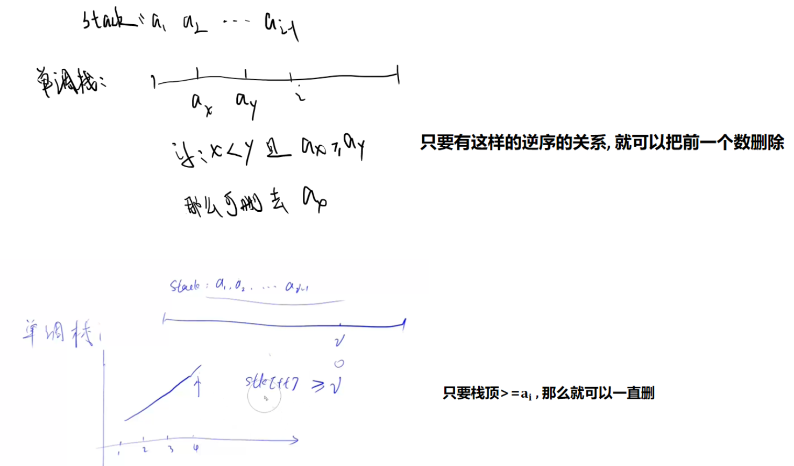

# 细节

## 数据范围

- 数组长度n的范围决定：arr[N]

- 数组元素的最大范围决定：用int还是long（一般是int），前缀和数组一般会爆Int，所以注意题意是否能将数组取模，否则就用long（即使用long都有危险）

- 数据元素的范围如果是可以负数，那么就不能用双指针滑动窗口（因为双指针的本质是单调性，当i向后移动的时候，如果元素是正数，j也是向后移动。如果是负数，就不满足这一点）

- long ans=0;答案用long存储会多过很多数据

- log(1000)=10,log(2000)=11

- 求方案数用long存储，很容易爆int

- 二维数组最大开到2*10^7，N一定要控制在4000以内

- 做题记得看数据范围，如果是10^9,10^18,10^5，有可能是公式解。

  如果是10^3,那么很可能是DP
  
- 题目中求的是最大值时，数据范围可能是负数，最大值变量mx一定要初始化成-INF，不要初始化成0。同理，最小值要初始化成INF

- 程序里的乘除法一定要特别注意，和逻辑上的乘除法不一样，向下取整不一样，乘法除法顺序导致结果不一样，比如：https://www.acwing.com/activity/content/code/add/8030/

- 元素都是正的，前缀和是递增的，对于区间求和的问题，就可以二分了；因为前缀和是单增的，也可以用双指针。

- 乘法除了注意顺序外，还需要注意爆int

- 前缀和容易爆int，最后用long存

- 数组下标越界：如果数组下标涉及到了减法，那么就特判一下是否大于0

- 在用快速幂的时候，注意取模，不是题目给了Mod就能取模的，比如：题目要对答案个数取模，在求快速幂的时候就不能取模

- 输入在超过1e6就要用快读，lqb中1e5的输入就最好用快读

- 输出println次数超过1e5就要用快写、print次数超过1e6就要用快写

- 蓝桥杯中最好每题都用快读快写，这样防止忘了


# 数学

## 等比数列求和

- 方法1：朴素做法

  O (n)

  Sk = 1+p^2+p^3+...+p^k 

  Sk-1 = 1+p^2+p^3+...+p^k-1 

  递推式：Sk = p*Sk-1 +1

  ```java 
  //计算1+p^2+p^3+...+p^k的和
  static long sum(int p,int k){
      long t=1;
      while(b--){
          t=(t*a+1);
      }
      return t;
  }
  ```

  

- 分治法

  O（logn）

  ```java
      //计算1+p^2+p^3+...+p^k的和（时间复杂度O（logn））
      static int sum(int p,int k) {
          p %= mod;//必须要加这个，不然会WA，会有溢出
          if(k==0) return 1;
          if(k%2==1) 
              return sum(p, k/2)*(qpow(p,k/2+1)+1)%mod;
          return (sum(p, k-1)*p+1)%mod;
      }
  
  	//https://www.acwing.com/activity/content/code/content/5624746/
  ```

  

## 海伦公式

三角形三边：a,b,c

令 p = (a+b+c)/2

面积 S = sqrt(p*(p-a)(p-b)(p-c))

## 同余

```
若a-b=n*k
则a%k==b%k
```

例题：k倍区间

## 位运算

### (cnt & 1) == 1:判断是否是奇数

```
if((cnt & 1) == 1)
```

奇数的二进制最后一位一定是1。否则就是偶数

### nlogn的时间复杂度

```java
 for(int i=1;i<=n;i++){//枚举i
    for(int j =i+i;j<=n;j+=i){//执行n/i次
```

执行次数：n + n/2 + n/3 + ...n/n

化简：n * (1+1/2+1/3+1/4+...+1/n) = nlogn

> 1+1/2+1/3+1/4+...1/n是调和级数，结果大概是logn
>
> 参考：素数筛

## 1~n中能被x整除的数的个数是：n/x


https://www.acwing.com/problem/content/4879/

# 基础算法

### 秦九韶算法

- 将n进制下的数x转换成10进制下的数

```java
    //将k进制下的数s转换成十进制数
	static int sum(char[] s,int k) {
        int res = 0;
        for(int i=0;i<s.length;i++) {
            res = res * k + s[i]-'0';
        }
        return res;
    }
```
- 求等比数列求和（O（n））

  例如求：1+p^1+p^2+...p^k

## 整数二分

- 模板1：寻找左边界

  找左边界——>找左区间——> r = mid，从而mid那里不需要+1，else里面就是l = mid+1;

  找左边界——>找左区间——>check中的mid一定在x的右边，mid>x

  ```java
  	int l = 1,r = n;
  	while(l<r) {
          int mid = (l+r)>>1;
          if(check(mid)) r=mid;
          else l = mid+1;
      }
  	return l;
  ```

- 模板2：寻找右边界

  找右边界——>找右区间——> l = mid，从而mid那里需要+1，else里面就是r = mid-1;

  找右边界——>找右区间——>check中的mid一定在x的左边，mid<x

  ```java
      int l = 1,r = n;
      while(l<r) {
          int mid = (l+r+1)>>1;
          if(check(mid)) l=mid;
          else r = mid-1;
      }
      return l;
  ```

- 二分步骤

  - 1.搞清楚这题用二分找到什么？比如求第一个mid满足mid > x
  - 2.是求左边界还是右边界，如果是左边界就是求左区间，那么check后面就是r=mid
  - 3.check函数就能写出来了（由2知道了左区间还是右区间，如果是求左区间，那么mid一定就在右区间）
  - 4.根据2就能知道mid的结果是否需要+1

- 注意点：

  - 二分一定有答案，一定会返回一个值，但是这个值不一定满足题意，所以要特判最后返回的l是否满足题意
  - if(check(mid))后面的语句不是l=mid就是r=mid，不存在l=mid+1这种情况。答案包含在这个范围内
  - 

  

### lowerBound、upperBound

```java
//找到nums中第一个大于x的数的下标
static int upperBound(int[] nums,int l,int r,int x) {
	while(l<r) {
		int mid = l+r>>1;
		if(nums[mid]>x) r=mid;
		else l = mid +1;
	}
	return l;//这里返回的nums[l]不一定满足题意，还需要特判
}
//找到nums中第一个大于等于x的数的下标
static int lowerBound(int[] nums,int l,int r,int x) {
    while(l<r) {
        int mid = l+r>>1;
        if(nums[mid]>=x) r=mid;
        else l = mid +1;
    }
    return l;//这里返回的nums[l]不一定满足题意，还需要特判
}
```
### 二分寻找左右边界

```java
//寻找升序数组arr中[l,r]中值为x的左边界（第一个x）下标
static int findLeft(int l,int r,int x) {
    while(l<r) {
        int mid = (l+r)>>1;
        if(arr[mid]>=x) r=mid;
        else l = mid+1;
    }
    return arr[l]==k?l:-1;//return l;
}
//寻找升序数组arr中[l,r]中值为x的右边界（最后一个x）下标
static int findRight(int l,int r,int x) {
    while(l<r) {
        int mid = (l+r+1)>>1;
        if(arr[mid]<=x) l=mid;
        else r = mid-1;
    }
    return arr[l]==k?l:-1;//return l;
}
```

作者：weiambt
链接：https://www.acwing.com/activity/content/code/content/5425322/
来源：AcWing
著作权归作者所有。商业转载请联系作者获得授权，非商业转载请注明出处。

### 二分的传参写法

在上面的lowerBound、upperBound函数中，我们最后还需要自己判断一下最后一个状态是否合法？如果用开区间的写法我们就不需要最后特判。见下文

比如要在[l,r]的时候二分，那么我在调用二分函数的时候，是这样`lower_bound(l,r)`调吗？不推荐，推荐使用`lower_bound(l,r+1)`（找右边）或者`lower_bound(l-1,r)`（找左边）的方式，见下文。不是第一种方式不能做，也能做，但是二分完要自己再进行处理，比较麻烦。

- 对于闭区间的传参写法（左闭右闭），二分是要一定有答案的，这里我们最后要自己特判最后一个位置是否合法。y总的都是这个写法
- 对于开区间的传参写法（左闭右开、左开有闭），我们不需要特判，因为开区间的那个地方，就是不满足的位置。

用库函数都是开区间的方式传参，如果用闭区间的方式传参，库函数我们无法在函数里判断，只能在外面判断，最后需要自己转化，就比较麻烦，所以如果图方便，可以在掉库函数的时候用自己将闭区间转成开区间传参，比如找右边，[i,n-1]中找，调用库函数就传参lower_bound(i+1,n)


## 浮点二分

浮点数二分没有边界的问题、也没有取整的问题

例子：下面是二分计算三次方根

```java
static double find(double l,double r,double x) {
    while(r-l>1e-6) {//保留6位小数，取决于题目
        double  mid = (l+r)/2;
        if(mid*mid*mid >= x) r = mid;
        else l = mid;//不用+1
    }
    return l;
}
//ps:最后要对l保留小数才能看到正确答案
System.out.printf("%.6f",l);
```


## 单调栈

- 题目背景

  寻找左边（右边）离他最近的比它大/小的数

- 原理

  单调性（下例是找比它小的值）

  

- 算法

  找左边离他最近的比他小的数：栈中元素升序（栈顶大的出栈）

  找左边离他最近的比他大的数：栈中元素降序（栈顶小的出栈）

  当栈为空时，表示找不到满足要求的，计算ans，将该值加入栈中

- 时间复杂度

  O（n）,暴力算法是O（n^2）

- 模板（寻找左边离他最近的比它小的）

  ```c++
  stack<int> st;
  int main(){
      int n;
      cin>>n;
      while(n--){
          int x;
          cin>>x;
          while(st.size() && st.top()>=x) st.pop();
          if(st.size()) cout<<st.top()<<" ";
          else cout<<"-1 ";
          st.push(x);
      }
      return 0;
  }
  ```

  

- 例题

  acwing830

  lc901
  
  lc907. 子数组的最小值之和(单调栈+数学)

## 单调队列

有难度！

- 题目背景：滑动窗口，计算一个大小为k的滑动窗口的实时的最大（最小）值

- 思路

  和单调栈一样，都是具有相同的单调性，比如：当找窗口内的最小值时，队列中是保持升序的。

  > 那么就是把队尾的比它大的值全部出队
  >
  > 具体思路：https://www.acwing.com/activity/content/code/content/1134199/

- 例题

  acwing154滑动窗口

## 递归

### 后序+中序构建二叉树

```java
static int build(int il,int ir,int pl,int pr) {
    int root = postOrder[pr];
    int rootIdx = pos[root];//找到根节点在中序遍历序列中的位置。
    if(rootIdx-1>=il)
        l[root] = build(il, rootIdx-1, pl, pl+rootIdx-1-il);//后序左子树右端点x =  pl+rootIdx-1-il
    if(rootIdx+1<=ir)
        r[root] = build(rootIdx+1, ir, pl+rootIdx-il,pr-1);//后序右子树左端点：x+1
    return root;
}
```

https://www.acwing.com/activity/content/code/content/5622312/

## 递推

**递推能降低时间复杂度**

### 子数组的最大公约数

 res = __gcd(res,nums[i])

- 例题

  lc2447. 最大公因数等于 K 的子数组数目

### 子数组的最大最小值


- 例题

  lc915. 分割数组（寻找子数组的最大最小值）


### 递推降低时间复杂度

这类题目很巧，循环的过程中，一边计数。当第i轮是，前面i-1轮计数的值为cnt，此时的cnt刚好可以作为ans在第i个位置的贡献。从而时间复杂度能降低一层。

[AcWing 3956. 截断数组](https://www.acwing.com/file_system/file/content/whole/index/content/8082442/)

## 前缀和

sum[i]=sum[i-1]+nums[i] (i一般从1开始)

也可以使用滚动数组

nums[i]+=nums[i-1]


## 不改变数组元素顺序的排序

### 顺序数组idx(下标)

可以操作下标进行排序

定义

vector< int > idx(n);

初始化

for(int i=0;i<n;i++) idx[i]=i;

排序

```
sort(idx.begin(),idx.end(),[&](int a,int b){
	nums[a]<nums[b];//升序，根据这个下标的值排序
})
```

此时，idx[i]=x， 表示nums中第i+1小的值是x。例如idx[0]=2,表示nums中最小的元素是2

### 元素的排名数组idx2（下标）

对上述的idx取反函数，得到idx2。

idx2[i]=x表示nums[i]在nums中的排名


例题：lc915. 分割数组（寻找子数组的最大最小值）


## 双指针

lc209长度最小的子数组(有思考量)


### 和不大于K的子数组个数问题

双指针，第十三届蓝桥杯 C++ B 组省赛 F 题——统计子矩阵 （AC）的来源

## 和为 K 的子数组问题

前缀和+哈希表解决

lc560

lc523

lc974

蓝桥杯真题（k倍区间）：https://www.dotcpp.com/oj/problem1882.html?sid=9373975&lang=3#editor

> 题解：https://leetcode.cn/problems/subarray-sum-equals-k/solutions/1956637/by-insomnia-5h-t3yu/


## 字符串消除问题（相同字母抵消）

> 对于一个字符串s，删除中间的相同连续字母对，最终得到的字符串中不能存在相同连续字母对。（如果删除某一对后，出现了新的相同连续字母对，则新的对也应当被删除。）
>
> 例子：输入：abcddcef；输出：abef

**解决思路**

使用栈去维护这个字符串

假设，栈中存放着的字符串已经合法（栈中不存在相同连续字母对），那么当下一个s[i]来了后，只需要和栈顶比一下是否相等即可，如果相等，那么出栈一次，否则进站。这个思路类似括号问题的思路（左括号只负责进站，右括号负责判断），对应于这个题，一个字母第k次出现，如果k是个奇数，那么就直接进栈，如果是个偶数，那么就判断。

> 例题：AcWing 4720. 字符串


## 找右边离他最远的比它小的数

> 问题描述：找到arr[i]最右边的那一个比它小的数：单调队列 + 二分 O（nlogn）

例题：AcWing 4721. 排队


