# 基础算法精讲

>  灵神

# 《灵茶八题》题目列表

仅仅是几个字的区别，会导致截然不同的做法，也许这就是算法之美吧！

- [子数组 +w+](https://www.luogu.com.cn/problem/U360300)
- [子数组 ^w^](https://www.luogu.com.cn/problem/U360487)
- [子数组 ^w+](https://www.luogu.com.cn/problem/U360489)
- [子数组 +w^](https://www.luogu.com.cn/problem/U360500)
- [子序列 +w+](https://www.luogu.com.cn/problem/U360640)
- [子序列 ^w^](https://www.luogu.com.cn/problem/U360641)
- [子序列 ^w+](https://www.luogu.com.cn/problem/U360642)
- [子序列 +w^](https://www.luogu.com.cn/problem/U360643)

### [同向双指针](https://www.bilibili.com/video/BV1hd4y1r7Gq/) 

- [209. 长度最小的子数组](https://leetcode.cn/problems/minimum-size-subarray-sum/)  [代码](https://leetcode.cn/problems/minimum-size-subarray-sum/solution/biao-ti-xia-biao-zong-suan-cuo-qing-kan-k81nh/)      

> 给定一个含有 `n` 个正整数的数组和一个正整数 `target` **。**
>
> 找出该数组中满足其和 `≥ target` 的长度最小的 **连续子数组** `[numsl, numsl+1, ..., numsr-1, numsr]` ，并返回其长度**。**如果不存在符合条件的子数组，返回 `0` 。

左指针从满足要求变成不满足要求

```
class Solution:
    def minSubArrayLen(self, target: int, nums: List[int]) -> int:
        n = len(nums)
        ans = inf
        s = left = 0
        for right,x in enumerate(nums):
            s += nums[right]
            while s >= target:
                ans = min(ans,right-left+1)
                s -= nums[left]
                left+=1
        return ans if ans!=inf else 0
```


- [713. 乘积小于 K 的子数组](https://leetcode.cn/problems/subarray-product-less-than-k/)  [代码](https://leetcode.cn/problems/subarray-product-less-than-k/solution/xia-biao-zong-suan-cuo-qing-kan-zhe-by-e-jebq/)     

> 给你一个整数数组 `nums` 和一个整数 `k` ，请你返回子数组内所有元素的乘积严格小于 `k` 的连续子数组的数目。

左指针从不满足要求变成满足要求

以右端点固定时，满足条件的区间的个数，找到right为右端点的最长的满足条件的区间个数，所以子区间也都满足

```
class Solution:
    def numSubarrayProductLessThanK(self, nums: List[int], k: int) -> int:
        n = len(nums)
        ans = 0
        left = 0
        s = 1
        for right in range(n):
            s *= nums[right]
            while left<=right and s>=k:
                s//=nums[left]
                left+=1
            ans += right-left+1
        return ans
```


- [3. 无重复字符的最长子串](https://leetcode.cn/problems/longest-substring-without-repeating-characters/)  [代码](https://leetcode.cn/problems/longest-substring-without-repeating-characters/solution/xia-biao-zong-suan-cuo-qing-kan-zhe-by-e-iaks/)     

> 给定一个字符串 `s` ，请你找出其中不含有重复字符的 **最长子串** 的长度。

哈希表维护

```
class Solution:
    def lengthOfLongestSubstring(self, s: str) -> int:
        mp = Counter()
        left = ans = 0
        for right in range(len(s)):
            mp[s[right]]+=1
            while left <= right and mp[s[right]]>1:
                mp[s[left]]-=1
                left+=1
            ans = max(ans,right-left+1)
        return ans
```


- [1004. 最大连续 1 的个数 III](https://leetcode.cn/problems/max-consecutive-ones-iii/)  [代码](https://leetcode.cn/problems/max-consecutive-ones-iii/solution/hua-dong-chuang-kou-yi-ge-shi-pin-jiang-yowmi/)  

> 给定一个二进制数组 `nums` 和一个整数 `k`，如果可以翻转最多 `k` 个 `0` ，则返回 *数组中连续 `1` 的最大个数* 。
>
> 1656

思维转化成双指针

```
class Solution:
    def longestOnes(self, nums: List[int], k: int) -> int:
        # 求最多有k个0的连续子数组的最大长度
        n = len(nums)
        ans = 0
        s = left = 0
        for right in range(n):
            s += nums[right]==0
            while s>k:
                s -= nums[left]==0
                left+=1
            ans = max(ans,right-left+1)
        return ans
```


- [1234. 替换子串得到平衡字符串](https://leetcode.cn/problems/replace-the-substring-for-balanced-string/)  [代码](https://leetcode.cn/problems/replace-the-substring-for-balanced-string/solution/tong-xiang-shuang-zhi-zhen-hua-dong-chua-z7tu/)  

> 有一个只含有 `'Q', 'W', 'E', 'R'` 四种字符，且长度为 `n` 的字符串。
>
> 假如在该字符串中，这四个字符都恰好出现 `n/4` 次，那么它就是一个「平衡字符串」。
>
> 给你一个这样的字符串 `s`，请通过「替换一个子串」的方式，使原字符串 `s` 变成一个「平衡字符串」。
>
> 你可以用和「待替换子串」长度相同的 **任何** 其他字符串来完成替换。
>
> 请返回待替换子串的最小可能长度。
>
> 如果原字符串自身就是一个平衡字符串，则返回 `0`。
>
> 1878

滑动窗口维护窗口外的每个元素个数、恰好出现

窗口外的所有元素都不变，数量有一个>n/4，那么这个窗口就不行

```
class Solution:
    def balancedString(self, s: str) -> int:
        n = len(s)
        mp = Counter(s)
        if all(mp[x]==n//4 for x in 'QWER'):
            return 0
        ans = inf
        left = 0
        for right in range(n):
            mp[s[right]]-=1
            while left<=right and all(mp[x]<=n//4 for x in 'QWER'):
                ans = min(ans,right-left+1)
                mp[s[left]]+=1
                left+=1
        return ans
```


- [1658. 将 x 减到 0 的最小操作数](https://leetcode.cn/problems/minimum-operations-to-reduce-x-to-zero/)  [代码](https://leetcode.cn/problems/minimum-operations-to-reduce-x-to-zero/solution/ni-xiang-si-wei-pythonjavacgo-by-endless-b4jt/)  

> 给你一个整数数组 `nums` 和一个整数 `x` 。每一次操作时，你应当移除数组 `nums` 最左边或最右边的元素，然后从 `x` 中减去该元素的值。请注意，需要 **修改** 数组以供接下来的操作使用。
>
> 如果可以将 `x` **恰好** 减到 `0` ，返回 **最小操作数** ；否则，返回 `-1` 。
>
>  1817

思维转化

左指针从不满足要求变成满足要求

```python
class Solution:
    def minOperations(self, nums: List[int], x: int) -> int:
        # 找最长的子数组，使得和是sum - x
        n = len(nums)
        left = 0
        tar = sum(nums)-x
        s = 0
        mx = -1
        for right in range(n):
            s += nums[right]
            while left <= right and s>tar:
                s -= nums[left]
                left+=1
            if s == tar:
                mx = max(mx,right-left+1)
        return n-mx if mx !=-1 else -1
```

### [相向双指针 1](https://www.bilibili.com/video/BV1bP411c7oJ/)  

- [167. 两数之和 II - 输入有序数组](https://leetcode.cn/problems/two-sum-ii-input-array-is-sorted/)  [代码](https://leetcode.cn/problems/two-sum-ii-input-array-is-sorted/solution/san-shu-zhi-he-bu-hui-xie-xiang-xiang-sh-6wbq/)     

> 给你一个下标从 **1** 开始的整数数组 `numbers` ，该数组已按 **非递减顺序排列** ，请你从数组中找出满足相加之和等于目标数 `target` 的两个数。如果设这两个数分别是 `numbers[index1]` 和 `numbers[index2]` ，则 `1 <= index1 < index2 <= numbers.length` 。
>
> 以长度为 2 的整数数组 `[index1, index2]` 的形式返回这两个整数的下标 `index1` 和 `index2`。
>
> 你可以假设每个输入 **只对应唯一的答案** ，而且你 **不可以** 重复使用相同的元素。
>
> 你所设计的解决方案必须只使用常量级的额外空间。

三种方法：1.哈希表2.排序+双指针3.排序+二分

```
class Solution:
    def twoSum(self, numbers: List[int], target: int) -> List[int]:
        n = len(numbers)
        i,j = 0,n-1
        while i<j:
            s = numbers[i] + numbers[j]
            if s == target:
                return [i+1,j+1]
            elif s > target:
                j-=1
            else:
                i+=1
```


-  [15. 三数之和](https://leetcode.cn/problems/3sum/)  [代码](https://leetcode.cn/problems/3sum/solution/shuang-zhi-zhen-xiang-bu-ming-bai-yi-ge-pno55/)  包含两个优化    

> 给你一个整数数组 `nums` ，判断是否存在三元组 `[nums[i], nums[j], nums[k]]` 满足 `i != j`、`i != k` 且 `j != k` ，同时还满足 `nums[i] + nums[j] + nums[k] == 0` 。请
>
> 你返回所有和为 `0` 且不重复的三元组。
>
> **注意：**答案中不可以包含重复的三元组。

本题也是有三种方法，但是双指针好去重

排序+双指针、难点在去重

```
class Solution:
    def threeSum(self, nums: List[int]) -> List[List[int]]:
        n = len(nums)
        nums.sort()
        ans = []
        for i in range(n-2):
            tar = -nums[i]
            if i and nums[i]==nums[i-1]:
                continue
            j,k = i+1,n-1
            while j<k:
                s = nums[j]+nums[k]
                if s==tar:
                    ans.append([nums[i],nums[j],nums[k]])
                    while j<k and nums[j]==nums[j+1]:
                        j+=1
                    while j<k and nums[k]==nums[k-1]:
                        k-=1
                    j+=1
                    k-=1
                elif s>tar:
                    k-=1
                else:
                    j+=1
        return ans
```


- [16. 最接近的三数之和](https://leetcode.cn/problems/3sum-closest/)  [代码](https://leetcode.cn/problems/3sum-closest/solution/zui-jie-jin-de-san-shu-zhi-he-by-leetcode-solution/)  *课后作业    

> 给你一个长度为 `n` 的整数数组 `nums` 和 一个目标值 `target`。请你从 `nums` 中选出三个整数，使它们的和与 `target` 最接近。
>
> 返回这三个数的和。
>
> 假定每组输入只存在恰好一个解。

枚举一个数然后再双指针

```
class Solution:
    def threeSumClosest(self, nums: List[int], target: int) -> int:
        n = len(nums)
        nums.sort()
        ans = inf
        for k in range(n-2):
            i,j = k+1,n-1
            while i<j:
                s = nums[i]+nums[j]+nums[k]
                if abs(s-target) < abs(ans-target):
                    ans = s
                if s == target:
                    return target
                elif s > target:
                    j-=1
                else:
                    i+=1
        return ans
```

优化方式：

优化1：第一个数相同的位置跳过

优化2：最小的和都>target，后面就不用扫描了

优化3：最大的和都<target，也不用扫描了

```
class Solution:
    def threeSumClosest(self, nums: List[int], target: int) -> int:
        n = len(nums)
        nums.sort()
        ans = inf
        diff = inf
        for k in range(n-2):
            # 优化1：第一个数相同的位置跳过
            if k and nums[k]==nums[k-1]:
                continue
            # 优化2：最小的和都>target，后面就不用扫描了
            s = nums[k]+nums[k+1]+nums[k+2]
            if s>= target:
                if s - target < diff:
                    ans = nums[k]+nums[k+1]+nums[k+2]
                    diff = s - target
                    continue
            # 优化3：最大的和都<target，也不用扫描了
            s = nums[k] + nums[-1] + nums[-2]
            if s<=target:
                if target - s < diff:
                    ans = s
                    diff = target - s
                    continue
            i,j = k+1,n-1
            while i<j:
                s = nums[i]+nums[j]+nums[k]
                if abs(s - target) < diff:
                    ans = s
                    diff = abs(s - target)
                if s == target:
                    return target
                elif s > target:
                    j-=1
                else:
                    i+=1
        return ans
```


- [18. 四数之和](https://leetcode.cn/problems/4sum/)  [代码](https://leetcode.cn/problems/4sum/solution/ji-zhi-you-hua-ji-yu-san-shu-zhi-he-de-z-1f0b/)  *课后作业

```
class Solution:
    def fourSum(self, nums: List[int], target: int) -> List[List[int]]:
        n = len(nums)
        ans = []
        nums.sort()
        for a in range(n-3):
            for b in range(a+1,n-2):
                if (a and nums[a]==nums[a-1]) or (b!=a+1 and nums[b]==nums[b-1]):
                    continue
                i,j = b+1,n-1
                while i<j:
                    s = nums[i]+nums[j]+nums[a]+nums[b]
                    if s == target:
                        ans.append([nums[a],nums[b],nums[i],nums[j]])
                        i+=1
                        j-=1
                        while i<j and nums[i]==nums[i-1]:
                            i+=1
                        while i<j and nums[j]==nums[j+1]:
                            j-=1
                    elif s>target:
                        j-=1
                    else:
                        i+=1
        return ans
```

### [相向双指针 2](https://www.bilibili.com/video/BV1Qg411q7ia/)  

- [11. 盛最多水的容器](https://leetcode.cn/problems/container-with-most-water/)  [代码](https://leetcode.cn/problems/container-with-most-water/solutions/1974355/by-endlesscheng-f0xz/)     

> 给定一个长度为 `n` 的整数数组 `height` 。有 `n` 条垂线，第 `i` 条线的两个端点是 `(i, 0)` 和 `(i, height[i])` 。
>
> 找出其中的两条线，使得它们与 `x` 轴共同构成的容器可以容纳最多的水。
>
> 返回容器可以储存的最大水量。
>
> **说明：**你不能倾斜容器。
>
>  

哪边小，那边的的指针就要移动

```
class Solution:
    def maxArea(self, height: List[int]) -> int:
        n = len(height)
        l,r = 0,n-1
        ans = 0
        while l<r:
            ans = max(ans,min(height[l],height[r])*(r-l))
            if height[l] <= height[r]:
                l+=1
            else:
                r-=1
        return ans
```


- [42. 接雨水](https://leetcode.cn/problems/trapping-rain-water/)  [代码](https://leetcode.cn/problems/trapping-rain-water/solutions/1974340/zuo-liao-nbian-huan-bu-hui-yi-ge-shi-pin-ukwm/)

> 给定 `n` 个非负整数表示每个宽度为 `1` 的柱子的高度图，计算按此排列的柱子，下雨之后能接多少雨水。
>
> **示例 1：**
>
> 
>
> 困难题

双指针、动态规划、前后缀	

思路：雨水分成按列分块，分别计算每一列的雨水个数，对于某一个height[i]，需要找到i左边的最大高度、i右边的最大高度，取最小值就是能接到的水的高度，再减去当前点的高度，就是这一列雨水的个数。

```
class Solution:
    def trap(self, height: List[int]) -> int:
        ans = 0
        n = len(height)
        l = [0]*(n+1)
        r = [0]*(n+1)

        for i in range(n):
            l[i] = max(l[i-1],height[i])
        for i in range(n-1,-1,-1):
            r[i] = max(r[i+1],height[i])
        
        for x,lh,rh in zip(height,l,r):
            ans += min(lh,rh) - x
        return ans
```


### [二分查找 - 深入理解](https://www.bilibili.com/video/BV1AP41137w7/)  

[34. 在排序数组中查找元素的第一个和最后一个位置](https://leetcode.cn/problems/find-first-and-last-position-of-element-in-sorted-array/)  [代码](https://leetcode.cn/problems/find-first-and-last-position-of-element-in-sorted-array/solutions/1980196/er-fen-cha-zhao-zong-shi-xie-bu-dui-yi-g-t9l9/)  三种写法  

> 给你一个按照非递减顺序排列的整数数组 `nums`，和一个目标值 `target`。请你找出给定目标值在数组中的开始位置和结束位置。
>
> 如果数组中不存在目标值 `target`，返回 `[-1, -1]`。
>
> 你必须设计并实现时间复杂度为 `O(log n)` 的算法解决此问题。

```
class Solution:
    def searchRange(self, nums: List[int], target: int) -> List[int]:
        n = len(nums)
        if n==0:return [-1,-1]
        a = bisect.bisect_left(nums,target,0,n-1)
        b = bisect.bisect_right(nums,target,0,n) # 因为是找后面一个所以右端点+1
        if nums[a]==target and b and nums[a]==nums[b-1]:
            return [a,b-1]
        return [-1,-1]
```


### [二分查找 - 习题课](https://www.bilibili.com/video/BV1QK411d76w/) 

- [162. 寻找峰值](https://leetcode.cn/problems/find-peak-element/)  [代码](https://leetcode.cn/problems/find-peak-element/solutions/1987497/by-endlesscheng-9ass/)  

> 峰值元素是指其值严格大于左右相邻值的元素。
>
> 给你一个整数数组 `nums`，找到峰值元素并返回其索引。数组可能包含多个峰值，在这种情况下，返回 **任何一个峰值** 所在位置即可。
>
> 你可以假设 `nums[-1] = nums[n] = -∞` 。
>
> 你必须实现时间复杂度为 `O(log n)` 的算法来解决此问题。
>
> - 对于所有有效的 `i` 都有 `nums[i] != nums[i + 1]`


>  本题是一道数组不有序但是能二分的题目

结论：**只要数组中存在一个元素比左边或右边的元素大，那么沿着它一定可以找到一个峰值**

关键点：左右端点是-inf

用数学解释：把所有点连起来想成一张函数图像，然后把左右边界-inf也连上，这样就得到一个连续的函数图像，由**罗尔定理**知道，左右两边相同，中间一定有一个导数等于0的点，由于题意告诉我们nums[i] != nums[i + 1]，所以这个点一定是极值点，由于边界都是-inf，所以一定有极大值，并且最少有一个极大值。所以，任取一个位置i,如果nums[i]>nums[i+1],那么在i左边一定有一个极大值，使得函数图像最后减到-inf；反之，如果nums[i]<nums[i+1],那么在i+1右边一定有一个极大值，使得图像一定减到-inf

```
class Solution:
    def findPeakElement(self, nums: List[int]) -> int:
        n = len(nums)
        if n==1:
            return 0
        l,r = 0,n-1
        while l<r:
            mid = l+r>>1
            if nums[mid] > nums[mid+1]:
                r = mid
            else:
                l = mid+1
        return l
```


- [153. 寻找旋转排序数组中的最小值](https://leetcode.cn/problems/find-minimum-in-rotated-sorted-array/)  [代码](https://leetcode.cn/problems/find-minimum-in-rotated-sorted-array/solutions/1987499/by-endlesscheng-owgd/)    

> 已知一个长度为 `n` 的数组，预先按照升序排列，经由 `1` 到 `n` 次 **旋转** 后，得到输入数组。例如，原数组 `nums = [0,1,2,4,5,6,7]` 在变化后可能得到：
>
> - 若旋转 `4` 次，则可以得到 `[4,5,6,7,0,1,2]`
> - 若旋转 `7` 次，则可以得到 `[0,1,2,4,5,6,7]`
>
> 注意，数组 `[a[0], a[1], a[2], ..., a[n-1]]` **旋转一次** 的结果为数组 `[a[n-1], a[0], a[1], a[2], ..., a[n-2]]` 。
>
> 给你一个元素值 **互不相同** 的数组 `nums` ，它原来是一个升序排列的数组，并按上述情形进行了多次旋转。请你找出并返回数组中的 **最小元素** 。
>
> 你必须设计一个时间复杂度为 `O(log n)` 的算法解决此问题。

思路：以右端点target作为基准值，根据nums[mid]和target大小关系确定区间。

具体的，对于某个数nums[i]，如果nums[i]比基准值大，那么说明它在数组的前半部分，而最小值在后半部分，所以缩小区间成[i+1,r]，反之同理

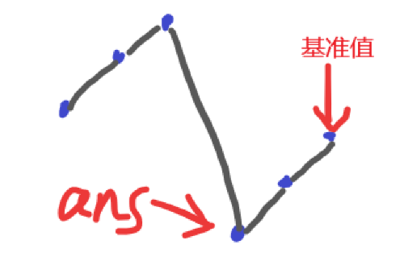

```
class Solution:
    def findMin(self, nums: List[int]) -> int:
        n = len(nums)
        l,r = 0,n-1
        # 
        target = nums[-1]
        while l<r:
            mid = l+r>>1
            if nums[mid] < target:
                r = mid
            else:
                l = mid+1
        return nums[l]
```


-  [33. 搜索旋转排序数组](https://leetcode.cn/problems/search-in-rotated-sorted-array/)  [代码](https://leetcode.cn/problems/search-in-rotated-sorted-array/solutions/1987503/by-endlesscheng-auuh/)  两种方法 

> 整数数组 `nums` 按升序排列，数组中的值 **互不相同** 。
>
> 在传递给函数之前，`nums` 在预先未知的某个下标 `k`（`0 <= k < nums.length`）上进行了 **旋转**，使数组变为 `[nums[k], nums[k+1], ..., nums[n-1], nums[0], nums[1], ..., nums[k-1]]`（下标 **从 0 开始** 计数）。例如， `[0,1,2,4,5,6,7]` 在下标 `3` 处经旋转后可能变为 `[4,5,6,7,0,1,2]` 。
>
> 给你 **旋转后** 的数组 `nums` 和一个整数 `target` ，如果 `nums` 中存在这个目标值 `target` ，则返回它的下标，否则返回 `-1` 。
>
> 你必须设计一个时间复杂度为 `O(log n)` 的算法解决此问题。

较难

将数组一分为二，其中一定有一个是有序的，另一个可能是有序，也能是部分有序。
此时有序部分用二分法查找。无序部分再一分为二，其中一个一定有序，另一个可能有序，可能无序。就这样循环. 

```
class Solution:
    def search(self, nums: List[int], target: int) -> int:
        def find(nums,left,right,target):
            if left==right:
                return left if nums[left]==target else -1
            mid = left+right>>1
            # mid落在左边有序数组上了
            if nums[left] <= nums[mid]:
                # 如果tar在左边有序数组上
                if nums[mid] >= target >= nums[left]:
                    i = bisect.bisect_left(nums,target,left,mid)
                    return i if nums[i]==target else -1
                else:
                    return find(nums,mid+1,right,target)
            # mid落在右边有序数组上了
            else:
                # 如果tar在右边有序数组上
                if nums[mid] <= target <= nums[right]:
                    i = bisect.bisect_left(nums,target,mid,right)
                    return i if nums[i]==target else -1
                else:
                    return find(nums,left,mid-1,target)
        return find(nums,0,len(nums)-1,target)
```


- [154. 寻找旋转排序数组中的最小值 II](https://leetcode.cn/problems/find-minimum-in-rotated-sorted-array-ii/)  [代码](https://leetcode.cn/problems/find-minimum-in-rotated-sorted-array-ii/solution/zhi-yao-ni-hui-153-jiu-neng-kan-dong-pyt-qqc6/)  *课后作业  

> 已知一个长度为 `n` 的数组，预先按照升序排列，经由 `1` 到 `n` 次 **旋转** 后，得到输入数组。例如，原数组 `nums = [0,1,4,4,5,6,7]` 在变化后可能得到：
>
> - 若旋转 `4` 次，则可以得到 `[4,5,6,7,0,1,4]`
> - 若旋转 `7` 次，则可以得到 `[0,1,4,4,5,6,7]`
>
> 注意，数组 `[a[0], a[1], a[2], ..., a[n-1]]` **旋转一次** 的结果为数组 `[a[n-1], a[0], a[1], a[2], ..., a[n-2]]` 。
>
> 给你一个可能存在 **重复** 元素值的数组 `nums` ，它原来是一个升序排列的数组，并按上述情形进行了多次旋转。请你找出并返回数组中的 **最小元素** 。
>
> 你必须尽可能减少整个过程的操作步骤。

要考虑重复的元素

```
class Solution:
    def findMin(self, nums: List[int]) -> int:
        n = len(nums)
        l,r = 0,n-1
        while l<r:
            mid = l+r>>1
            if nums[mid] < nums[r]:
                r = mid
            elif nums[mid] > nums[r]:
                l = mid + 1
            else:
                r-=1
        return nums[l]
```


### [链表 - 反转系列](https://www.bilibili.com/video/BV1sd4y1x7KN/)  

[206. 反转链表](https://leetcode.cn/problems/reverse-linked-list/)  [代码](https://leetcode.cn/problems/reverse-linked-list/solutions/1992225/you-xie-cuo-liao-yi-ge-shi-pin-jiang-tou-o5zy/)      

[92. 反转链表 II](https://leetcode.cn/problems/reverse-linked-list-ii/)  [代码](https://leetcode.cn/problems/reverse-linked-list-ii/solutions/1992226/you-xie-cuo-liao-yi-ge-shi-pin-jiang-tou-teqq/)      

[25. K 个一组翻转链表](https://leetcode.cn/problems/reverse-nodes-in-k-group/)  [代码](https://leetcode.cn/problems/reverse-nodes-in-k-group/solutions/1992228/you-xie-cuo-liao-yi-ge-shi-pin-jiang-tou-plfs/)     

 [24. 两两交换链表中的节点](https://leetcode.cn/problems/swap-nodes-in-pairs/)  [代码](https://leetcode.cn/problems/swap-nodes-in-pairs/solution/tu-jie-die-dai-di-gui-yi-zhang-tu-miao-d-51ap)  *课后作业   

 [445. 两数相加 II](https://leetcode.cn/problems/add-two-numbers-ii/)  [代码](https://leetcode.cn/problems/add-two-numbers-ii/solution/fan-zhuan-lian-biao-liang-shu-xiang-jia-okw6q)  *课后作业 

###  [链表 - 快慢指针](https://www.bilibili.com/video/BV1KG4y1G7cu/)

  [876. 链表的中间结点](https://leetcode.cn/problems/middle-of-the-linked-list/)  [代码](https://leetcode.cn/problems/middle-of-the-linked-list/solutions/1999265/mei-xiang-ming-bai-yi-ge-shi-pin-jiang-t-wzwm/)     

 [141. 环形链表](https://leetcode.cn/problems/linked-list-cycle/)  [代码](https://leetcode.cn/problems/linked-list-cycle/solutions/1999269/mei-xiang-ming-bai-yi-ge-shi-pin-jiang-t-c4sw/)    

  [142. 环形链表 II](https://leetcode.cn/problems/linked-list-cycle-ii/)  [代码](https://leetcode.cn/problems/linked-list-cycle-ii/solutions/1999271/mei-xiang-ming-bai-yi-ge-shi-pin-jiang-t-nvsq/)    

  [143. 重排链表](https://leetcode.cn/problems/reorder-list/)  [代码](https://leetcode.cn/problems/reorder-list/solutions/1999276/mei-xiang-ming-bai-yi-ge-shi-pin-jiang-t-u66q/)   

###  [链表 - 删除系列](https://www.bilibili.com/video/BV1VP4y1Q71e/)  

[237. 删除链表中的节点](https://leetcode.cn/problems/delete-node-in-a-linked-list/)  [代码](https://leetcode.cn/problems/delete-node-in-a-linked-list/solutions/2004056/ru-he-shan-chu-jie-dian-liu-fen-zhong-ga-x3kn/)  脑筋急转弯

​    [19. 删除链表的倒数第 N 个结点](https://leetcode.cn/problems/remove-nth-node-from-end-of-list/)  [代码](https://leetcode.cn/problems/remove-nth-node-from-end-of-list/solutions/2004057/ru-he-shan-chu-jie-dian-liu-fen-zhong-ga-xpfs/)  前后指针 

   [83. 删除排序链表中的重复元素](https://leetcode.cn/problems/remove-duplicates-from-sorted-list/)  [代码](https://leetcode.cn/problems/remove-duplicates-from-sorted-list/solutions/2004062/ru-he-qu-zhong-yi-ge-shi-pin-jiang-tou-p-98g7/)      [82. 删除排序链表中的重复元素 II](https://leetcode.cn/problems/remove-duplicates-from-sorted-list-ii/)  [代码](https://leetcode.cn/problems/remove-duplicates-from-sorted-list-ii/solutions/2004067/ru-he-qu-zhong-yi-ge-shi-pin-jiang-tou-p-2ddn/) 

###    [二叉树与递归 - 深入理解](https://www.bilibili.com/video/BV1UD4y1Y769/)  

- [104. 二叉树的最大深度](https://leetcode.cn/problems/maximum-depth-of-binary-tree/)  [代码](https://leetcode.cn/problems/maximum-depth-of-binary-tree/solution/kan-wan-zhe-ge-shi-pin-rang-ni-dui-di-gu-44uz/)  两种方法	

  方法1：用子节点更新父节点

  ```
  class Solution:
      def maxDepth(self, root: Optional[TreeNode]) -> int:
          if root is None:
              return 0
          mx = max(self.maxDepth(root.left),self.maxDepth(root.right))
          return mx+1
  ```

  方法2：父节点状态传递给子节点

  ```
  class Solution:
      def maxDepth(self, root: Optional[TreeNode]) -> int:
          ans = 0
          def dfs(root,dep):
              if root is None:
                  return 
              nonlocal ans
              ans = max(ans,dep+1)
              dfs(root.left,dep+1)
              dfs(root.right,dep+1)
          dfs(root,0)
          return ans
  ```

  

###   [二叉树与递归 - 灵活运用](https://www.bilibili.com/video/BV18M411z7bb/)  

- [100. 相同的树](https://leetcode.cn/problems/same-tree/)  [代码](https://leetcode.cn/problems/same-tree/solutions/2015056/ru-he-ling-huo-yun-yong-di-gui-lai-kan-s-empk/)    

  > 判断两棵树是否对称

  ```
  class Solution:
      def isSameTree(self, p: Optional[TreeNode], q: Optional[TreeNode]) -> bool:
          if not p and not q:
              return True
          if not p or not q:
              return False
          if p.val != q.val:
              return False
          return self.isSameTree(p.left,q.left) and self.isSameTree(p.right,q.right)
  ```

  

- [101. 对称二叉树](https://leetcode.cn/problems/symmetric-tree/)  [代码](https://leetcode.cn/problems/symmetric-tree/solutions/2015063/ru-he-ling-huo-yun-yong-di-gui-lai-kan-s-6dq5/)    

  > 给你一个二叉树的根节点 `root` ， 检查它是否轴对称。

  ```
  class Solution:
      def isSymmetric(self, root: Optional[TreeNode]) -> bool:
          # 修改100. 相同的树的代码
          def isSame(p,q):
              if not p or not q:
                  return not p and not q
              return p.val == q.val and isSame(p.left,q.right) and isSame(p.right,q.left)
          return isSame(root.left,root.right)
  ```

- [110. 平衡二叉树](https://leetcode.cn/problems/balanced-binary-tree/)  [代码](https://leetcode.cn/problems/balanced-binary-tree/solutions/2015068/ru-he-ling-huo-yun-yong-di-gui-lai-kan-s-c3wj/)    

  > 给定一个二叉树，判断它是否是高度平衡的二叉树。
  >
  > 本题中，一棵高度平衡二叉树定义为：
  >
  > > 一个二叉树*每个节点* 的左右两个子树的高度差的绝对值不超过 1 。

  ```
  class Solution:
      def isBalanced(self, root: Optional[TreeNode]) -> bool:
          def dfs(root)->int:
              if not root:
                  return 0
              return max(dfs(root.left),dfs(root.right))+1
          if not root:
              return True
          return abs(dfs(root.left)-dfs(root.right))<=1 and self.isBalanced(root.left) and self.isBalanced(root.right) 
  ```

  

- [199. 二叉树的右视图](https://leetcode.cn/problems/binary-tree-right-side-view/)  [代码](https://leetcode.cn/problems/binary-tree-right-side-view/solutions/2015061/ru-he-ling-huo-yun-yong-di-gui-lai-kan-s-r1nc/)   

  > 给定一个二叉树的 **根节点** `root`，想象自己站在它的右侧，按照从顶部到底部的顺序，返回从右侧所能看到的节点值。

  方法1：先递归右子树，再找剩多出来的(很妙！！！)

  ```
  class Solution:
      def rightSideView(self, root: Optional[TreeNode]) -> List[int]:
          ans = []
          def dfs(root,dep):
              if root is None:
                  return
              if dep == len(ans):
                  ans.append(root.val)
              dfs(root.right,dep+1)
              dfs(root.left,dep+1)          
          dfs(root,0) 
          return ans 
  ```

  方法2：BFS

  ```
  class Solution:
      def rightSideView(self, root: Optional[TreeNode]) -> List[int]:
          q = deque()
          if not root:
              return []
          q.append(root)
          ans = []
          while len(q):
              sz = len(q)
              t = TreeNode(-1)
              while sz:
                  t = q.popleft()
                  if t.left:
                      q.append(t.left)
                  if t.right:
                      q.append(t.right)
                  sz-=1
              if t.val!=-1:
                  ans.append(t.val)
          return ans
  ```

  

- [1026. 节点与其祖先之间的最大差值](https://leetcode.cn/problems/maximum-difference-between-node-and-ancestor/)  [代码](https://leetcode.cn/problems/maximum-difference-between-node-and-ancestor/solution/liang-chong-fang-fa-zi-ding-xiang-xia-zi-wj9v/)  *课后作业 

  > 给定二叉树的根节点 `root`，找出存在于 **不同** 节点 `A` 和 `B` 之间的最大值 `V`，其中 `V = |A.val - B.val|`，且 `A` 是 `B` 的祖先。
  >
  > （如果 A 的任何子节点之一为 B，或者 A 的任何子节点是 B 的祖先，那么我们认为 A 是 B 的祖先）

  维护最大、最小值

  用父节点的状态更新子节点
  
  ```
  class Solution:
      def maxAncestorDiff(self, root: Optional[TreeNode]) -> int:
          ans = -inf
          def dfs(root,ma,mi):
              if root is None:
                  return
              nonlocal ans
              if ma==-1 and mi==-1:
                  ma = -inf
                  mi = inf
              else:
                  ans = max(ans,abs(ma-root.val),abs(mi-root.val))
              print(root.val,ans)
              nma = max(root.val,ma)
              nmi = min(root.val,mi)
              
              dfs(root.left,nma,nmi)
              dfs(root.right,nma,nmi)
          dfs(root,-1,-1)
        return ans
  ```

  
  
   [1080. 根到叶路径上的不足节点](https://leetcode.cn/problems/insufficient-nodes-in-root-to-leaf-paths/)  [代码](https://leetcode.cn/problems/insufficient-nodes-in-root-to-leaf-paths/solution/jian-ji-xie-fa-diao-yong-zi-shen-pythonj-64lf/)  *课后作业 
  
  > 给你二叉树的根节点 `root` 和一个整数 `limit` ，请你同时删除树中所有 **不足节点** ，并返回最终二叉树的根节点。
  >
  > 假如通过节点 `node` 的每种可能的 “根-叶” 路径上值的总和全都小于给定的 `limit`，则该节点被称之为 **不足节点** ，需要被删除。
  >
  > **叶子节点**，就是没有子节点的节点。
  >
  > 1805
  
  不好想的递归
  
  ```python
  class Solution:
      def sufficientSubset(self, root: Optional[TreeNode], limit: int) -> Optional[TreeNode]:
          # 返回新树的根节点
          def dfs(root,s):
              s += root.val
              # 如果root是叶子节点
              if root.left is None and root.right is None:
                  return root if s>=limit else None
              # 如果是非叶子节点
              if root.left:
                  root.left = dfs(root.left,s)
              if root.right:
                  root.right = dfs(root.right,s)
              # 如果root的儿子都被删除了，那么root也要删除
              if root.left is None and root.right is None:
                  return None
              else:
                  return root
          return dfs(root,0)
  ```
  
  

###  [二叉树与递归 - 前序/中序/后序](https://www.bilibili.com/video/BV14G411P7C1/)  

[98. 验证二叉搜索树](https://leetcode.cn/problems/validate-binary-search-tree/)  [代码](https://leetcode.cn/problems/validate-binary-search-tree/solutions/2020306/qian-xu-zhong-xu-hou-xu-san-chong-fang-f-yxvh/)  三种方法 

 [二叉树与递归 - 最近公共祖先](https://www.bilibili.com/video/BV1W44y1Z7AR/) 

 [236. 二叉树的最近公共祖先](https://leetcode.cn/problems/lowest-common-ancestor-of-a-binary-tree/)  [代码](https://leetcode.cn/problems/lowest-common-ancestor-of-a-binary-tree/solutions/2023872/fen-lei-tao-lun-luan-ru-ma-yi-ge-shi-pin-2r95/)    

  [235. 二叉搜索树的最近公共祖先](https://leetcode.cn/problems/lowest-common-ancestor-of-a-binary-search-tree/)  [代码](https://leetcode.cn/problems/lowest-common-ancestor-of-a-binary-search-tree/solutions/2023873/zui-jin-gong-gong-zu-xian-yi-ge-shi-pin-8h2zc/)  

  [二叉树 - BFS](https://www.bilibili.com/video/BV1hG4y1277i/) 

 [102. 二叉树的层序遍历](https://leetcode.cn/problems/binary-tree-level-order-traversal/)  [代码](https://leetcode.cn/problems/binary-tree-level-order-traversal/solutions/2049807/bfs-wei-shi-yao-yao-yong-dui-lie-yi-ge-s-xlpz/)  两种写法   

 [103. 二叉树的锯齿形层序遍历](https://leetcode.cn/problems/binary-tree-zigzag-level-order-traversal/)  [代码](https://leetcode.cn/problems/binary-tree-zigzag-level-order-traversal/solutions/2049827/bfs-wei-shi-yao-yao-yong-dui-lie-yi-ge-s-xlv3/)  两种写法 

   [513. 找树左下角的值](https://leetcode.cn/problems/find-bottom-left-tree-value/)  [代码](https://leetcode.cn/problems/find-bottom-left-tree-value/solutions/2049776/bfs-wei-shi-yao-yao-yong-dui-lie-yi-ge-s-f34y/) 

   [回溯 - 子集型](https://www.bilibili.com/video/BV1mG4y1A7Gu/) 

 [17. 电话号码的字母组合](https://leetcode.cn/problems/letter-combinations-of-a-phone-number/)  [代码](https://leetcode.cn/problems/letter-combinations-of-a-phone-number/solutions/2059416/hui-su-bu-hui-xie-tao-lu-zai-ci-pythonja-3orv/)  引入回溯概念用 

   [78. 子集](https://leetcode.cn/problems/subsets/)  [代码](https://leetcode.cn/problems/subsets/solutions/2059409/hui-su-bu-hui-xie-tao-lu-zai-ci-pythonja-8tkl/)  两种写法 

   [131. 分割回文串](https://leetcode.cn/problems/palindrome-partitioning/)  [代码](https://leetcode.cn/problems/palindrome-partitioning/solutions/2059414/hui-su-bu-hui-xie-tao-lu-zai-ci-pythonja-fues/)  两种写法

  [回溯 - 组合型与剪枝](https://www.bilibili.com/video//) 

 [77. 组合](https://leetcode.cn/problems/combinations/)  [代码](https://leetcode.cn/problems/combinations/solutions/2071017/hui-su-bu-hui-xie-tao-lu-zai-ci-pythonja-65lh/)  两种写法  

  [216. 组合总和 III](https://leetcode.cn/problems/combination-sum-iii/)  [代码](https://leetcode.cn/problems/combination-sum-iii/solutions/2071013/hui-su-bu-hui-xie-tao-lu-zai-ci-pythonja-feme/)  两种写法  

  [22. 括号生成](https://leetcode.cn/problems/generate-parentheses/)  [代码](https://leetcode.cn/problems/generate-parentheses/solutions/2071015/hui-su-bu-hui-xie-tao-lu-zai-ci-pythonja-wcdw/)  两种写法 

 [回溯 - 排列型](https://www.bilibili.com/video/BV1mY411D7f6/) 

 [46. 全排列](https://leetcode.cn/problems/permutations/)  [代码](https://leetcode.cn/problems/permutations/solutions/2079585/hui-su-bu-hui-xie-tao-lu-zai-ci-jing-que-6hrh/)  精确计算搜索树的节点个数  

  [51. N 皇后](https://leetcode.cn/problems/n-queens/)  [代码](https://leetcode.cn/problems/n-queens/solutions/2079586/hui-su-tao-lu-miao-sha-nhuang-hou-shi-pi-mljv/)    

  [52. N 皇后 II](https://leetcode.cn/problems/n-queens-ii/)  [代码](https://leetcode.cn/problems/n-queens-ii/solution/hui-su-miao-sha-nhuang-hou-yi-ge-shi-pin-l41l)  


## DFS

### 标记树上起点到终点的路径上的所有点

枚举到root，先递归访问子节点j，当返回True时，代表是这条路，则标记root

```
        def dfs_cnt(root,end,fa):
            if root == end:
                cnt[root]+=1
                return True
            for j in e[root]:
                if j != fa:
                    if dfs_cnt(j,end,root):
                        cnt[root]+=1
                        return True
            return False
```


## lc中dp初始条件的细节

dp需要给定一个初始状态，一般是dp[0]，一般写的时候下标最好都从1开始，这样，do[0]就表示无意义的初始状态，但是在leetcode中一般下标都从0开始，如果不改变下标，都比较麻烦，下面分析一下

- 如果是python，只需要定义的时候dp数组多定义一个，然后dp[-1]表示初始状态，这样最方便
- 如果是其他语言，那么在写状态转移的时候，要将dp数组下标向后进行偏移。比如`dp[i][j] = max(dp[i-1][j] ,dp[i][j-1]) + nums[i] `就要写成`dp[i+1][j+1] = max(dp[i][j+1] ,dp[i+1][j]) + nums[i]`，最后的答案也要偏移。

### [动态规划 - 从记忆化搜索到递推](https://www.bilibili.com/video/BV1Xj411K7oF/) 

- [198. 打家劫舍](https://leetcode.cn/problems/house-robber/)  [代码](https://leetcode.cn/problems/house-robber/solutions/2102725/ru-he-xiang-chu-zhuang-tai-ding-yi-he-zh-1wt1/)  包含空间优化   

  > 你是一个专业的小偷，计划偷窃沿街的房屋。每间房内都藏有一定的现金，影响你偷窃的唯一制约因素就是相邻的房屋装有相互连通的防盗系统，**如果两间相邻的房屋在同一晚上被小偷闯入，系统会自动报警**。
  >
  > 给定一个代表每个房屋存放金额的非负整数数组，计算你 **不触动警报装置的情况下** ，一夜之内能够偷窃到的最高金额。

  dp[i]表示前i个中选的最大值

  ```
  class Solution:
      def rob(self, nums: List[int]) -> int:
          n = len(nums)
          dp =[0]*(n+1)
          dp[0] = nums[0]
          for i in range(1,n):
              dp[i] = max(dp[i-1],dp[i-2]+nums[i])
          return dp[n-1]
  ```

-  [213. 打家劫舍 II](https://leetcode.cn/problems/house-robber-ii/)  [代码](https://leetcode.cn/problems/house-robber-ii/solution/jian-ji-xie-fa-zhi-jie-diao-yong-198-ti-8ff81/)  *课后作业 

  > 你是一个专业的小偷，计划偷窃沿街的房屋，每间房内都藏有一定的现金。这个地方所有的房屋都 **围成一圈** ，这意味着第一个房屋和最后一个房屋是紧挨着的。同时，相邻的房屋装有相互连通的防盗系统，**如果两间相邻的房屋在同一晚上被小偷闯入，系统会自动报警** 。
  >
  > 给定一个代表每个房屋存放金额的非负整数数组，计算你 **在不触动警报装置的情况下** ，今晚能够偷窃到的最高金额。

  环形打家劫舍

  思考如何把环形转换成线性的问题

  思路：考虑nums[0]选还是不选

  ```
  class Solution:
      def rob(self, nums: List[int]) -> int:
          # 198题的代码
          def rob198(nums: List[int]) -> int:
              n = len(nums)
              if n==0:
                  return 0
              dp =[0]*(n+1)
              dp[0] = nums[0]
              for i in range(1,n):
                  dp[i] = max(dp[i-1],dp[i-2]+nums[i])
              return dp[n-1]
          return max(rob198(nums[2:-1])+nums[0],rob198(nums[1:]))
  ```

- [2466. 统计构造好字符串的方案数](https://leetcode.cn/problems/count-ways-to-build-good-strings/)

  > 给你整数 `zero` ，`one` ，`low` 和 `high` ，我们从空字符串开始构造一个字符串，每一步执行下面操作中的一种：
  >
  > - 将 `'0'` 在字符串末尾添加 `zero` 次。
  > - 将 `'1'` 在字符串末尾添加 `one` 次。
  >
  > 以上操作可以执行任意次。
  >
  > 如果通过以上过程得到一个 **长度** 在 `low` 和 `high` 之间（包含上下边界）的字符串，那么这个字符串我们称为 **好** 字符串。
  >
  > 请你返回满足以上要求的 **不同** 好字符串数目。由于答案可能很大，请将结果对 `109 + 7` **取余** 后返回。
  >
  >  1694

  ```
  class Solution:
      def countGoodStrings(self, low: int, high: int, zero: int, one: int) -> int:
          mod = 10**9+7
          dp = [0]*(high+1)
          dp[0] = 1
          for i in range(high+1):
              if i-zero>=0:
                  dp[i] = dp[i-zero] 
              if i-one>=0:
                  dp[i] = (dp[i] + dp[i-one])%mod
          ans = 0
          for i in range(low,high+1):
              ans = (ans + dp[i])%mod
          return ans
  ```

  

###  [0-1 背包 完全背包 至多/恰好/至少](https://www.bilibili.com/video/BV16Y411v7Y6/) 

 完全背包证明：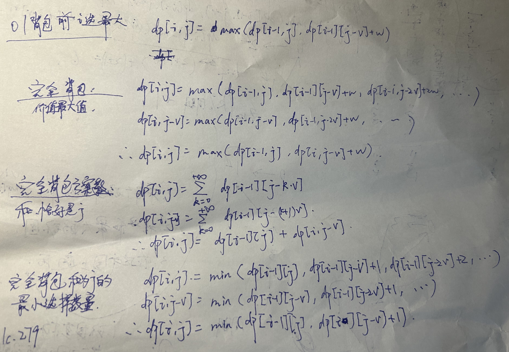

- [494. 目标和](https://leetcode.cn/problems/target-sum/)  [代码](https://leetcode.cn/problems/target-sum/solutions/2119041/jiao-ni-yi-bu-bu-si-kao-dong-tai-gui-hua-s1cx/)  包含空间优化  

  > 给你一个非负整数数组 `nums` 和一个整数 `target` 。
  >
  > 向数组中的每个整数前添加 `'+'` 或 `'-'` ，然后串联起所有整数，可以构造一个 **表达式** ：
  >
  > - 例如，`nums = [2, 1]` ，可以在 `2` 之前添加 `'+'` ，在 `1` 之前添加 `'-'` ，然后串联起来得到表达式 `"+2-1"` 。
  >
  > 返回可以通过上述方法构造的、运算结果等于 `target` 的不同 **表达式** 的数目。

  01背包、第二维枚举最大上下界

  ```
  class Solution:
      def findTargetSumWays(self, nums: List[int], target: int) -> int:
          n = len(nums)
          dp = [[0]*(2001) for _ in range(n+1)]
          dp[-1][0] = 1
          for i in range(n):
              for j in range(-1000,1001):
                  dp[i][j] = dp[i-1][j-nums[i]] + dp[i-1][j+nums[i]]
          return dp[n-1][target]
  ```

- [518. 零钱兑换 II](https://leetcode.cn/problems/coin-change-ii/)

  完全背包求方案数

  ```
  class Solution:
      def change(self, amount: int, coins: List[int]) -> int:
          n = len(coins)
          dp = [0]*(amount+1)
          dp[0] = 1
          for i in range(n):
              for j in range(coins[i],amount+1):
                  dp[j] += dp[j-coins[i]]
          return dp[amount]
  ```

  

- [279. 完全平方数](https://leetcode.cn/problems/perfect-squares/)

  > 给你一个整数 `n` ，选择一些个完全平方数（ans个），使得和是n，求ans的最小值 。
  >
  > 输入：n = 12
  > 输出：3 
  > 解释：12 = 4 + 4 + 4

  完全背包求选法的最少选择个数

  一维写法如下：

  ```
  class Solution:
      def numSquares(self, n: int) -> int:
          nums = [-1]
          i = 1
          while i ** 2 <= n:
              nums.append(i ** 2)
              i += 1
          nn = len(nums)-1
          dp = [inf]*(n+1)
          dp[0] = 0
  
          for i in range(1,nn+1):
              for j in range(n+1):
                  if nums[i]<=j:
                      dp[j] = min(dp[j],dp[j-nums[i]]+1)
          return dp[n]
  ```

  暴力写法：

  ```
  class Solution:
      def numSquares(self, n: int) -> int:
          nums = []
          i = 1
          while i ** 2 <= n:
              nums.append(i ** 2)
              i += 1
          nn = len(nums)
          dp = [[inf] * (n + 1) for _ in range(nn)]
          for i in range(nn):
              dp[i][0] = 0
          for i in range(nn):
              for j in range(1, n + 1):
                  if i == 0:
                      if j % nums[i] == 0:
                          dp[i][j] = j // nums[i]
                          continue
                  dp[i][j] = dp[i - 1][j]
                  for k in range(j // nums[i] + 1):
                      dp[i][j] = min(dp[i][j], dp[i - 1][j - k * nums[i]] + k)
          return dp[nn - 1][n]
  ```

- [322. 零钱兑换](https://leetcode.cn/problems/coin-change/)  [代码](https://leetcode.cn/problems/coin-change/solutions/2119065/jiao-ni-yi-bu-bu-si-kao-dong-tai-gui-hua-21m5/)  包含空间优化 

  > 给你一个整数数组 `coins` ，表示不同面额的硬币；以及一个整数 `amount` ，表示总金额。
  >
  > 计算并返回可以凑成总金额所需的 **最少的硬币个数** 。如果没有任何一种硬币组合能组成总金额，返回 `-1` 。
  >
  > 你可以认为每种硬币的数量是无限的。

  完全背包求方案的最少选择个数

  推公式（本题和上一题279. 完全平方数一模一样）

  二维写法如下：

  ```
  class Solution:
      def coinChange(self, coins: List[int], amount: int) -> int:
          n = len(coins)
          dp = [[inf]*(amount+1) for _ in range(n+1)]
          dp[-1][0] = 0
          for i in range(n):
              for j in range(amount+1):
                  dp[i][j] = dp[i-1][j]
                  if j-coins[i]>=0:
                      dp[i][j] = min(dp[i][j],dp[i][j-coins[i]]+1)
          ans = dp[n-1][amount]
          return ans if ans!=inf else -1
  ```

- [416. 分割等和子集](https://leetcode.cn/problems/partition-equal-subset-sum/)

  > 给你一个 **只包含正整数** 的 **非空** 数组 `nums` 。请你判断是否可以将这个数组分割成两个子集，使得两个子集的元素和相等。

  01背包问题，`dp[i][j]表示前i个数中选，和是j的方案是否存在（True和False）`

  这题只需要检查是否存在一个方案的和是sum(nums)//2

  ```
  class Solution:
      def canPartition(self, nums: List[int]) -> bool:
          n = len(nums)
          s = sum(nums)
          if s%2:
              return False
          target = s//2
          dp = [False]*(target+1)
          dp[0] = True
          for i in range(n):
              for j in range(target,nums[i]-1,-1):
                  dp[j] |= dp[j-nums[i]]
          return dp[target]
  ```

  

###  [最长公共子序列 LCS](https://www.bilibili.com/video/BV1TM4y1o7ug/)  

- [1143. 最长公共子序列](https://leetcode.cn/problems/longest-common-subsequence/)  [代码](https://leetcode.cn/problems/longest-common-subsequence/solutions/2133188/jiao-ni-yi-bu-bu-si-kao-dong-tai-gui-hua-lbz5/)  包含空间优化  

  不需要初始值？

  思考：

  - `当s[i]!=t[j]时，不需要dp[i-1][j-1]`
  - `当s[i]==t[j]时，不需要dp[i-1][j]、dp[i][j-1]`

  ```
  class Solution:
      def longestCommonSubsequence(self, text1: str, text2: str) -> int:
          n1 = len(text1)
          n2 = len(text2)
          dp = [[0]*(n2+1) for _ in range(n1+1)]
  
          for i in range(n1):
              for j in range(n2):
                  dp[i][j] = max(dp[i-1][j],dp[i][j-1])
                  if text1[i]==text2[j]:
                      dp[i][j] = max(dp[i][j],dp[i-1][j-1]+1)
          return dp[n1-1][n2-1]
  ```

  

- [72. 编辑距离](https://leetcode.cn/problems/edit-distance/)  [代码](https://leetcode.cn/problems/edit-distance/solutions/2133222/jiao-ni-yi-bu-bu-si-kao-dong-tai-gui-hua-uo5q/)  包含空间优化

  ```
  class Solution:
      def minDistance(self, word1: str, word2: str) -> int:
          n1,n2 = len(word1),len(word2)
          dp = [[inf]*(n2+1) for _ in range(n1+1)]
          for i in range(n1):
              dp[i][-1] = i+1
          for i in range(n2):
              dp[-1][i] = i+1
          # 这题不适合用python写
          dp[-1][-1] = 0
          for i in range(n1):
              for j in range(n2):
                  dp[i][j] = min(dp[i-1][j],dp[i][j-1])+1
                  if word1[i]==word2[j]:
                      dp[i][j] = min(dp[i][j],dp[i-1][j-1])
                  else:
                      dp[i][j] = min(dp[i][j],dp[i-1][j-1]+1)
          return dp[n1-1][n2-1]
  ```

- [583. 两个字符串的删除操作](https://leetcode.cn/problems/delete-operation-for-two-strings/)
- [712. 两个字符串的最小ASCII删除和](https://leetcode.cn/problems/minimum-ascii-delete-sum-for-two-strings/)
- [1458. 两个子序列的最大点积](https://leetcode.cn/problems/max-dot-product-of-two-subsequences/)
- [97. 交错字符串](https://leetcode.cn/problems/interleaving-string/)

###   [最长递增子序列 LIS](https://www.bilibili.com/video/BV1ub411Q7sB/) 

- [300. 最长递增子序列](https://leetcode.cn/problems/longest-increasing-subsequence/)  [代码](https://leetcode.cn/problems/longest-increasing-subsequence/solution/jiao-ni-yi-bu-bu-si-kao-dpfu-o1-kong-jia-4zma/)  包括贪心二分 + $O(1)$ 空间 

- [1626. 无矛盾的最佳球队](https://leetcode.cn/problems/best-team-with-no-conflicts/)  [代码](https://leetcode.cn/problems/best-team-with-no-conflicts/solution/zui-chang-di-zeng-zi-xu-lie-cong-on2-dao-ojqu/)  *课后作业 

  > 假设你是球队的经理。对于即将到来的锦标赛，你想组合一支总体得分最高的球队。球队的得分是球队中所有球员的分数 **总和** 。
  >
  > 然而，球队中的矛盾会限制球员的发挥，所以必须选出一支 **没有矛盾** 的球队。如果一名年龄较小球员的分数 **严格大于** 一名年龄较大的球员，则存在矛盾。同龄球员之间不会发生矛盾。
  >
  > 给你两个列表 `scores` 和 `ages`，其中每组 `scores[i]` 和 `ages[i]` 表示第 `i` 名球员的分数和年龄。请你返回 **所有可能的无矛盾球队中得分最高那支的分数** 。
  >
  > 2027

  LIS好题

  第一维枚举下标

  自定义复杂排序规则：根据age排序，找score的最长上升子序列

  ```
  class Solution:
      def bestTeamScore(self, scores: List[int], ages: List[int]) -> int:
          n = len(scores)
          idx = list(range(n))
          idx.sort(key = lambda x:(ages[x],scores[x]))
          dp = [-inf]*n
          ans = -inf
          for i in range(n):
              idxi = idx[i]
              dp[i] = scores[idxi]
              for j in range(i):
                  idxj = idx[j]
                  if scores[idxj]<=scores[idxi]:
                      dp[i] = max(dp[i],dp[j]+scores[idxi])
              ans = max(ans,dp[i])
          return ans
  ```

- [673. 最长递增子序列的个数](https://leetcode.cn/problems/number-of-longest-increasing-subsequence/)

- [1964. 找出到每个位置为止最长的有效障碍赛跑路线](https://leetcode.cn/problems/find-the-longest-valid-obstacle-course-at-each-position/)

- [1671. 得到山形数组的最少删除次数](https://leetcode.cn/problems/minimum-number-of-removals-to-make-mountain-array/)

  > 我们定义 `arr` 是 **山形数组** 当且仅当它满足：
  >
  > - `arr.length >= 3`
  > - 存在某个下标 i（从 0 开始） 满足 0 < i < arr.length - 1，且：
  >   - `arr[0] < arr[1] < ... < arr[i - 1] < arr[i]`
  >   - `arr[i] > arr[i + 1] > ... > arr[arr.length - 1]`
  >
  > 给你整数数组 `nums` ，请你返回将 `nums` 变成 **山形状数组** 的 **最少** 删除次数。

  LIS好题
  求前缀LIS、后缀LIS

  注意：LIS长度必须大于1才能更新ans

  ```
  class Solution:
      def minimumMountainRemovals(self, nums: List[int]) -> int:
          n = len(nums)
          dp = [0]*(n+1)
          for i in range(n):
              dp[i] = 1
              for j in range(i):
                  if nums[j]<nums[i]:
                      dp[i] = max(dp[i],dp[j]+1)
          dp2 = [0]*(n+1)
          ans = 0
          for i in range(n-1,-1,-1):
              dp2[i] = 1
              for j in range(i+1,n,1):
                  if nums[j]<nums[i]:
                      dp2[i] = max(dp2[i],dp2[j]+1)
              if dp[i]>1 and dp2[i]>1:
                  ans = max(ans,dp[i]+dp2[i]-1)
          return n-ans
  ```

  

- [354. 俄罗斯套娃信封问题](https://leetcode.cn/problems/russian-doll-envelopes/)

  

###  [状态机 DP](https://www.bilibili.com/video/BV1ho4y1W7QK/) 

- [122. 买卖股票的最佳时机 II](https://leetcode.cn/problems/best-time-to-buy-and-sell-stock-ii/)  [代码](https://leetcode.cn/problems/best-time-to-buy-and-sell-stock-ii/solution/shi-pin-jiao-ni-yi-bu-bu-si-kao-dong-tai-o3y4/)    

  > 给你一个整数数组 `prices` ，其中 `prices[i]` 表示某支股票第 `i` 天的价格。
  >
  > 在每一天，你可以决定是否购买和/或出售股票。你在任何时候 **最多** 只能持有 **一股** 股票。你也可以先购买，然后在 **同一天** 出售。
  >
  > 返回 *你能获得的 **最大** 利润* 。

  

  

  ```
  class Solution:
      def maxProfit(self, prices: List[int]) -> int:
          n = len(prices)
          dp = [[-inf]*2 for _ in range(n+1)]
          dp[-1][0] = 0
          for i in range(n):
              dp[i][0] = max(dp[i-1][0],dp[i-1][1]+prices[i])
              dp[i][1] = max(dp[i-1][1],dp[i-1][0]-prices[i])
          return dp[n-1][0]
  ```

- [309. 最佳买卖股票时机含冷冻期](https://leetcode.cn/problems/best-time-to-buy-and-sell-stock-with-cooldown/)  [代码](https://leetcode.cn/problems/best-time-to-buy-and-sell-stock-with-cooldown/solution/shi-pin-jiao-ni-yi-bu-bu-si-kao-dong-tai-0k0l/)   

  > 给定一个整数数组`prices`，其中第 `prices[i]` 表示第 `*i*` 天的股票价格 。
  >
  > 设计一个算法计算出最大利润。在满足以下约束条件下，你可以尽可能地完成更多的交易（多次买卖一支股票）:
  >
  > - 卖出股票后，你无法在第二天买入股票 (即冷冻期为 1 天)。
  >
  > **注意：**你不能同时参与多笔交易（你必须在再次购买前出售掉之前的股票）。

  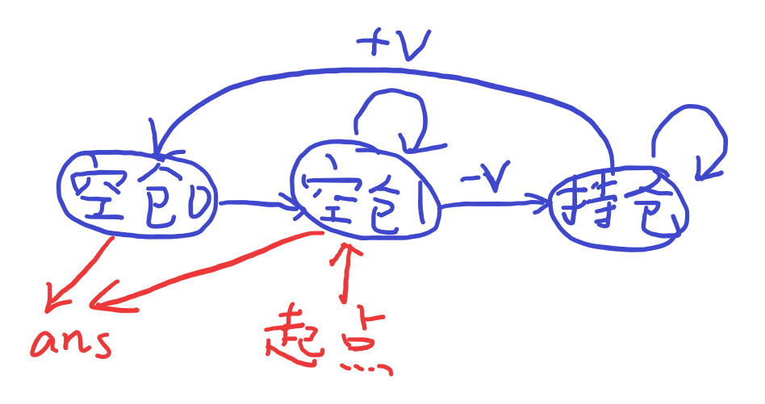

  ```
  class Solution:
      def maxProfit(self, prices: List[int]) -> int:
          n = len(prices)
          dp = [[-inf]*3 for _ in range(n+1)]
          dp[-1][1] = 0
          for i in range(n):
              dp[i][0] = dp[i-1][2]+prices[i]
              dp[i][1] = max(dp[i-1][1],dp[i-1][0])
              dp[i][2] = max(dp[i-1][2],dp[i-1][1]-prices[i])
          return max(dp[n-1][0],dp[n-1][1])
  ```

- [188. 买卖股票的最佳时机 IV](https://leetcode.cn/problems/best-time-to-buy-and-sell-stock-iv/)  [代码](https://leetcode.cn/problems/best-time-to-buy-and-sell-stock-iv/solution/shi-pin-jiao-ni-yi-bu-bu-si-kao-dong-tai-kksg/)  变形：恰好/至少 

  > 给你一个整数数组 `prices` 和一个整数 `k` ，其中 `prices[i]` 是某支给定的股票在第 `i` 天的价格。
  >
  > 设计一个算法来计算你所能获取的最大利润。你最多可以完成 `k` 笔交易。也就是说，你最多可以买 `k` 次，卖 `k` 次。
  >
  > **注意：**你不能同时参与多笔交易（你必须在再次购买前出售掉之前的股票）。
  >
  > 困难

  这题初始化要想清楚

  从前-1个中选任意k个的空仓情况的最大值都是0

  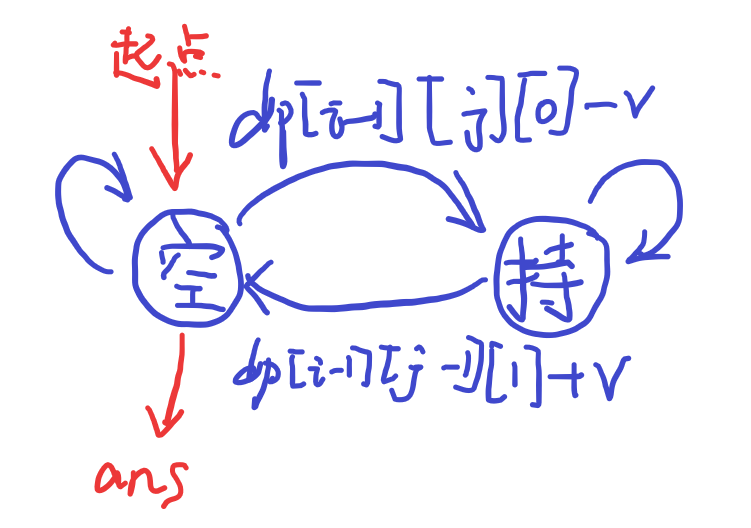

  ```
  class Solution:
      def maxProfit(self, k: int, prices: List[int]) -> int:
          n = len(prices)
          dp = [[[-inf]*2 for __ in range(k+2)] for _ in range(n+1)]
          # dp[i][j][0]、dp[i][j][1]
          for i in range(k+2):
              dp[-1][i][0] = 0
          for i in range(n):
              for j in range(0,k+1):
                  dp[i][j][0] = max(dp[i-1][j][0],dp[i-1][j-1][1]+prices[i])
                  dp[i][j][1] = max(dp[i-1][j][1],dp[i-1][j][0]-prices[i])
          # print(dp)
          return dp[n-1][k][0]
  ```

- [121. 买卖股票的最佳时机](https://leetcode.cn/problems/best-time-to-buy-and-sell-stock/)

  > 给定一个数组 `prices` ，它的第 `i` 个元素 `prices[i]` 表示一支给定股票第 `i` 天的价格。
  >
  > 你只能选择 **某一天** 买入这只股票，并选择在 **未来的某一个不同的日子** 卖出该股票。设计一个算法来计算你所能获取的最大利润。
  >
  > 返回你可以从这笔交易中获取的最大利润。如果你不能获取任何利润，返回 `0` 。
  >
  > `1 <= prices.length <= 105`

  ```
  class Solution:
      def maxProfit(self, prices: List[int]) -> int:
          mi = prices[0]
          ans = 0
          for x in prices:
              ans = max(ans,x-mi)
              mi = min(mi,x)
          return ans
  ```

- [123. 买卖股票的最佳时机 III](https://leetcode.cn/problems/best-time-to-buy-and-sell-stock-iii/)

- [714. 买卖股票的最佳时机含手续费](https://leetcode.cn/problems/best-time-to-buy-and-sell-stock-with-transaction-fee/)

- [1911. 最大子序列交替和](https://leetcode.cn/problems/maximum-alternating-subsequence-sum/)

###  [区间 DP](https://www.bilibili.com/video/BV1ho4y1W7QK/) 

- [516. 最长回文子序列](https://leetcode.cn/problems/longest-palindromic-subsequence/)  [代码](https://leetcode.cn/problems/longest-palindromic-subsequence/solution/shi-pin-jiao-ni-yi-bu-bu-si-kao-dong-tai-kgkg/)  包含空间优化  

- [1039. 多边形三角剖分的最低得分](https://leetcode.cn/problems/minimum-score-triangulation-of-polygon/)  [代码](https://leetcode.cn/problems/minimum-score-triangulation-of-polygon/solution/shi-pin-jiao-ni-yi-bu-bu-si-kao-dong-tai-aty6/)   

- [1771. 由子序列构造的最长回文串的长度](https://leetcode.cn/problems/maximize-palindrome-length-from-subsequences/)  [代码](https://leetcode.cn/problems/maximize-palindrome-length-from-subsequences/solution/shi-pin-qiao-miao-zhuan-huan-516-bian-xi-jhrt/)  *课后作业  

- [1000. 合并石头的最低成本](https://leetcode.cn/problems/minimum-cost-to-merge-stones/)  [代码](https://leetcode.cn/problems/minimum-cost-to-merge-stones/solution/tu-jie-qu-jian-dpzhuang-tai-she-ji-yu-yo-ppv0/)  *课后作业

###   [树形 DP - 直径系列](https://www.bilibili.com/video/BV17o4y187h1/)  

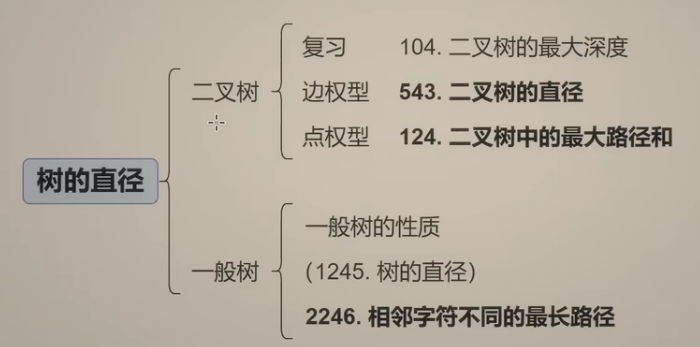

- 树的直径：等价于两个节点之间路径长度的最大值。

  看到**求树中满足条件的两个节点的最大距离，就是树的直径的树形dp**

- [543. 二叉树的直径](https://leetcode.cn/problems/diameter-of-binary-tree/)  [代码](https://leetcode.cn/problems/diameter-of-binary-tree/solution/shi-pin-che-di-zhang-wo-zhi-jing-dpcong-taqma/)    

  > 给你一棵二叉树的根节点，返回该树的 **直径** 。
  >
  > 二叉树的 **直径** 是指树中任意两个节点之间最长路径的 **长度** 。这条路径可能经过也可能不经过根节点 `root` 。
  >
  > 两节点之间路径的 **长度** 由它们之间边数表示。

  求二叉树直径

  ```
  class Solution:
      def diameterOfBinaryTree(self, root: Optional[TreeNode]) -> int:
          ans = 0
          def dfs(i):
              if i is None:
                  return 0
              l = dfs(i.left) 
              r = dfs(i.right)
              nonlocal ans
              ans = max(ans,l+r)
              return max(l,r)+1
          dfs(root)
          return ans
  ```

- [1245. 树的直径](https://leetcode.cn/problems/tree-diameter/)（会员题）

  > 给你一棵**树**的根节点，返回该树的 **直径** 。
  >
  > **树**的 **直径** 是指树中任意两个节点之间最长路径的 **长度** 。这条路径可能经过也可能不经过根节点 `root` 
  >
  > 两节点之间路径的 **长度** 由它们之间边数表示。
  >
  > 1792

  树的直径

  - 写法1：求最大、次大值

    ```
            # 返回节点i向下的一条合法链的最大长度（边的长度）
            def dfs(i,fa):
                mx1,mx2 = 0,0
                for j in e[i]:
                	if j==fa:
                		continue
                    res = dfs(j,i)+1
                    if res >= mx1:
                    	mx2 = mx1
                    	mx1 = res
                    elif res > mx2:
                    	mx2 = res
                nonlocal ans
                ans = max(ans,mx1+mx2)
                return mx1 
    ```

    

  - 写法2：**递推更新最大值**

    只使用一个变量，保存上一轮的最大值，再和当前轮次的值取和，更新ans

    ```
    		def dfs(i,fa):
                mx = 0
                nonlocal ans
                for j in e[i]:
                	if j==fa:
                		continue
                    res = dfs(j)+1
                    ans = max(ans,mx + res) # 最大值+次大值会被包含在这里
                    mx = max(mx,res)
                return mx
    ```

    > 这个递推的使用例子参考下方题目：[2538. 最大价值和与最小价值和的差值]

- [124. 二叉树中的最大路径和](https://leetcode.cn/problems/binary-tree-maximum-path-sum/)  [代码](https://leetcode.cn/problems/binary-tree-maximum-path-sum/solution/shi-pin-che-di-zhang-wo-zhi-jing-dpcong-n9s91/)   

  > 二叉树中的 **路径** 被定义为一条节点序列，序列中每对相邻节点之间都存在一条边。同一个节点在一条路径序列中 **至多出现一次** 。该路径 **至少包含一个** 节点，且不一定经过根节点。
  >
  > **路径和** 是路径中各节点值的总和。
  >
  > 给你一个二叉树的根节点 `root` ，返回其 **最大路径和** 。

  点权型求直径

  这题和543. 二叉树的直径思路完全一样，不同点是这里是考虑节点的val，对于负数的点权，可以直接返回0表示不选负数的点

  ```
  class Solution:
      def maxPathSum(self, root: Optional[TreeNode]) -> int:
          ans = -inf
          # dfs(i)返回从i开始向下的路径的最大和（i可以不选，最小返回0）
          def dfs(i):
              if i is None:
                  return 0
              l,r = dfs(i.left),dfs(i.right)
              nonlocal ans 
              ans = max(ans,l+r+i.val)
              return max(max(l,r)+i.val,0)
          dfs(root)
          return ans
  ```

- [2246. 相邻字符不同的最长路径](https://leetcode.cn/problems/longest-path-with-different-adjacent-characters/)  [代码](https://leetcode.cn/problems/longest-path-with-different-adjacent-characters/solution/by-endlesscheng-92fw/)   

  > 给你一棵 **树**（即一个连通、无向、无环图），根节点是节点 `0` ，这棵树由编号从 `0` 到 `n - 1` 的 `n` 个节点组成。用下标从 **0** 开始、长度为 `n` 的数组 `parent` 来表示这棵树，其中 `parent[i]` 是节点 `i` 的父节点，由于节点 `0` 是根节点，所以 `parent[0] == -1` 。
  >
  > 另给你一个字符串 `s` ，长度也是 `n` ，其中 `s[i]` 表示分配给节点 `i` 的字符。
  >
  > 请你找出路径上任意一对相邻节点都没有分配到相同字符的 **最长路径** ，并返回该路径的长度。
  > 2126

  求满足条件的树的直径的最大长度

  边权型求树直径

  细节：要先dfs子节点j，再判断是否合法，否则会遗漏情况

  思路：求出每个节点向下的最大边长度、次大边长度，两者之和更新ans，dfs返回最大长度

  易错点：本题由于parent[0]=-1，初始化邻接表时不能把0也算进去，否则会死循环

  ```
  class Solution:
      def longestPath(self, parent: List[int], s: str) -> int:
          n = len(parent)
          e = [[] for _ in range(n)]
          for i in range(1,n):
              e[parent[i]].append(i)
          ans = 0
          # 返回节点i向下的一条合法链的最大长度（边的长度）
          def dfs(i):
              mx1,mx2 = 0,0
              for j in e[i]:
                  res = dfs(j)+1
                  # 当j不满足条件时，就无法连成一个合法的链，满足则更新
                  if s[j]!=s[i]:
                      if res >= mx1:
                          mx2 = mx1
                          mx1 = res
                      elif res > mx2:
                          mx2 = res
              nonlocal ans
              ans = max(ans,mx1+mx2)
              return mx1 
          dfs(0)
          # 由于需要返回节点的个数，所以需要边数+1
          return ans+1
  ```

  

- [687. 最长同值路径](https://leetcode.cn/problems/longest-univalue-path/)  [代码](https://leetcode.cn/problems/longest-univalue-path/solution/shi-pin-che-di-zhang-wo-zhi-jing-dpcong-524j4/)  *课后作业  

  > 给定一个二叉树的 `root` ，返回 *最长的路径的长度* ，这个路径中的 *每个节点具有相同值* 。 这条路径可以经过也可以不经过根节点。
  >
  > **两个节点之间的路径长度** 由它们之间的边数表示。

  边权型求二叉树直径

  ```
  class Solution:
      def longestUnivaluePath(self, root: Optional[TreeNode]) -> int:
          ans = 0
          def dfs(i):
              if i is None:
                  return -1 # 叶子节点正好是0
              l,r = dfs(i.left)+1,dfs(i.right)+1
              nonlocal ans
              if i.left and i.left.val!=i.val:
                  l = 0
              if i.right and i.right.val!=i.val:
                  r = 0
              ans = max(ans,l+r)
              return max(l,r)
          dfs(root)
          return ans
  ```

  

- [1617. 统计子树中城市之间最大距离](https://leetcode.cn/problems/count-subtrees-with-max-distance-between-cities/)  [代码](https://leetcode.cn/problems/count-subtrees-with-max-distance-between-cities/solution/tu-jie-on3-mei-ju-zhi-jing-duan-dian-che-am2n/)  *课后作业  

  > 给你 `n` 个城市，编号为从 `1` 到 `n` 。同时给你一个大小为 `n-1` 的数组 `edges` ，其中 `edges[i] = [ui, vi]` 表示城市 `ui` 和 `vi` 之间有一条双向边。题目保证任意城市之间只有唯一的一条路径。换句话说，所有城市形成了一棵 **树** 。
  >
  > 一棵 **子树** 是城市的一个子集，且子集中任意城市之间可以通过子集中的其他城市和边到达。两个子树被认为不一样的条件是至少有一个城市在其中一棵子树中存在，但在另一棵子树中不存在。
  >
  > 对于 `d` 从 `1` 到 `n-1` ，请你找到城市间 **最大距离** 恰好为 `d` 的所有子树数目。
  >
  > 请你返回一个大小为 `n-1` 的数组，其中第 `d` 个元素（**下标从 1 开始**）是城市间 **最大距离** 恰好等于 `d` 的子树数目。
  >
  > **请注意**，两个城市间距离定义为它们之间需要经过的边的数目。
  >
  > - `2 <= n <= 15`
  > - `edges.length == n-1`
  >
  > ```
  > 输入：n = 4, edges = [[1,2],[2,3],[2,4]]
  > 输出：[3,4,0]
  > 解释：
  > 子树 {1,2}, {2,3} 和 {2,4} 最大距离都是 1 。
  > 子树 {1,2,3}, {1,2,4}, {2,3,4} 和 {1,2,3,4} 最大距离都为 2 。
  > 不存在城市间最大距离为 3 的子树。
  > ```
  >
  > 2309

  指数型枚举 + 树的最大直径（边权型）

  细节：需要特判子树是否合法

  ```
  class Solution:
      def countSubgraphsForEachDiameter(self, n: int, edges: List[List[int]]) -> List[int]:
          e = [[] for _ in range(n)]
          for a,b in edges:
              e[a-1].append(b-1)
              e[b-1].append(a-1)
          vis = [-1]*n
          ans = [0]*(n-1)
          def dfs(i):
              if i==n:
                  # 确定了一种子树的情况
                  # 下面计算这棵子树的直径
                  start = -1
                  for i in range(n):
                      if vis[i]:
                          start = i
                  if start == -1:
                      return
                  res = 0
                  # cnt记录枚举到的所有节点的个数
                  cnt = 0
                  # 计算当前子树的直径
                  def dfs_mx(i,fa):
                      nonlocal cnt
                      cnt += 1
                      mx1,mx2 = 0,0
                      for j in e[i]:
                          if j != fa and vis[j]==1:
                              t = dfs_mx(j,i)+1
                              if t >= mx1:
                                  mx2 = mx1
                                  mx1 = t
                              elif t > mx2:
                                  mx2 = t
                      nonlocal res
                      res = max(res,mx1+mx2)
                      return mx1
                  dfs_mx(start,-1)
                  nonlocal ans
                  # 如果cnt!=sum(vis)，就表示该子树不连通
                  if res and cnt==sum(vis):
                      ans[res-1] += 1
                  return
              vis[i] = 0
              dfs(i+1)
              vis[i] = 1
              dfs(i+1)
          dfs(0)
          return ans
  ```

  

- [2538. 最大价值和与最小价值和的差值](https://leetcode.cn/problems/difference-between-maximum-and-minimum-price-sum/)  [代码](https://leetcode.cn/problems/difference-between-maximum-and-minimum-price-sum/solution/by-endlesscheng-5l70/)  *课后作业 

  > 给你一个 `n` 个节点的无向无根图，节点编号为 `0` 到 `n - 1` 。给你一个整数 `n` 和一个长度为 `n - 1` 的二维整数数组 `edges` ，其中 `edges[i] = [ai, bi]` 表示树中节点 `ai` 和 `bi` 之间有一条边。
  >
  > 每个节点都有一个价值。给你一个整数数组 `price` ，其中 `price[i]` 是第 `i` 个节点的价值。
  >
  > 一条路径的 **价值和** 是这条路径上所有节点的价值之和。
  >
  > 你可以选择树中任意一个节点作为根节点 `root` 。选择 `root` 为根的 **开销** 是以 `root` 为起点的所有路径中，**价值和** 最大的一条路径与最小的一条路径的差值。
  >
  > 请你返回所有节点作为根节点的选择中，**最大** 的 **开销** 为多少。
  >
  > 2398

  点权型求树的最大路径

  需要使用递推更新最大值的树形dp写法

  有难度，需要分类讨论(不好想)

  - 思路：

    由于点权都是正数，所以最小值路径就是一个节点的路径。对于枚举到节点i，考虑选不选叶子节点，dfs需要返回两个值，第一个值是选择叶子节点的最大值，第二个值是不选的最大值

    所以问题变成：求树的所有直径中，删除了一个叶子节点的最大值？

    情况1：选择当前路径最大值（包含叶子节点） + 前面轮次的路径最大值（不选叶子节点）

    情况2：选择当前路径最大值（不包含叶子节点） + 前面轮次的路径最大值（选叶子节点）

  ```
  class Solution:
      def maxOutput(self, n: int, edges: List[List[int]], price: List[int]) -> int:
          e = [[] for _ in range(n)]
          for a,b in edges:
              e[a].append(b)
              e[b].append(a)
          ans = 0
          # 返回节点i下去包含、不包含叶子节点的最大值
          def dfs(i,fa):
              x = price[i]
              mx_contains,mx_un = x,0
              for j in e[i]:
                  if j!=fa:
                      mx1,mx2 = dfs(j,i)
                      nonlocal ans
                      # 注意这里不需要+x
                      ans = max(ans,mx1+mx_un,mx2+mx_contains)
                      mx_contains = max(mx_contains,mx1+x)
                      mx_un = max(mx_un,mx2+x)
              return mx_contains,mx_un
          dfs(0,-1)
          return ans
  ```

  

###  [树形 DP - 最大独立集](https://www.bilibili.com/video/BV1vu4y1f7dn/) 

最大独立集：从图中选择一些点，使得这些点不相邻，使得点权和最大

如何由子问题算出原问题，是树形dp思考的出发点

- [337. 打家劫舍 III](https://leetcode.cn/problems/house-robber-iii/)  [代码](https://leetcode.cn/problems/house-robber-iii/solution/shi-pin-ru-he-si-kao-shu-xing-dppythonja-a7t1/)  

  树形dp，树上打家劫舍，返回2个值

- [1377. T 秒后青蛙的位置](https://leetcode.cn/problems/frog-position-after-t-seconds/)  [代码](https://leetcode.cn/problems/frog-position-after-t-seconds/solution/dfs-ji-yi-ci-you-qu-de-hack-by-endlessch-jtsr/)  *课后作业   

  预处理到达每个点的最早时间

  分情况讨论

  >  思考题：如果有多个目标位置呢？

- [2646. 最小化旅行的价格总和](https://leetcode.cn/problems/minimize-the-total-price-of-the-trips/)  [代码](https://leetcode.cn/problems/minimize-the-total-price-of-the-trips/solution/lei-si-da-jia-jie-she-iii-pythonjavacgo-4k3wq/)  *课后作业

  树上打家劫舍 + （树上差分/DFS ）

- [P1352 没有上司的舞会](https://www.luogu.com.cn/problem/P1352)

  经典树形dp

### 树形 DP - 监控二叉树

[968. 监控二叉树](https://leetcode.cn/problems/binary-tree-cameras/)

> 给定一个二叉树，我们在树的节点上安装摄像头。
>
> 节点上的每个摄影头都可以监视**其父对象、自身及其直接子对象。**
>
> 计算监控树的所有节点所需的最小摄像头数量。

树形dp+状态机

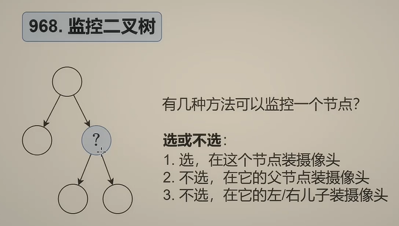

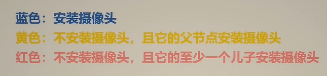

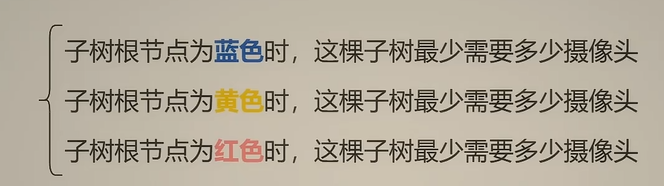

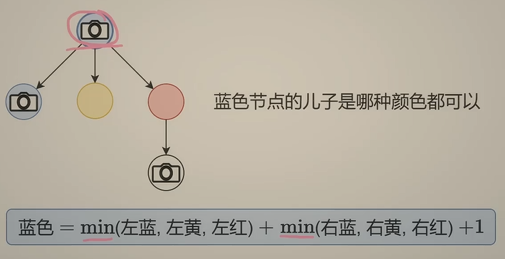

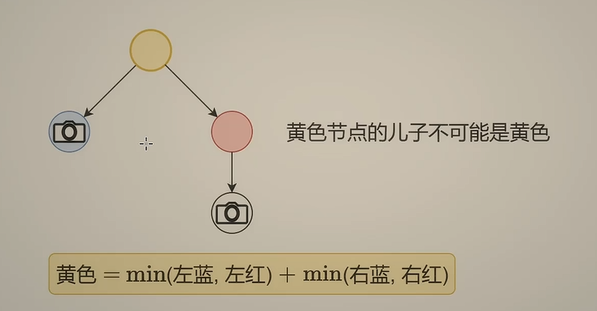

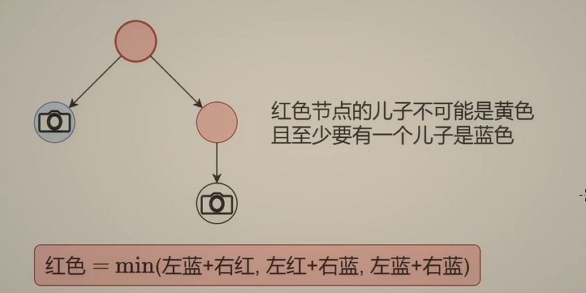

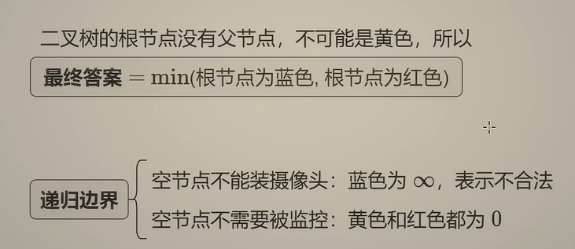

初始化的时候要将**空节点**作为边界初始化，而不是叶子节点，如果选择叶子节点，那么空节点也需要初始化，会增加代码量，所以树的初始化边界是空节点而不是叶子节点

```
class Solution:
    def minCameraCover(self, root: Optional[TreeNode]) -> int:
        # 树形dp+状态机
        # 每个节点只有三种状态：
        # 1.choose表示u被安装摄像头；
        # 2.by_fa表示u被父节点监控，不按摄像头；
        # 3.by_son表示u被子节点监控，不按摄像头
        def dfs(u):
            # 初始化：当是空节点时，无法被监控，也无需被监控
            if u is None:
                return inf,0,0
            l_choose,l_byfa,l_byson = dfs(u.left)
            r_choose,r_byfa,r_byson = dfs(u.right)
            # 当u被安上摄像头，子节点可按可不按
            choose = min(l_choose,l_byfa,l_byson) + min(r_choose,r_byfa,r_byson)+1
            # 当u被父节点监控，子节点不存在被父节点监控的情况
            byfa = min(l_choose,l_byson) + min(r_choose,r_byson)
            # 当u被子节点监控，至少有一个子节点的状态是choose，并且子节点没有被父节点监控的状态
            byson = min(l_choose+r_choose,l_choose+r_byson,l_byson+r_choose)
            return choose,byfa,byson
        choose, _, by_son = dfs(root)
        return min(choose,by_son)
```


变形1

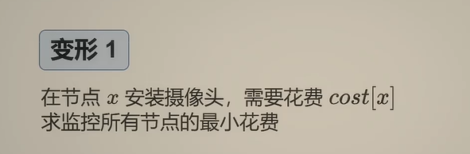

把代码里的+1改成加cost[x]即可

变形2

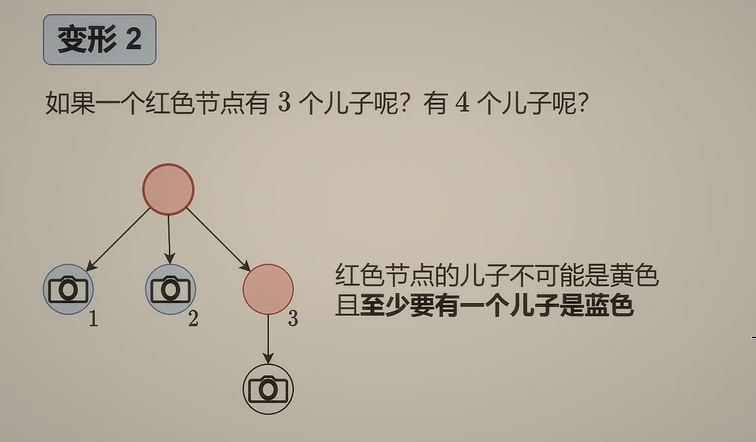

如果有多个儿子，我们在计算红色节点（by_son）的时候，要保证至少有一个被放置了摄像头的子节点，如果有n个儿子，那么就有2^n-1个情况，我们需要枚举所有的情况？？？其实不用，可以化简这个公式

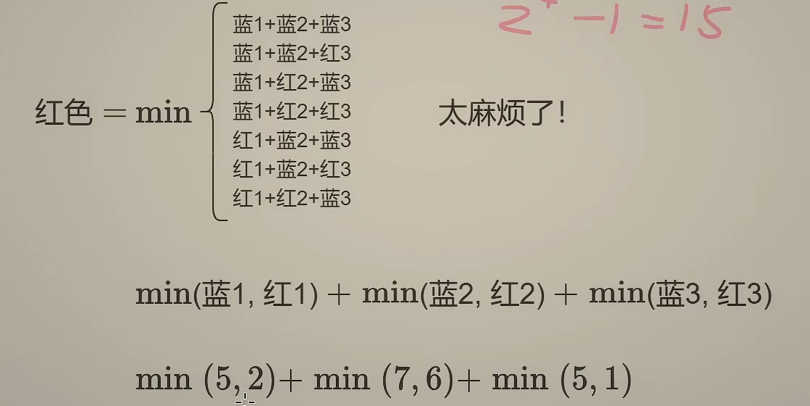

切入点：如果没有“至少选择一个蓝色节点”这个条件，式子就是求每个子节点的最小值再求和，上图所示。那么如何改才能计算出我们要的“至少选择一个蓝色节点”的情况呢，将其中一个红色节点改成蓝色节点，比如将2改成5，或者将6改成7，或者将1改成5，再看看到底选哪个蓝色的情况，其实就是选择：蓝色-红色的最小值。ps：如果最小值是负数，代表至少有一个最小值是蓝色的，所以不考虑，就和0取最大值即可。看下图，由于三个颜色的状态之间可以相互化简，可以再进行转化。

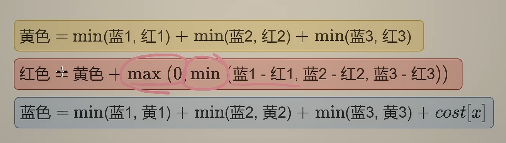

课后作业： 

保安站岗 https://www.luogu.com.cn/problem/P2458 

保安站岗 Python 代码 https://www.luogu.com.cn/paste/y9iiynzw 

LCP34. 二叉树染色（选做） https://leetcode.cn/problems/er-cha-shu-ran-se-UGC/ 

LCP64. 二叉树灯饰（选做） https://leetcode.cn/problems/U7WvvU/