模板笔记

空间最大开到5e7

## 板子

### 快读

下面这个板子才是真正有用的（在蓝桥杯有用）

- 读入数字：用StreamTokenizer，先nextToken，再st.nval拿到值
- 读字符串：用BufferedReader，用readLine读。
- 如果数字和字符混读，那么在每一个数字读完再读String的时候要多用一个nextLine读入回车符

```java
class Read{
	StreamTokenizer st = new StreamTokenizer(new BufferedReader(new InputStreamReader(System.in)));
	BufferedReader reader = new BufferedReader(new InputStreamReader(System.in));
	public int nextInt() throws Exception{
		st.nextToken();
		return (int) st.nval;
	}
	
	public double nextDouble() throws Exception{
		st.nextToken();
		return st.nval;
	}
	
	public long nextLong() throws Exception{
		st.nextToken();
		return (long)st.nval;
	}
	
	public String nextLine() throws Exception{
		return reader.readLine();
	}
}
```

> 在蓝桥杯中，1e5数据量的输入需要用快读才能拿下更多的分

### 快写

println很慢，执行1e5次println需要1秒，执行1e6次print需要1秒，所以当输出超过1e6就要用快写

```
PrintWriter out = new PrintWriter(new OutputStreamWriter(System.out));
//......
out.flush();
```


### 取模

处理负数的模是负数的问题，可以让负数的模是正数

```java
	static int getMod(int a,int mod) {
		return (a%mod + mod)%mod;
	}
```

### 快速幂

```java
public class Main {
  static long qpow(long a,long b,long mod){
    long res = 1;
    while(b>0){
      if((b&1)==1) res *= a;
      b >>= 1;
      a *= a;
      res %= mod;
      a %= mod;
    }
    return res;
  }

//ps:用long来存，里面有乘法，会爆int的，即使题目里面的输入是int的。
```


## 模拟

### 日期

```java
static int[] d = {0,31,30,31,30,31,30,31,31,30,31,30,31};

static int nextDay(int n) {
	int year = n/10000;
	int mon = n%10000/100;
	int day = n%100;
	
	//判断闰年，确定2月有多少天
	if(year%4==0 && year%100!=0 || year%400==0) 
		d[2] = 29;
	else d[2] = 28;
		
	//计算
	day++;
	if(day>d[mon]) {
		mon++;
		day = 1;
	}
	if(mon>12) {
		mon = 1;
		year++;
	}
	return year*10000+mon*100+day;
}

//从开始日期枚举到结束日期
for(int i=from;i<=to;i=nextDay(i)) {
    if(check(i))
        ans++;
}
```


## 基础算法

### 整数二分

- 模板1：寻找左边界

  找左边界——>找左区间——> r = mid，从而mid那里不需要+1，else里面就是l = mid+1;

  找左边界——>找左区间——>check中的mid一定在x的右边，mid>x

  ```java
  	int l = 1,r = n;
  	while(l<r) {
          int mid = (l+r)>>1;
          if(check(mid)) r=mid;
          else l = mid+1;
      }
  	return l;
  ```

- 模板2：寻找右边界

  找右边界——>找右区间——> l = mid，从而mid那里需要+1，else里面就是r = mid-1;

  找右边界——>找右区间——>check中的mid一定在x的左边，mid<x

  ```java
      int l = 1,r = n;
      while(l<r) {
          int mid = (l+r+1)>>1;
          if(check(mid)) l=mid;
          else r = mid-1;
      }
      return l;
  ```

- 二分步骤

  - 1.搞清楚这题用二分找到什么？比如求第一个mid满足mid > x
  - 2.是求左边界还是右边界，如果是左边界就是求左区间，那么check后面就是r=mid
  - 3.check函数就能写出来了（由2知道了左区间还是右区间，如果是求左区间，那么mid一定就在右区间）
  - 4.根据2就能知道mid的结果是否需要+1

- 注意点：

  - 二分一定有答案，一定会返回一个值，但是这个值不一定满足题意，所以要特判最后返回的l是否满足题意
  - if(check(mid))后面的语句不是l=mid就是r=mid，不存在l=mid+1这种情况。答案包含在这个范围内
  - 

  

#### lowerBound、upperBound

```java
//找到nums中第一个大于x的数的下标
static int upperBound(int[] nums,int l,int r,int x) {
	while(l<r) {
		int mid = l+r>>1;
		if(nums[mid]>x) r=mid;
		else l = mid +1;
	}
	return l;//这里返回的nums[l]不一定满足题意，还需要特判
}
//找到nums中第一个大于等于x的数的下标
static int lowerBound(int[] nums,int l,int r,int x) {
    while(l<r) {
        int mid = l+r>>1;
        if(nums[mid]>=x) r=mid;
        else l = mid +1;
    }
    return l;//这里返回的nums[l]不一定满足题意，还需要特判
}
```

#### 二分寻找左右边界

```java
//寻找升序数组arr中[l,r]中值为x的左边界（第一个x）下标
static int findLeft(int l,int r,int x) {
    while(l<r) {
        int mid = (l+r)>>1;
        if(arr[mid]>=x) r=mid;
        else l = mid+1;
    }
    return arr[l]==k?l:-1;//return l;
}
//寻找升序数组arr中[l,r]中值为x的右边界（最后一个x）下标
static int findRight(int l,int r,int x) {
    while(l<r) {
        int mid = (l+r+1)>>1;
        if(arr[mid]<=x) l=mid;
        else r = mid-1;
    }
    return arr[l]==k?l:-1;//return l;
}
```

作者：weiambt
链接：https://www.acwing.com/activity/content/code/content/5425322/
来源：AcWing
著作权归作者所有。商业转载请联系作者获得授权，非商业转载请注明出处。

#### 二分的传参写法

在上面的lowerBound、upperBound函数中，我们最后还需要自己判断一下最后一个状态是否合法？如果用开区间的写法我们就不需要最后特判。见下文

比如要在[l,r]的时候二分，那么我在调用二分函数的时候，是这样`lower_bound(l,r)`调吗？不推荐，推荐使用`lower_bound(l,r+1)`（找右边）或者`lower_bound(l-1,r)`（找左边）的方式，见下文。不是第一种方式不能做，也能做，但是二分完要自己再进行处理，比较麻烦。

- 对于闭区间的传参写法（左闭右闭），二分是要一定有答案的，这里我们最后要自己特判最后一个位置是否合法。y总的都是这个写法
- 对于开区间的传参写法（左闭右开、左开有闭），我们不需要特判，因为开区间的那个地方，就是不满足的位置。

用库函数都是开区间的方式传参，如果用闭区间的方式传参，库函数我们无法在函数里判断，只能在外面判断，最后需要自己转化，就比较麻烦，所以如果图方便，可以在掉库函数的时候用自己将闭区间转成开区间传参，比如找右边，[i,n-1]中找，调用库函数就传参lower_bound(i+1,n)


### 浮点数二分

浮点数二分没有边界的问题、也没有取整的问题

例子：下面是二分计算三次方根

```java
static double find(double l,double r,double x) {
    while(r-l>1e-6) {//保留6位小数，取决于题目
        double  mid = (l+r)/2;
        if(mid*mid*mid >= x) r = mid;
        else l = mid;//不用+1
    }
    return l;
}
//ps:最后要对l保留小数才能看到正确答案
System.out.printf("%.6f",l);
```


### 秦九韶算法

- 将n进制下的数x转换成10进制下的数

```java
    //将k进制下的数s转换成十进制数
	static int sum(char[] s,int k) {
        int res = 0;
        for(int i=0;i<s.length;i++) {
            res = res * k + s[i]-'0';
        }
        return res;
    }
```

- 求等比数列求和（O（n））

  例如求：1+p^1+p^2+...p^k

### 单调栈

- 题目背景

  寻找左边（右边）离他最近的比它大/小的数

- 原理

  单调性（下例是找比它小的值）

  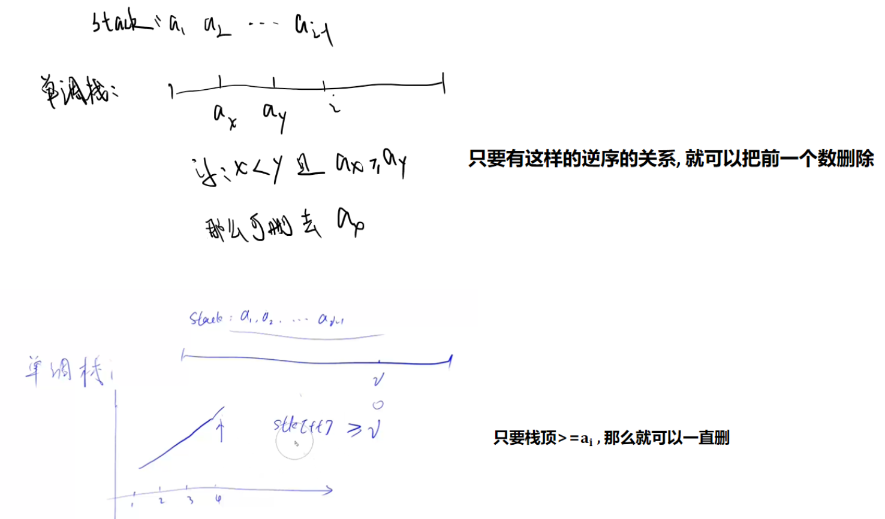

- 算法

  找左边离他最近的比他小的数：栈中元素升序（栈顶大的出栈）

  找左边离他最近的比他大的数：栈中元素降序（栈顶小的出栈）

  当栈为空时，表示找不到满足要求的，计算ans，将该值加入栈中

- 时间复杂度

  O（n）,暴力算法是O（n^2）

- 模板（寻找左边离他最近的比它小的）

  ```c++
  stack<int> st;
  int main(){
      int n;
      cin>>n;
      while(n--){
          int x;
          cin>>x;
          while(st.size() && st.top()>=x) st.pop();
          if(st.size()) cout<<st.top()<<" ";
          else cout<<"-1 ";
          st.push(x);
      }
      return 0;
  }
  ```

  

- 例题

  acwing830

  lc901

  lc907. 子数组的最小值之和(单调栈+数学)

### 单调队列

有难度！

- 题目背景：滑动窗口，计算一个大小为k的滑动窗口的实时的最大（最小）值

- 思路

  和单调栈一样，都是具有相同的单调性，比如：当找窗口内的最小值时，队列中是保持升序的。

  > 那么就是把队尾的比它大的值全部出队
  >
  > 具体思路：https://www.acwing.com/activity/content/code/content/1134199/

- 例题

  acwing154滑动窗口


## 数据结构

- - -

​      

### 前缀和

> 前缀和和差分数组都是从下标1开始

```java
//初始化
sum[i] = sum[i-1] + arr[i];

//求和arr的[a,b]的和
sum[b] - sum[a-1];
```

- 下标从1开始方便

#### 二维前缀和

```java
	//1、初始化
	for(int i=1;i<=n;i++) 
   	 	for(int j=1;j<=m;j++) {
        	s[i][j] = sc.nextInt();
        	s[i][j] += s[i-1][j]+s[i][j-1]-s[i-1][j-1];
    	}
    
   //2.求和：求（x1,y1）和(x2,y2)中间的子矩形的和
   System.out.println(s[x2][y2]-s[x1-1][y2]-s[x2][y1-1]+s[x1-1][y1-1]);
```

- 下标从1开始方便

### 差分

> 前缀和的逆运算

作用：能够以O（1）的时间修改一个区间的值

原数组sum，差分数组chafen

```java
//初始化
for(int i = 1;i<=n;i++) {
    arr[i] = sc.nextInt();
    chafen[i] = arr[i] - arr[i-1];
}

//操作一：对于原数组sum中的[l,r]中的值+v（这是离线操作，实际上sum没有被更新）
static void add(int l,int r,int v){
    chafen[l]+=v;
    chafen[r+1]-=v;
}

//操作二：计算最终结果（数组的最终值）
for(int i=1;i<=n;i++) 
    sum[i] = sum[i-1] + chafen[i];

//差分原理
chafen[i] = sum[i] - sum[i-1]
    
//最终数组的原理(修改结束后)
sum[i] = chafen[1] + chafen[2] + ... + chafen[i]

```

- 思考
  - 差分数组第一个元素是a，后面元素全0：代表原数组的值都是a
  - 特殊的，差分数组中元素全0：代表原数组全0
  - chafen[i]会对sum[i+3]的值影响，要想把sum[i+3]降到0，就要先把chafen[i]降成0


#### 二维差分

```java
	原理：和二维前缀和一样的公式
	
	1.初始化：
	for(int i=1;i<=n;i++) 
        for(int j=1;j<=m;j++) {
            s[i][j] = sc.nextInt();
            chafen[i][j] = s[i][j] - s[i-1][j] - s[i][j-1] + s[i-1][j-1];
    }
    
    2.在（x1,y1）和(x2,y2)中间的子矩形中的所有元素都加c
                chafen[x1][y1] += c;
                chafen[x1][y2+1] -= c;
                chafen[x2+1][y1] -= c;
                chafen[x2+1][y2+1] += c;
                
    3、计算最终数组
    for(int i=1;i<=n;i++) {
        for(int j=1;j<=m;j++) {
            s[i][j] = s[i-1][j] + s[i][j-1] - s[i-1][j-1] + chafen[i][j];
            System.out.print(s[i][j]+" ");
        }
        System.out.println();
    }
```


### 离散化

- 如果一个数组，他的值域的范围很大，比如上界减下界的值大于1e8，但是数组的长度只有1e5，通常需要使用离散化，这类题目需要用把数组转化成只保留相对关系的离散化数组。

- 比如，arr = {33,88,44,111}，可以转换成：w = {1,3,2,4};

- 方法就是对arr排序，并保留下标，最后把下标位置上的数换成排名.

- 步骤
  - 1.排序
  - 2.去重
  - 3.二分寻找

- 严谨模版

  ```java
  	//计算离散化数组O（nlogn）
  	static Integer[] solve(int[] t,int sz) {
  		TreeSet<Integer> se = new TreeSet<Integer>();
  		for(int i=1;i<=sz;i++)
  			se.add(t[i]);
          Integer[] order = se.toArray(new Integer[0]);
   		return order;
  	}
  
  	//二分找离散后的值
  	static int find(int x){
  	    int l = 0,r = idx-1;
  	    while(l<r){
  	        int mid = l+r+1>>1;
  	        if(order[mid]<=x) l = mid;
  	        else r = mid-1;
  	    }
  	    return l;
  	}
  
  	//二分，或者用arr[i]的时候查一下离散值
  		find(a[i]);
  ```

  

- 不严谨模版模板（适用于所有数都不同的情况）

```java
   //初始化结构体数组
    Node[] arr = new Node[N];
    for(int i=1;i<=n;i++){
        arr[i] = new Node(nums[i],i);
    }
    //排序
    Arrays.sort(arr,1,n+1,(a,b)->a.val-b.val);
    //用排名代替值
    for(int i=1;i<=n;i++){
        w[arr[i].id] = i;
    }

    class Node{
        int val,id;//id是下标位置
        Node(int val,int id){
            this.val = val;
            this.id = id;
        }
    }
```

#### 前缀和离散化

> AcWing 802区间和：https://www.acwing.com/activity/content/code/content/6437889/

求区间和。

用treemap

- 本题就是前缀和，唯一的不同是数据范围，数组的下标是-1e9~1e9，不能用连续的数组去存储，需要离散化存储，java中用treemap作为离散化的前缀和数组，需要对下标排序，从而计算前缀和。

- 计算ketSet拿到所有的key，从而计算前一个位置的map值，

- 此外，所有的查询下标l,r也需要初始化在map中，否则就无法计算。这样map的最大值就要开到3e5，keys数组要这么大

- 查询的时候，需要返回l前一个key的值，而不是简单的l-1，所以需要用到treemap的api：lowerEntry(key),得到小于key的最大的key对应的实体

```
		//输入
		for(int i=1;i<=n;i++) {
            int idx = sc.nextInt();
            int val = sc.nextInt();
            mp.put(idx,mp.getOrDefault(idx, 0)+val);
        }
		//查询的区间初始化到map中
        for(int i=0;i<m;i++) {
            int l = sc.nextInt();
            int r = sc.nextInt();
            q[i][0] = l;q[i][1] = r;
            mp.put(l, mp.getOrDefault(l, 0));
            mp.put(r, mp.getOrDefault(r, 0));
        }
        //拿到所有用到的下标
        Integer[] keys =  mp.keySet().toArray(new Integer[1]);
        for(int i=1;i<keys.length;i++) {
            mp.put(keys[i],mp.get(keys[i])+mp.get(keys[i-1]));//前缀和
        }

        for(int i=0;i<m;i++) {
            int l = q[i][0];
            int r = q[i][1];
            if(l==keys[0])
//              System.out.println(mp.ceilingEntry(r).getValue());//可以这么写
                System.out.println(mp.get(r));
            else
//              System.out.println(mp.get(r)-mp.get(l-1));//不能这么写！！！
                System.out.println(mp.get(r)-mp.lowerEntry(l).getValue());

        }
```


### 堆

堆是二叉树的结构，我们要利用堆实现以下五个操作：

1. 插入一个数
2. 求集合最值
3. 删除最值
4. 删除任意元素
5. 修改任意元素

前三个操作可以采用STL直接实现，然而后两个就不行了。

堆删除最后一层之后是一个完全二叉树，我们以小根堆为例。

#### 双堆找中位数

- 题意：P1168 中位数。给定一个长度为 *N* 的非负整数序列 A，对于前奇数项求中位数。

- 思路首先记录一个变量mid，记录答案（中位数）。建立两个堆，一个大根堆一个小根堆，大根堆≤mid的数，小根堆存 >mid的的数。所以我们向堆中加入元素时，就通过与m**i**d的比较，选择加入哪一个堆。但我们在输出答案前需要对mid进行调整，如果**小根堆和大根堆内元素相同**，就无需处理，此时mid仍然是当前的中位数。如果两个堆中元素个数不同，那我们就需要进行调整。**具体是把元素个数较多的堆的堆顶作为mid，上一次的mid加入元素较少的堆。**

> 参考：https://www.luogu.com.cn/blog/zy-E/p1168-zhong-wei-shuo


### 字典树Tire

作用：高效的进行字符串存储和查询（也可以用来存二进制，参考题：最大异或对）

- 一棵26叉树，每个节点的二十六个孩子分别代表是否存在，存在就是>0的数，不存在就是0
- 根节点是0，如果son数组的值是0表示这个点不存在，每一个新的点都是 >= 1。
- N是所有字符串的长度和（s1.len + s2.len + ...）的最大值
- 时间复杂度O（字符串的最大长度）
```java
        static int N = 101000;//所有字符串的长度和（s1.len + s2.len + ...）的最大值
		static int[][] son = new int[N][26];
		//son[i][k] = j表示：节点i的下一个位置存放的字符是k的节点索引是j
		static int[] cnt = new int[N];
		static int idx = 0;
		
		//插入一个字符串
		static void insert(char[] str) {
			int p=0;//字典树指针，初始时指向根节点0
			for(int i=0;i<str.length;i++) {
				int u = str[i]-'a';
				if(son[p][u]==0) //如果是0，就代表这个节点不存在，那么创建一个
                    son[p][u]= ++idx;
				p = son[p][u];
			}
			cnt[p]++;
		}
		
		//查询字符串str出现的次数
		static int query(char[] str) {
			int p = 0;
			for(int i=0;i<str.length;i++) {
				int u = str[i]-'a';
				if(son[p][u]==0) return 0;
				p = son[p][u];
			}
			return cnt[p];
		}
		参考：https://www.acwing.com/activity/content/code/content/725149/
```

### 并查集

```java
	//存放父节点（祖先节点）
	static int[] p = new int[N];
	//找到x的祖先节点（路径压缩）
	static int find(int x) {
        if(x==p[x]) return x;
        return p[x] = find(p[x]);
    }

	//初始化
	for(int i=1;i<=n;i++) 
        p[i]=i;//每个节点都是根节点
	//操作1：合并
	p[find(a)]=find(b);
	//操作2：查询
	if(find(a)==find(b))//在同一个集合中
        
```

### 分块思想

https://www.lanqiao.cn/courses/38752/learning/?id=2690843&compatibility=false

解决的问题：区间修改、区间求和、区间求和、在线问题、懒标记

用区间分块的思想，进行优化的策略（和线段树主要思想完全一样）。

分块的缺点是渐进意义的复杂度O(n * sqrt(n) )，相较于线段树和树状数组不够好。

- 分块和[线段树](https://so.csdn.net/so/search?q=线段树&spm=1001.2101.3001.7020)的区别在于
  - **分块算法可以维护一些线段树维护不了的东西**，例如单调队列等，
  - **线段树能维护的东西必须能够进行信息合并**，而分块则不需要。 
  - 不过，它们也有共同点，分块和线段树一样，分块需要支持**类似标记合并**的东西。  
  - 分块的时间O(n√n)，而线段树O(nlogn)
  - 线段树是递归实现的，分块是循环

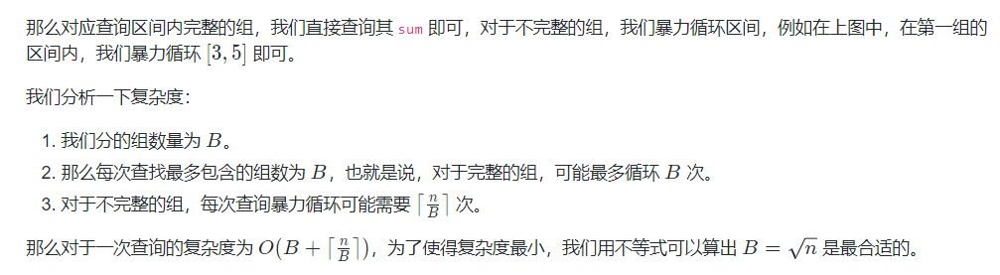

模板：

- 单点修改、区间查询

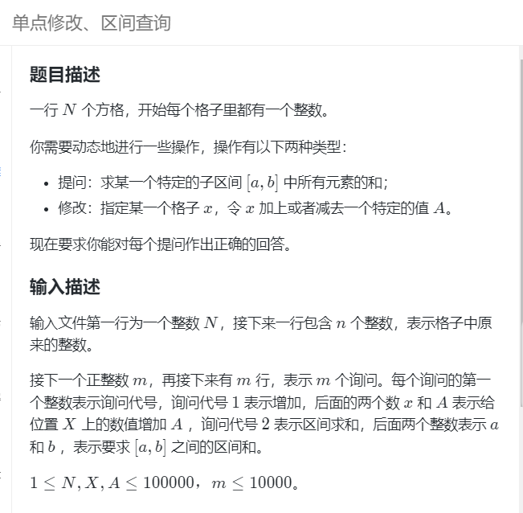

```
import java.util.Scanner;

public class Main {
  static int N = 101000;
  static long[] a = new long[N];
  static long[] sum = new long[N];
  
  //a[idx]表示原数组a下标idx的值
  //sum[id]表示组号id下所有元素和
  //zusz 表示组的大小：组内元素个数
  //zucnt 表示组的个数
  //zuid[idx]表示数组a下标idx处属于哪个组
  //zul[idx]表示数组a下标idx处属于的组的左边界
  //zur[idx]表示数组a下标idx处属于的组的右边界
  
  static int[] zuid = new int[N],zul = new int[N], zur = new int[N];
  static int zusz, zucnt;
    static int n,m;

    static void init(){
      zusz = (int)Math.sqrt(n) + 1;
      
      for(int i=1;i <= n;i += zusz){
        zucnt += 1;

        for(int j=i;j<=i+zusz-1;j++){
          sum[zucnt] += a[j];
          zuid[j] = zucnt;
          zul[j] = i;
          zur[j] = Math.min(i+zusz-1,n);
        }
      }
    }
    public static void main(String[] args) {
        Scanner sc = new Scanner(System.in);
        
        n = sc.nextInt();
        for(int i=1;i<=n;i++)
          a[i] = sc.nextInt();
        init();
        m = sc.nextInt();
        while(m-->0){
          int op = sc.nextInt();
          int x = sc.nextInt();
          int y = sc.nextInt();
          if(op==1){//增加
            a[x] += y;
            sum[zuid[x]] += y;
          }else{//区间求和
            long res = 0;
            if(zuid[x] == zuid[y]){//如果是一组，要单独处理，否则WA
                for(int i = x;i <= y;i++)
                    res += a[i];
            }else{
                for(int i = zuid[x]+1;i < zuid[y];i++)
                    res += sum[i];
                for(int i=x;i<=zur[x];i++)
                    res += a[i];
                for(int i=zul[y];i<=y;i++)
                    res += a[i];
            }
            
            System.out.println(res);
          }
        }
          

    }
}
```

- 区间修改、区间求和


多了一个懒标记（永久化标记，不会被清空），但是这里的懒标记比线段树简单，是静态的懒标记，不会被清空，因为分块是可以操作**原数组**的，不需要在每一次查询时恢复懒标记，

```
import java.util.Scanner;

public class Main {
  static int N = 101000;
  static long[] a = new long[N];
  static long[] sum = new long[N];
  
  //a[idx]表示原数组a下标idx的值
  //sum[gid]表示组号gid下所有元素和
  //zusz 表示组的大小：组内元素个数
  //zucnt 表示组的个数
  //zuid[idx]表示数组a下标idx处属于哪个组
  //zul[idx]表示数组a下标idx处属于的组的左边界
  //zur[idx]表示数组a下标idx处属于的组的右边界

  //zulazy[gid]表示组号gid的懒标记
  
  static int[] zuid = new int[N],zul = new int[N], zur = new int[N],zulazy = new int[N];
  static int zusz, zucnt;
    static int n,m;

    static void init(){
      zusz = (int)Math.sqrt(n) + 1;
      
      for(int i=1;i <= n;i += zusz){
        zucnt += 1;

        for(int j=i;j<=i+zusz-1;j++){
          sum[zucnt] += a[j];
          zuid[j] = zucnt;
          zul[j] = i;
          zur[j] = Math.min(i+zusz-1,n);
        }
      }
    }

    public static void main(String[] args) {
        Scanner sc = new Scanner(System.in);
        
        n = sc.nextInt();
        m = sc.nextInt();
        for(int i=1;i<=n;i++)
          a[i] = sc.nextInt();
        init();
        
        while(m-->0){
          int op = sc.nextInt();
          int x = sc.nextInt();
          int y = sc.nextInt();
          if(op==1){//区间增加
            int v = sc.nextInt();
            if(zuid[x] == zuid[y]){
                for(int i = x;i <= y;i++){
                  a[i] += v;
                  sum[zuid[i]] += v;
                } 
            }else{
                //完整区间加标记
                for(int i = zuid[x]+1;i < zuid[y];i++){
                  sum[i] += zusz * v;
                  zulazy[i] += v;
                }
                //不完整的暴力加
                for(int i=x;i<=zur[x];i++){
                  a[i] += v;
                  sum[zuid[i]] += v;
                } 
                for(int i=zul[y];i<=y;i++){
                  a[i] += v;
                  sum[zuid[i]] += v;
                }        
            }

          }else{//区间求和
            long res = 0;
            if(zuid[x] == zuid[y]){//如果是一组，要单独处理，否则WA
                for(int i = x;i <= y;i++)
                    res += a[i]+zulazy[zuid[i]];
            }else{
                for(int i = zuid[x]+1;i < zuid[y];i++)
                    res += sum[i];
                for(int i=x;i<=zur[x];i++)
                    res += a[i]+zulazy[zuid[i]];
                for(int i=zul[y];i<=y;i++)
                    res += a[i]+zulazy[zuid[i]];
            }
            
            System.out.println(res);
          }
        }
          

    }
}
```


### 树状数组

解决哪些问题

- 单点修改、区间查询
  - 求和
  - 最大值（只能查前缀最大值，不能查区间最大值）
- 区间修改，单点查询
  - 求和（差分树状数组）
- 区间修改，区间查询
  - 求和（维护2个差分树状数组）
- 权值树状数组
  - logn时间统计比x小的数的个数

#### 单点修改、区间查询

两个操作（一维数组）

- 单点修改：修改某个位置上的数的值：O（logn）
- 区间求和：求一个区间前缀和：O（logn）

树状数组：

```
C[x] = sum(x-lowbit(x) , x] #左开右闭
```

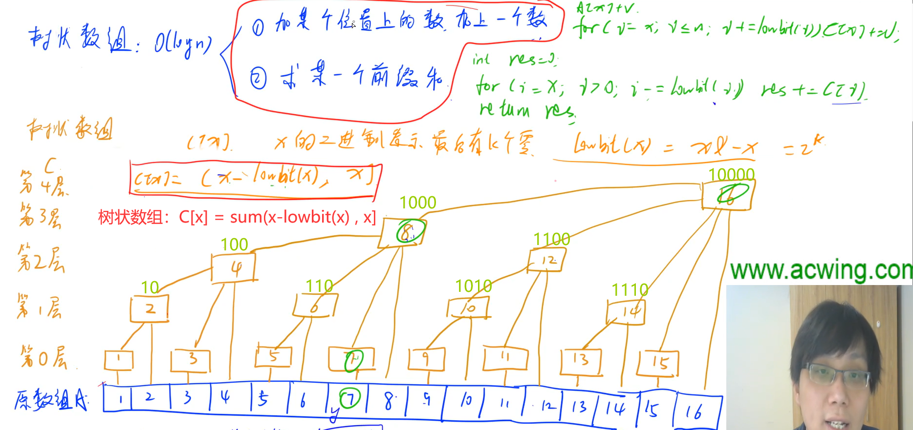

> 普通前缀和虽然是O（1）的，但是一旦修改了某一个元素后，计算前缀和的时间复杂度就是O（n）了
>
> 普通前缀和是离线的，树状数组是在线的。（树状数组是根据下标的二进制后面有几个0进行划分层数的，比如3的二进制有0个0，那么就在最底层）
>
> ​										添加元素                        求和
>
> 普通前缀和：					O（1）						O（n）
>
> 树状数组：						O（logn）                  O（logn）

**模板**

- 树状数组下标从1开始的

```java
	//原数组:arr,树状数组：tree,=
 	static int lowbit(int x) {
		return x&-x;
	}
	//在arr[idx]的值添加v
	static void add(int idx,int v) {
        //arr[idx] += v;//如果将idx变成v
		for(int i=idx;i<=n;i+=lowbit(i)) 
			tree[i]+=v;
	}
	//计算arr[1~x]的和
	static int sum(int idx) {
		int res = 0;
		for(int i=idx;i>0;i-=lowbit(i)) 
			res += tree[i];
		return res;
	}

	static int query(int l,int r){
        return sum(r)-sum(l-1);
    }

	//初始化,如果初始是0不需要初始化
	for(int i=1;i<=n;i++)
		add(i,arr[i]);

	//arr[idx]的值添加y
	add(idx,y);

	//计算[x,y]前缀和
	query(x,y)

	//arr[idx]修改成y
    add(idx,y-arr[idx]);
```

#### 权值树状数组

- 树状数组下标是值域（计算左边小于它的数的个数）

- 关键信息：**树状数组的query(x)操作是计算一个前缀和，如果下标是数组中的元素值，那么刚好就可以logn得到个数。**

- 思路：对于每个arr[i]，每次需要求出左边/右边比它小的数的个数，由于数组长度的限制，而实际数组的值域很大，所以这种思路一般需要进行离散化处理，这样得到的数组的值域就是1<=y<=n，这样就能把值域作为树状数组的下标了。对于树状数组的每一次query,实际上是计算一个前缀和，比如query(x)，返回值就是1~x中小于等于x的数的个数。
- 离散化数组w,保存的相对大小关系，w中存储的数是1~n，这个值域就是作为树状数组的下标
- 此时的tree[i]=j记录的是值为i的数的个数，每一次query(idx)，实际就是找到小于等于idx的数的个数是j（而idx在这里正好是值）

思路参考：https://zhuanlan.zhihu.com/p/93795692

例题：lc315. 计算右侧小于当前元素的个数（树状数组+离散化）

**应用**

- lc315. 计算右侧小于当前元素的个数（树状数组+离散化）
- 计算逆序对的数量（可以用归并排序、也可以用树状数组）：倒着求
- AcWing 241. 楼兰图腾
- AcWing 1215. 小朋友排队（结论+树状数组）

#### 差分树状数组

> 树状数组的变形

##### 区间修改、单点查询

- 树状数组维护差分数组：将原数组a计算出差分数组b，构建树状数组
  
  - 单点求和：ai = b1 + ... + bi
    - 区间修改：b(l) += x; b(r+1) -= x
  
  - 思路：在树状数组上做差分
  
    - 每一次修改[l,r]元素+d,相当于`add(l,d) ,add(r+1,-d)`
    - 每一次查询x处元素的值，相当于`sum(x)`
    - 差分树状数组的初始化
  
  ```java
            for(int i=1;i<=n;i++) {
    			arr[i] = sc.nextInt();
    			add(i,(int)(arr[i]-arr[i-1]));
    		}
  ```
  

##### 区间修改、区间查询

- 方法

  构建一个差分树状数组bi，再构建一个i * bi的树状数组
  
- 思路：推公式

  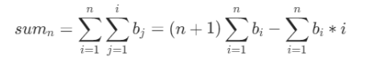
  
- 推导过程

  

- 区间修改 （树状数组）

```

  static long[] tree = new long[N],tree2 = new long[N];
  static int n,m;
  static int lowbit(int x){
    return x&-x;
  }
  static void add(long[] tree,int idx,long v ){
    for(int i=idx;i<=n;i+=lowbit(i))
      tree[i] += v;
  }

  static long sum(long[] tree,int idx){
    long res = 0;
    for(int i=idx;i>0;i-=lowbit(i))
      res += tree[i];
    return res;
  }

  //原数组：区间修改操作
  static void f_add(int l,int r,long v){
    add(tree,l,v);
    add(tree,r+1,-v);
    //i * di数组
    add(tree2,l,(long)l*v);
    add(tree2,r+1,-(long)(r+1)*v);
  }

  //原数组：查询前缀操作
  static long f_sum(int idx){
      return (idx+1) * sum(tree,idx) - sum(tree2,idx);
  }
  //原数组：查询区间操作
  static long f_query(int l,int r){
    return f_sum(r) - f_sum(l-1);
  }
  
  //初始化
		int pre = 0;
        for(int i=1;i<=n;i++){
          int x = sc.nextInt();
          //将差分值插入树状数组
          int chafen = x - pre;
          add(tree,i,chafen);
          add(tree2,i,(long)i*chafen);
          pre = x;
        }
```


#### 前缀最大值

树状数组其实也能维护最大值，但是只能求前缀的最大值，不能求子区间的最大值（因为最大值没有减法）

    //插入一个数，更新最大值
    static void solveMax(int idx,long val) {
        for(int i=idx;i<N;i+=lowbit(i))
            tree[i]= Math.max(tree[i],val);
    }
    
    //计算1~idx中的最大值
    static long maxPre(int idx) {
        long res = 0;
        for(int i=idx;i>0;i-=lowbit(i))
            res = Math.max(res, tree[i]);
        return res;
    }
https://www.acwing.com/activity/content/code/content/6538977/

### 线段树

> 树状数组的扩展，应用场景远大于树状数组


#### 单点修改、区间查询

板子如下

```java
	static int[] w = new int[N];//原数组
	static Node[] tree = new Node[4*N];//线段树数组

	//向上更新，根节点是u
	static void pushup(int u) {
		tree[u].val = tree[u<<1].val + tree[u<<1|1].val;
	}

	//构建线段树函数，根节点u，构建区间[l,r]
	static void build(int u,int l,int r) {
		//叶子节点直接记录权值
		if(l==r) 
			tree[u] = new Node(l, r, w[l]);
		else {
			tree[u] = new Node(l, r, 0);//值先记为0，pushup再更新
			int mid = l+r>>1;
			build(u<<1, l, mid);//构建左子树
			build(u<<1|1, mid+1, r);//构建右子树
			pushup(u);//向上更新val
		}
	}

	//单点修改：给idx位置上的数+v。u代表当前节点
	static void modify(int u,int idx,int v) {
		//遍历到叶子节点就是具体的位置idx
		if(tree[u].l==tree[u].r)
			tree[u].val += v;
		else {
			//判断是在该节点u的左子树还是右子树上
			int mid = tree[u].l + tree[u].r >>1;
			if(idx<=mid) modify(u<<1, idx, v);
			else modify(u<<1|1, idx, v);
			pushup(u);//向上更新,这里非常容易忘记！！！
		}
	}
	
	//计算当前节点u下的在[l,r]范围内的和，u代表当前节点(递归的时候l,r是不变的)
	static int query(int u,int l,int r) {
		//如果区间和val完全包含当前节点，就直接加上
		if(tree[u].l>=l && tree[u].r<=r) 
			return tree[u].val;
		//否则，当前节点的范围一分为二
		int mid = tree[u].l + tree[u].r >>1;
		int sum = 0;//这个参数根据具体题目变化，如果是求和这里就是sum
		//如果左、右区间满足就加上
		if(l <= mid) sum += query(u<<1,l,r);
		if(r >= mid+1) sum += query(u<<1|1, l, r);
		return sum;
	}
	
	

    static class Node{
        int l,r,val;
        public Node(int l,int r,int val) {
            this.l = l;
            this.r = r;
            this.val = val;
        }
    }

//初始化：
build(1,1,n);

//查询[a,b]的结果：
query(1,a,b);

//修改idx位置的值+v
modify(1,idx,v);
```

细节：

- 线段树数组tree是4倍N的区间（N是原数组最大长度）
- pushup是用子节点的信息更新父节点的信息
- build是初始化函数
- query是查询函数（最容易错），参数l和r在递归的时候都是不变的；mid是取树的左右边界的中点而不是l和r的中点；递归的出口是当前节点已经被完全包含就返回val，不是遍历到叶子节点。
- modify函数的mid也是计算树节点的中点，而不是l和r的中点；递归调用左右子树后一定要pushup
- 三个核心函数build，query，modify都是递归调用；只有query有返回值；build、modify都需要pushup


#### 带懒标记的线段树

- 应用场景：区间修改问题

- 描述：如果当修改的不是一个点而是一个区间的时候，使用懒标记能够依然以O（logn）的时间进行。

- 思路：修改[l,r]区间内的数，每次递归遍历到一个节点区间[a,b]，当这个节点的区间[a,b]被[l,r]完全覆盖的时候，为了节约性能，我们直接在这个节点上加上懒标记（相当于记上这笔账），并更新val，然后直接返回。如果后面在进行修改/查询的时候，先进行PushDown，把父节点的账给孩子们算清楚，再去对孩子们进行操作

- 核心思想

  - val属性实时记录节点的最新值，而懒标记lz是记录区间所有数需要加的值（为了不完整区间准备）

  - pushDown方法，用父节点懒标记更新子节点。

    - 当节点是被[l,r]完整的覆盖时，则只更新一下最值val即可，并更新懒标记，O（1）

    - 当需要修改、查询子节点部分区间时，将懒标记向下传递（如果是只要部分区间，那么需要把每个值都更新了）。O（logn）

- 实现细节

  - 单点修改与区间修改的实现**区别**

    - Node多了一个懒标记lz

    - 多了一个函数pushDown

    - build函数不变，只需要Node增加一位度

    - add函数

      函数参数增加了左右下标

      如果是节点被区间全覆盖，就更新val和lz

      否则，先pushdown，再分别检查左右2个区间（之前是只检查一个区间、不是idx了）

    - query函数

      如果是节点不被区间全覆盖，那么先 pushdown

  - 关键点

    - pushDown方法：将父节点的lz给2个子节点，并更新子节点的val，因为子节点的val没有被父节点的lz更新过。最后父节点的lz置空
    - pushDown方法在add、query中使用，在节点不被完全包含的情况下，都需要先被执行pushdown
    - add和query的方法参数：l,r都是一直传下去的，不需要修改

    - pushUp方法在build、add中使用

- 核心操作：

  ```java
  	//向下更新：用父节点的状态更新子节点，把懒标记给儿子节点
  	//把父亲的账给儿子算清
  	static void pushDown(int u) {
  	    //传递懒标记
  		tree[u<<1].add += tree[u].add;
  		tree[u<<1|1].add += tree[u].add;
  		//传递最大值
  		tree[u<<1].val += tree[u].add;
  		tree[u<<1|1].val += tree[u].add;
  		tree[u].add = 0;//清空父节点的标记
  	}
  	    //区间修改：将[l,r]的值都+val
  	static void modify(int u,int l,int r,int val) {
  	    //如果这个节点的区间被完全覆盖，就加上懒标记
  		if(tree[u].l>=l && tree[u].r<=r) {
  			tree[u].add += val;
  			tree[u].val += val;
  		}else {//否则，不被完全覆盖，先把账算清再修改区间，最后更新到父节点
  			pushDown(u);
  			int mid = tree[u].l+tree[u].r>>1;
  			if(mid>=l) modify(u<<1,l,r,val);
  			if(mid+1<=r) modify(u<<1|1,l,r,val);
  			pushUp(u);
  		}
  	}
  	
  	//区间求和
  	static long query(int u,int l,int r) {
  		if(tree[u].l>=l && tree[u].r<=r)
  			return tree[u].val;
  		//先算清账，再求内部的值
  		pushDown(u);
  		long mx = INF;
  		int mid = tree[u].l+tree[u].r>>1;
  		if(l<=mid) mx = Math.min(mx,query(u<<1,l,r));
  		if(mid+1<=r) mx = Math.min(mx,query(u<<1|1,l,r));
  		return mx;
  	}
  ```


##### 区间修改、区间查询（最值）

完整代码：

```java
    class Node{
        int l,r;
        long val;
        long add;//懒标记
        public Node(int l,int r,long val,long add) {
            this.l = l;this.r = r;this.val = val;this.add = add;
        }
    }
	static int[] w = new int[N];
	static Node[] tree = new Node[4*N];
	//向上更新：用子节点的值更新父节点
	static void pushUp(int u) {
		tree[u].val = Math.min(tree[u<<1].val,tree[u<<1|1].val);
	}

	//向下更新：用父节点的状态更新子节点，把懒标记给儿子节点
	//把父亲的账给儿子算清
	static void pushDown(int u) {
	    //传递懒标记
		tree[u<<1].add += tree[u].add;
		tree[u<<1|1].add += tree[u].add;
		//传递最大值
		tree[u<<1].val += tree[u].add;
		tree[u<<1|1].val += tree[u].add;
		tree[u].add = 0;//清空父节点的标记
	}
	static void build(int u,int l,int r) {
		if(l==r) {
			tree[u] = new Node(l,r,w[l],0);
		}else {
			tree[u] = new Node(l, r, 0, 0);
			int mid = l+r>>1;
			build(u<<1,l,mid);
			build(u<<1|1,mid+1,r);
			pushUp(u);
		}
	}

    //区间修改：将[l,r]的值都+val
	static void modify(int u,int l,int r,int val) {
	    //如果这个节点的区间被完全覆盖，就加上懒标记
		if(tree[u].l>=l && tree[u].r<=r) {
			tree[u].add += val;
			tree[u].val += val;
		}else {//否则，不被完全覆盖，先把账算清再修改区间，最后更新到父节点
			pushDown(u);
			int mid = tree[u].l+tree[u].r>>1;
			if(mid>=l) modify(u<<1,l,r,val);
			if(mid+1<=r) modify(u<<1|1,l,r,val);
			pushUp(u);
		}
	}
	
	//区间求和
	static long query(int u,int l,int r) {
		if(tree[u].l>=l && tree[u].r<=r)
			return tree[u].val;
		//先算清账，再求内部的值
		pushDown(u);
		long mx = INF;
		int mid = tree[u].l+tree[u].r>>1;
		if(l<=mid) mx = Math.min(mx,query(u<<1,l,r));
		if(mid+1<=r) mx = Math.min(mx,query(u<<1|1,l,r));
		return mx;
	}
	//初始化
	build(1,1,n);

	//修改[l,r]内的每个数+d
	modify(1, l, r,d);
	
	//查询[l,r]
	query(1, l, n)
				
```

##### 区间修改、区间求和（求和）


```java
class SegTree_lz{
	static int N = 101000;
	static Node[] tree = new Node[4*N];
	
	//向上更新：用子节点的值更新父节点
	static void pushUp(int u) {
		tree[u].val = tree[u<<1].val + tree[u<<1|1].val;
	}
	//向下更新：用父节点的状态更新子节点，把懒标记给儿子节点
	//把父亲的账给儿子算清
	static void pushDown(int u) {
	    //传递懒标记
		tree[u<<1].add += tree[u].add;
		tree[u<<1|1].add += tree[u].add;
		//传递
		tree[u<<1].val += tree[u].add * (tree[u<<1].r-tree[u<<1].l+1);
		tree[u<<1|1].val += tree[u].add * (tree[u<<1|1].r-tree[u<<1|1].l+1);
		tree[u].add = 0;//清空父节点的标记
	}
	static void build(int u,int l,int r) {
		if(l==r) {
			tree[u] = new Node(l,r,w[l],0);
		}else {
			tree[u] = new Node(l,r,0,0);
			int mid = l+r>>1;
			build(u<<1,l,mid);
			build(u<<1|1,mid+1,r);
			pushUp(u);
		}
	}

    //区间修改：将[l,r]的值都+val
	static void modify(int u,int l,int r,int val) {
	    //如果这个节点的区间被完全覆盖，就加上懒标记
		if(tree[u].l>=l && tree[u].r<=r) {
			tree[u].add += val;
			tree[u].val += val*(tree[u].r-tree[u].l+1);
		}else {//否则，不被完全覆盖，先把账算清再修改区间，最后更新到父节点
			pushDown(u);
			int mid = tree[u].l+tree[u].r>>1;
			if(mid>=l) modify(u<<1,l,r,val);
			if(mid+1<=r) modify(u<<1|1,l,r,val);
			pushUp(u);
		}
	}

	//区间求和
	static long query(int u,int l,int r) {
		if(tree[u].l>=l && tree[u].r<=r)
			return tree[u].val;
		//先算清账，再求内部的值
		pushDown(u);
		long res = 0;
		int mid = tree[u].l+tree[u].r>>1;
		if(l<=mid) res += query(u<<1,l,r);
		if(mid+1<=r) res += query(u<<1|1,l,r);
		return res;
	}
	static class Node{
			int l,r;
			long val;
			long add;//懒标记
			public Node(int l,int r,long val,long add) {
					this.l = l;this.r = r;this.val = val;this.add = add;
			}
	}
}
```

#### 板子

##### 求和

```java
//单点修改、区间查询：求和
class SegTree{
  int[] w;
  Node[] tree;
  int n;

  SegTree(int n,int[] ww){
    this.n = n;
    this.w = ww;
    this.tree = new Node[4*(n+1)];

    build(1,1,n);
  }

  void pushUp(int u){
    tree[u].val = tree[u<<1].val + tree[u<<1|1].val;
  }

  void build(int u,int l,int r){
    if(l==r){
      tree[u] = new Node(l,r,w[l]);
    }else{
      tree[u] = new Node(l,r,w[l]);
      int mid = l+r>>1;
      build(u<<1,l,mid);
      build(u<<1|1,mid+1,r);
      pushUp(u);
    }
  }

  void add(int u,int idx,long val){
    if(tree[u].l == tree[u].r) tree[u].val += val;
    else{
      int mid = tree[u].l + tree[u].r >> 1;
      if(idx<=mid) add(u<<1,idx,val);
      else add(u<<1|1,idx,val);
      pushUp(u);
    }
  }

  long query(int u,int l,int r){
    if(tree[u].l >= l && tree[u].r <= r)
      return tree[u].val;
    else{
      int mid = tree[u].l + tree[u].r >>1;
      int s = 0;
      if(mid >= l) s += query(u<<1,l,r);
      if(mid+1 <= r) s += query(u<<1|1,l,r);
      return s;
    }
  }

  class Node{
    int l,r;
    long val;
    public Node(int l,int r,long val) {
      this.l = l;
      this.r = r;
      this.val = val;
    }
  }
}
```


```java
//区间修改、区间查询：求和
class SegTree{
  int[] w;
  Node[] tree;
  int n;

  SegTree(int n,int[] ww){
    this.n = n;
    this.w = ww;
    this.tree = new Node[4*(n+1)];

    build(1,1,n);
  }

  void pushUp(int u){
    tree[u].val = tree[u<<1].val + tree[u<<1|1].val;
  }

  void pushDown(int u){
    long lazy = tree[u].lz;
    tree[u<<1].lz += lazy;
    tree[u<<1|1].lz += lazy;
    tree[u<<1].val += lazy * (tree[u<<1].r - tree[u<<1].l+1);
    tree[u<<1|1].val += lazy * (tree[u<<1|1].r - tree[u<<1|1].l+1);
    tree[u].lz = 0;
  }

  void build(int u,int l,int r){
    if(l==r){
      tree[u] = new Node(l,r,w[l],0);
    }else{
      tree[u] = new Node(l,r,0,0);
      int mid = l+r>>1;
      build(u<<1,l,mid);
      build(u<<1|1,mid+1,r);
      pushUp(u);
    }
  }

  void add(int u,int l,int r,long val){
    if(tree[u].l >= l && tree[u].r <= r){
      tree[u].val += val * (tree[u].r - tree[u].l+1);
      tree[u].lz += val;
    }else{
      pushDown(u);
      int mid = tree[u].l + tree[u].r >> 1;
      if(l<=mid) add(u<<1,l,r,val);
      if(mid+1<=r) add(u<<1|1,l,r,val);
      pushUp(u);
    }
  }

  long query(int u,int l,int r){
    if(tree[u].l >= l && tree[u].r <= r)
      return tree[u].val;
    else{
      pushDown(u);
      int mid = tree[u].l + tree[u].r >>1;
      long s = 0;
      if(mid >= l) s += query(u<<1,l,r);
      if(mid+1 <= r) s += query(u<<1|1,l,r);
      return s;
    }
  }

  class Node{
    int l,r;
    long val,lz;
    public Node(int l,int r,long val,long lz) {
      this.l = l;
      this.r = r;
      this.val = val;
      this.lz = lz;
    }
  }
}
```

##### 最大值

```java
//单点修改、区间求和
class SegTree{
  int[] w;
  Node[] tree;
  int n;
  long INF = Long.MAX_VALUE;

  SegTree(int n,int[] ww){
    this.n = n;
    this.w = ww;
    this.tree = new Node[4*(n+1)];

    build(1,1,n);
  }

  void pushUp(int u){
    tree[u].val = Math.max(tree[u<<1].val,tree[u<<1|1].val);
  }

  void build(int u,int l,int r){
    if(l==r){
      tree[u] = new Node(l,r,w[l]);
    }else{
      tree[u] = new Node(l,r,0);
      int mid = l+r>>1;
      build(u<<1,l,mid);
      build(u<<1|1,mid+1,r);
      pushUp(u);
    }
  }

  void add(int u,int idx,long val){
    if(tree[u].l == tree[u].r) tree[u].val += val;
    else{
      int mid = tree[u].l + tree[u].r >> 1;
      if(idx<=mid) add(u<<1,idx,val);
      else add(u<<1|1,idx,val);
      pushUp(u);
    }
  }

  long query(int u,int l,int r){
    if(tree[u].l >= l && tree[u].r <= r)
      return tree[u].val;
    else{
      int mid = tree[u].l + tree[u].r >>1;
      long ma = -INF;
      if(mid >= l) ma = Math.max(ma,query(u<<1,l,r));
      if(mid+1 <= r) ma = Math.max(ma,query(u<<1|1,l,r));
      return ma;
    }
  }

  class Node{
    int l,r;
    long val;
    public Node(int l,int r,long val) {
      this.l = l;
      this.r = r;
      this.val = val;
    }
  }
}

```


```
//区间修改、区间求和
```


### 分块、树状数组、线段树的适用场景

小结

- 区间查询

  - 离线区间查询

    - 求和：

      前缀和、ST表

    - 最值、GCD

      ST表

  - 在线区间查询

    - 求和

      树状数组、线段树、分块

    - 最值、GCD

      线段树、分块

- 前缀查询

  - 离线

    - 求和、最值、GCD

      前缀和、前缀最值、前缀GCD

  - 在线

    - 求和、最值、

      树状数组、线段树、分块
      
    - GCD
    
      ?


### ST表

ST 表是用于解决 **可重复贡献问题** 的数据结构。RMQ问题也是一个可重复贡献问题

> RMQ 是英文 Range Maximum/Minimum Query 的缩写，表示区间最大（最小）值。解决 RMQ 问题有很多种方法，可以参考 [RMQ 专题](https://oi-wiki.org/topic/rmq/)。

ST 表基于 [倍增](https://oi-wiki.org/basic/binary-lifting/) 思想，可以做到O（nlogn）预处理，O（1） 回答每个询问。

> 模板题（https://www.luogu.com.cn/problem/P3865
>
> 题目大意：给定n个数，有m个询问，对于每个询问，你需要回答区间[l,r]中的最大值。
>
> 考虑暴力做法。每次都对区间[l,r]扫描一遍，求出最大值。显然，这个算法会超时。
>
> 如果用线段树，也行，但是大材小用了，因为是求静态的

- 初始化

  首先你应该知道的是，ST表是利用倍增思想来缩短时间的。而倍增就体现在他数组的定义中：对于𝑓[𝑖][𝑗]*f*[*i*][*j*]，指的是在序列的第i项，**向后2^𝑗个元素所包含序列间的最大值**。具体的，`f[i][j]表示从节点i开始向右2^j个元素的区间的最值,f[i][j]表示区间[i,i+2^j-1]的最大值`

  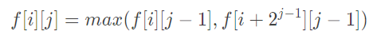

- 区间求值

  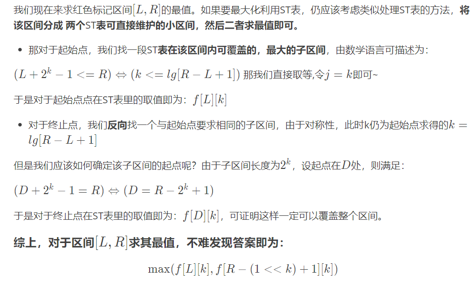

- ST表模板

	```
	static int[] arr = new int[N];
	
	//f[i][j]表示从节点i开始向右2^j个元素的区间的最值：区间[i,i+2^j-1]
	static int[][] f = new int[N][M];
	
	//初始化st表，O（nlogn）
	static void init() {
		//长度是1的区间就是本身
		for(int i=1;i<=n;i++)
			f[i][0] = arr[i];
		//分成两个子区间
		for(int j=1;j<M;j++) 
			for(int i=1;i+(1<<j)-1 <= n;i++) 
				f[i][j] = Math.max(f[i][j-1],f[i+(1<<(j-1))][j-1]);
	}
	
	//查询st表，O（1）
	static int query(int l,int r) {
		//计算区间[l,r]的最大2的幂跨度（l+2^k-1 <= r）
		int k = (int) (Math.log(r-l+1)/Math.log(2));
		//分为两个子区间
		int res = Math.max(f[l][k],f[r-(1<<k)+1][k]);
		return res;
	}
	```
	
	

> ps：log(2,n)可以用递推式优化，从而达到O(1)查询
>
> log (2,n) = log(2,n/2) + 1
>
> 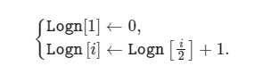

- st表的应用

  除 RMQ 以外，还有其它的「可重复贡献问题」。例如「区间按位与」、「区间按位或」、「区间 GCD」，ST 表都能高效地解决。

  如果分析一下，「可重复贡献问题」一般都带有某种类似 RMQ 的成分。例如「区间按位与」就是每一位取最小值，而「区间 GCD」则是每一个质因数的指数取最小值。

- 例题

  选牛：https://www.luogu.com.cn/record/158444125

  降雨量：https://www.luogu.com.cn/problem/P2471

> 基于ST表倍增的思想还有最近公共祖先知识点（图论章节）


## 字符串


### KMP

判断模式串（p）是不是主串（s）的子串，返回主串中出现子串的下标

> 也可以用字符串哈希

时间复杂度O（n）

```java
static char[] p,s;//p是模式串，s是主串
static int[] ne = new int[N];//p的next数组,ne[i]=j表示相等的前后缀最大长度
//n是模式串的长度，m是主串的长度。

//1.计算模式串p的next数组（背过）
static void getNext() {
    for(int i=2,j=0;i<=n;i++) {
        while(j>0 && p[i]!=p[j+1]) 
            j=ne[j];
        if(p[i]==p[j+1])
            j++;
        ne[i] = j;
    }
}

//2.kmp匹配
for(int i=1,j=0;i<=m;i++) {
    while(j>0 && s[i]!=p[j+1])
        j=ne[j];
    if(s[i]==p[j+1]) j++;
    if(j==n) {//匹配成功
        out.print(i-n+1+" ");//下标从1开始
        j = ne[j];//计算后面是否还有子串p
    }
}
```

关键点：

- 模式串p，主串s。字符串下标都是从1开始。n是p的长度，m是s的长度。
- 指针i指向主串，指针j指向模式串，**每一轮是将i与j+1的位置比较**，如果不满足，j就回退到ne[j]
- 如果i和j+1位置相同，那么就j++
- 为什么是j+1和i的位置比较？？？因为一旦找到不符合的，我们就需要找前一位前面的子串的next数组

### 字符串哈希

应用场景：给定一个字符串，快速判断这个子串的两个子串是否相等，时间复杂度O（1）

> 正常用substring()，最坏会达到O（n）

- 前缀和思想
- 把一个字符串映射成一个数，hash[i]存放前缀字符串str[1~i]的hash值
- 初始化：hash[i] = hash[i-1]*P + str[i]
- 计算子串str[l~R]的哈希值 = hash[r] - hash[l-1]*pow(P,r-l+1).画图就能推出来

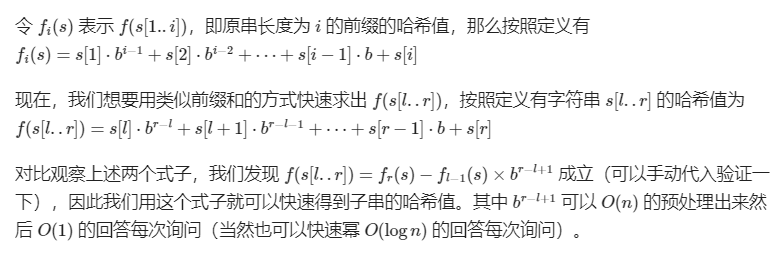

```java
	static char[] str = new char[N];
	static int[] hash = new int[N],pow = new int[N];
	static int P = 131;//经验值
	
	//初始化
	pow[0]=1;
	hash[0]=0;
	for(int i=1;i<=n;i++) {
		hash[i] = hash[i-1]*P + str[i];
		pow[i] = pow[i-1]*P;//预处理次方
	}
	
	//计算子串的哈希值
	static int query(int l,int r) {
		return hash[r] - hash[l-1]*pow[r-l+1];
	}

```

#### 字符串哈希判断回文子串

用二分答案+字符串哈希平替。（判断是否可行时枚举回文中心（对称轴），哈希判断两侧是否相等。需要分别预处理正着和倒着的哈希值）

### 允许  k次失配的字符串匹配

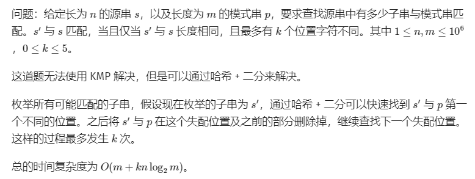

二分位置mid,然后check a[1~mid]和b[1~mid]的哈希值是否相同，如果相同，就表示左边没有不一样的值，就右区间

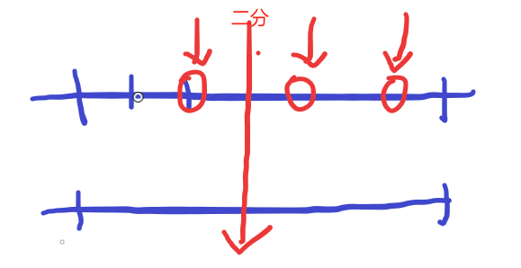

### 马拉车算法

以O（n）时间找到最长**回文子串**的长度。

```

```


- 这个算法可以用二分答案+字符串哈希平替。（判断是否可行时枚举回文中心（对称轴），哈希判断两侧是否相等。需要分别预处理正着和倒着的哈希值）


## 数学

https://www.acwing.com/blog/content/681/

### 判断质数（试除法）

时间复杂度O（sqrt(n)）

```java
static int is_prime(int n){
        if(n<2) return 0;
        for (int i=2;i<=n/i;i++){
            if(n%i==0) return 0;
        }
        return 1;
}
```

### 质因数分解

时间复杂度O（sqrt(n)）

- 用treemap存储
- 枚举2~根号n
- 最多只有一个大于根号n的质因子k，并且这个大于根号n的质因子k的幂一定是1。（反证法：参考[证明](https://blog.csdn.net/Supreme7/article/details/129336166?csdn_share_tail=%7B%22type%22%3A%22blog%22%2C%22rType%22%3A%22article%22%2C%22rId%22%3A%22129336166%22%2C%22source%22%3A%22Supreme7%22%7D)）

```java
static Map<Integer,Integer> mp = new TreeMap<>();//TreeMap有序
static void divide(int n){
    for(int i=2;i<=n/i;i++){
        int cnt = 0;//java里不能mp[i]++，所以用变量cnt存储，再赋值
        while(n%i==0){
            n/=i;
            cnt++;
        }
        mp.put(i,cnt);
    }
    if(n>1) mp.put(n,1);
}
//输出
for(Integer key:mp.keySet()){
    int val = mp.get(key);
    if(val>0)
        System.out.println(key+" "+mp.get(key));
}
```


### 求因子（约数）

时间复杂度 sqrt(n）

```java
	static ArrayList<Integer> yue = new ArrayList<>();   
	static void solve(int n){
        for (int i = 1; i <= n/i; i++) {
            if(n%i==0){
                yue.add(i);
                if(n/i!=i)
                    yue.add(n/i);
            }
        }
        Collections.sort(yue);//约数从小到达排
    }
```

### 约数之和、约数个数

```
如果 N = p1^c1 * p2^c2 * ... *pk^ck
约数个数： (c1 + 1) * (c2 + 1) * ... * (ck + 1)
约数之和： (p1^0 + p1^1 + ... + p1^c1) * ... * (pk^0 + pk^1 + ... + pk^ck)
```


### 素数筛

求n以内的所有素数

#### 1.埃氏筛法（适合求每一个素数）（推荐）

时间复杂度（O（nlogn））

- 枚举n次
- 将素数的所有倍数筛掉

```java
static int[] st;
static int[] primes;
static int cnt;

void get_primes(int n){
    for(int i=2;i<=n;i++){
        if(st[i]==0){
            primes[cnt++]=i;
            for(int j=i+i;j<=n;j+=i)
                st[j]=1;
        }
    }
    //求素数个数
    cnt	
}
```

#### 2.优化的埃氏筛法（不适合求每一个素数）

时间复杂度（O（nloglogn））

- 枚举根号n次
- 还是筛质数的倍数，但是是从i*i开始筛，因为比i * i小的数已经被前面的晒过了

```java
void getPrimes(int n){
    for(int i=2;i<=n/i;i++){//根号n次
        if(st[i]==0){
            for(int j=i*i;j<=n;j+=i)//i*i开始
                st[j]=1;
        }
    }
    //求素数个数
    for(int i=2;i<=n;i++) 
        if(st[i]==0) ans++;
    //求每一个素数
    // for(int i=2;i<=n;i++)
    //     if(st[i]==0) primes[cnt++]=i;
}
```


#### 3.线性筛（性能最好）
```java
void get_primes(int n)
{
    for (int i = 2; i <= n; i ++ )
    {
        if (!st[i]) primes[cnt ++ ] = i;
        for (int j = 0; primes[j] <= n / i; j ++ )
        {
            st[primes[j] * i] = true;
            if (i % primes[j] == 0) break;
        }
    }
}
```


### 求组合数

求C（a,b）

用long存！！！

- N 在3000以内（题意不用取模）

```java
    static long[][] C = new long[N][N];
    static void init(){
        for (int i = 0; i < N; i++) {
            for (int j = 0; j <= i; j++) {
                if(j==0) C[i][j] = 1;
                else C[i][j] = C[i-1][j] + C[i-1][j-1];
                //对于要对答案取模的时候，在计算组合数的时候就要取模
                //else C[i][j] = (C[i-1][j] + C[i-1][j-1])%Mod;
            }
        }
    }
```

- N在10^8以内、题目说要取模（用逆元求）

  `C(a,b) = a!/(b! * (a-b)!) = a! * niyuan(b!) * niyuan((a-b)!)`

  由于询问比较多，直接初始化阶乘和阶乘的逆元数组

  递推式：
  `n! = (n-1)! * n`
  `1/(n!) = 1/(n-1)! * 1/n`,其中`1/n = qpow(n,Mod-2)`(费马小定理)

```java
    //jiechen[i] = i!
    static long[] jiechen = new long[N];
    //jiechenniyuan[i] = “i!的逆元”
    static long[] jiechenniyuan = new long[N];

	//初始化阶乘、阶乘的逆元
	static void init() {
		jiechen[0] = 1;
		jiechenniyuan[0] = 1;
		for(int i=1;i<N;i++) {
			jiechen[i] = jiechen[i-1] * i%Mod;
			jiechenniyuan[i] = jiechenniyuan[i-1] * qpow(i, Mod-2)%Mod;
		}
	}
	//C(a,b) = a!/(b! * (a-b)!) = a! * niyuan(b!) * niyuan((a-b)!)
	static long C(int a,int b) {
		long res = 1;
		res = res * jiechen[a]%Mod;
		res = res * jiechenniyuan[b]%Mod;
		res = res * jiechenniyuan[a-b]%Mod;
		return res;
	}
https://www.acwing.com/activity/content/code/content/5904493/
```

> 如果题目里面没有说要对组合数取模，那么这种方法不能使用！！！！！！！！


### 判断其他点是否在同一条直线上

> 已知两个点（x0,y0）(x1,y1)从而可以确定一条直线，再去判断一个点（x,y）是否在这条直线上面，有如下公式。用的是直线的一般形式。

由于除法会出问题，所以一般都是使用直线的一般形式：$(Y-y0)/(X-x0) = (y1-y0)/(x1-x0)$，化简得 $(Y-y0) * (x1-x0) == (X-x0) = (y1-y0)$,我们只需要判断这个东西是不是相等即可判断是否在同一条直线上

- 例子：x0,y0固定，统计经过（x0,y0）的所有直线中，至少需要多少根直线能够把所有给定的点覆盖掉。

``` java
		//这里x0,y0是固定的
		for(int i=0;i<n;i++) {//枚举第二个点，确定这条直线
			if(st[i]==1) continue;//这个点已经在其他的直线上了,就不需考虑这个点了
			int x1 = arr[i].x;
			int y1 = arr[i].y;
			ans++;//这是一条新的直线，计数+1
			for(int j=i+1;j<n;j++) {
				int x = arr[j].x;
				int y = arr[j].y;
                //使用直线的一般公式判断点(x,y)是否在这条直线上
				if((x-x0)*(y0-y1) == (y-y0)*(x0-x1)) 
					st[j] = 1;
			}
		}
```


### 费马小定理

描述：

```
如果一个数p是质数，并且a不是p的倍数，那么有a^（p-1） = 1 (mod p)。
除以p同余
```

等价于：（推荐）

```
如果一个数p是质数,并且a和p互质（就一定满足gcd(a,p）=1），那么有a^（p-1） = 1 (mod p)
```

> 底层逻辑：a是p的倍数，那么gcd(a,p) = p;如果a不是p的倍数，那么gcd(a,p)不一定是1，但是当a和p有一个是质数时，那么此时gcd(a,p)=1。
>
> 互质的理解：gcd(a,p）=1。如果两个数都是质数，那么一定互质。如果两个数有一个是质数，另外一个数不是它的倍数，那么这两个数互质，原因：质数只有1和他本身两个约数，不是倍数，那么他本身不能成为公约数了，那么公约数只能是1了。

官方解释：

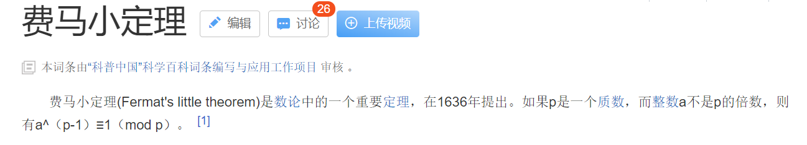

> 一般配合求逆元使用

https://www.acwing.com/activity/content/code/content/748142/)

### 欧拉定理

#### 欧拉函数

1∼N  中与 N 互质的数的个数被称为欧拉函数，记为 ϕ(N)。

若在算数基本定理中，下图中的p是n的质因子


> 特别的，如果n是质数，则ϕ(n) = n-1

```java
int solve(int n){
    int res=n;
    for(int i=2;i<=n/i;i++){
        if(n%i==0){
            res = res /i * (i-1);
            while(n%i==0)n/=i;
        }
    }
    if(n>1) res = res/n*(n-1);
    return res;
}
```

#### 费马小定理

根据费马小定理可知：

当m是质数并且a不是m的倍数时， a^(m−2)就是a在模m意义下的乘法逆元.


#### 欧拉定理

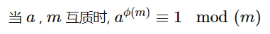

其中，ϕ(m)表示模数m的欧拉函数，特别的，费马小定理就是欧拉定理的特殊情况，因为费马小定理的条件（m是质数并且a不是m的倍数）是欧拉定理（a与m互质）的充分条件。

> gcd(3,4) = 1，a=3,m=4，但是不满足费马小定理所以不是充要

- 也就是说 

  当a,m互质时，a^(ϕ(m) -1) 是a的乘法逆元,但是时间是O(sqrrt(n))的

#### 扩展欧拉定理(欧拉降幂)

欧拉定理的油互质的限制的，但是扩展的欧拉定理没有

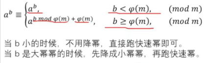

注意：**这两个情况不能合并,需要单独处理**

> 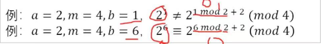

```
//根据大指数数组和欧拉函数值，进行降幂，返回降后结果
long oula_down(char[] s, long oula){
	long res = 1,flag = 0;
	for(int i=0;i<s.length;i++){
		res = res * 10 + (s[i]-'0');//秦九韶算法
		if(res > oula){
			res %= oula;
			flag = 1;
		}
	}
	if(flag==1) res += oula;
	return res;
}
```

> ps：
>
> - 由于只有当指数b > oula时，才需要取模，所以用if特判，此外，还需要 + oula
>
> - 加法乘法分配取模符
>
>   由于abc = (a*10 + b) *10 +  c，所以在计算时一边算一边取模

### 裴蜀定理（线性组合）

- 若a,b是整数,且gcd(a,b)=d，那么对于任意的整数x,y,都有ax+by都一定是d的倍数。（充要的）
  特别地，一定存在整数x,y，使ax+by=d成立。

换句话说：

- 两个整数a,b,方程`a*x+b*y=m`有解，当且仅当m是gcd(a,b)的倍数（充要）

#### 推论：最大无法线性组合的数

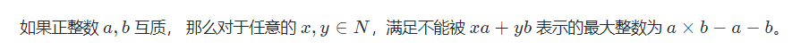

O（1）

### 扩展欧几里得算法

扩展欧几里得代码：

```java
// 求x, y，使得ax + by = gcd(a, b)
// 扩展欧几里得:求解方程ax+by=gcd(a,b)的解
// x=y′ y=x′−[a/b]*y′
static int x, y;//全局变量，替代引用
int exgcd(int a,int b){
    if(b==0){
        x=1,y=0;
        return a;
    }

    int gcd=exgcd(b,a%b);//递归调用
    int tmp = x;
    x=y,y=tmp-a/b*y;
    return gcd;
}

	//结果说明
	1.exgcd()的返回值是最大公约数
 	2.最后的（x，y）是方程ax + by = gcd(a,b)的解
    3.如果exgcd()的结果是1（那么a和b互质，就存在逆元），那么x是a的逆元（x可能是负数，所以答案是getMod(x)）
        
    参考：https://www.cnblogs.com/kksk/p/13069795.html  
```


#### **扩展欧几里得求逆元**

板子已经给出来了，下面给出说明。

目标：求a的逆元x，a*x==1(% mod)，a不是质数

我们假设逆元存在，已知逆元存在的充要条件是：gcd(a,mod) == 1

已知裴蜀定理：ax + by = gcd(a, b)的方程一定有解

另b = mod

则，a * x + mod * y =  gcd(a,mod) = 1 

两边模mod得： a*x % mod = 1，即 a * x = 1(%mod)

此时的x就是a的模mod的逆元，x也就是方程ax+by=gcd(a,b)的解的横坐标


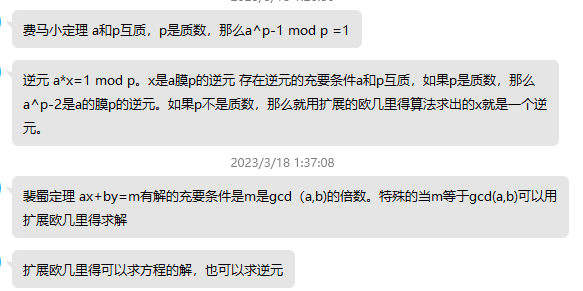

### 逆元

- 定义

```
若整数b，m互质，并且对于任意的整数 a，如果满足b|a，则存在一个整数x，使得 a/b≡a∗x(mod m) ,同余，则称x为b的模m乘法逆元，记为b^{-1}(mod m)。 
```

- 理解：除以a 等于乘以 （a的逆元）

  **用逆元把除法变成了乘法**。除法是一个很麻烦的事情，所以上述构造的含义：a除以一个数，我们要把他变成a乘以一个数，除以b，相当于乘以x，那么$b^{-1} = x$。即 b*x == 1(mod m)

- 逆元存在的充要条件： 

  b存在乘法逆元的充要条件是 **b与模数 m互质**。

- 求解

  - 当模数 m为质数时，并且b不是m的倍数时（利用费马小定理）

    b^(m−2)即为b的模m的乘法逆元

  - 其他情况，可以用扩展欧几里得求逆元，也可以用欧拉定理，**推荐扩展欧几里得**（效率高）

    就需要用扩展欧几里得算法求出来的x就是一个逆元

- 具体题目中

  - 如果m是一个的大质数（如1e9+7），那么可以直接费马小定理，

    ```
    a的逆元 = a ^(m-2)
    ```

  - 当模数 m不是质数时，那么就用扩展欧几里得求出解，或者欧拉定理

    - 欧拉定理 sqrt(n）时间复杂度较高

    ```
    a的逆元 = a ^( ϕ(m) -1 )
    ```

    - 扩展欧几里得O(logn)

    ```
    // 求x, y，使得ax + by = gcd(a, b)
    // 扩展欧几里得:求解方程ax+by=gcd(a,b)的解
    // x=y′ y=x′−[a/b]*y′
    static int x, y;//全局变量，替代引用
    int exgcd(int a,int b){
        if(b==0){
            x=1,y=0;
            return a;
        }
    
        int gcd=exgcd(b,a%b);//递归调用
        int tmp = x;
        x=y,y=tmp-a/b*y;
        return gcd;
    }
    
    	//结果说明
    	1.exgcd()的返回值是最大公约数
     	2.最后的（x，y）是方程ax + by = gcd(a,b)的解
        3.如果exgcd()的结果是1（那么a和b互质，就存在逆元），那么x是a的逆元（x可能是负数，所以答案是getMod(x)）
    ```

    

https://www.cnblogs.com/greenofyu/p/14103851.html

### 基础数论的时间复杂度没有想象的高

#### sqrt(n)

题目中值域在1e6的时候，对应的就是sqrt(n)的时间复杂度，这是一个关键信息

一般只有数论中会有sqrt(n)的时间复杂度，如：分解质因数、求因子、判断质数。

#### 调和级数

>  有的时候想象中的复杂度是n^2，但是实际确是nlogn的，所以不要把复杂度想高了
>
>  参见题目：https://leetcode.cn/problems/find-the-number-of-good-pairs-ii/description/

调和级数 = (1/1 + 1/2 + 1/3 +... + 1/n)的求和的运行次数是 logn级别的

算法：质数筛、枚举1~n的所有数的倍数。都是nlogn的时间

- 例子

  看上去两重循环，实际的复杂度不是n^2，而是n * logm，m是值域最大值

```
for(Integer v : val.keySet()){
	int cnt = val.get(v);
	int x = v;
	//枚举x的所有倍数
	for(int j=1;j * x <= mx;j++)
		mp.put(j*x,mp.getOrDefault(j*x,0)+cnt);
}
```


### nlogn的时间复杂度

```java
 for(int i=1;i<=n;i++){//枚举i
    for(int j =i+i;j<=n;j+=i){//执行n/i次
```

执行次数：n + n/2 + n/3 + ...n/n

化简：n * (1+1/2+1/3+1/4+...+1/n) = nlogn

> 1+1/2+1/3+1/4+...1/n是调和级数，结果大概是logn
>
> 参考：素数筛


### 卡特兰数

满足条件的01序列（卡特兰数）

- 给定n个0和n个1，它们按照某种顺序排成长度为2n的序列，满足任意前缀中0的个数都不少于1的个数的序列的数量为： Cat(n) = C(2n, n) - C(2n,n-1) = C(2n, n) / (n + 1)

  

https://www.acwing.com/activity/content/code/content/5905692/


### 容斥原理


注意观察，奇数个集合的交集是正的，偶数个是负号

- 例题：890. 能被整除的数

  > 给定一个整数 n𝑛 和 m𝑚 个不同的质数 p1,p2,…,pm
  >
  > 请你求出 1∼n 中能被 p1,p2,…,pm 中的至少一个数整除的整数有多少个。
  >
  > 1≤m≤16
  > 1≤n,pi≤109

  相当于求：a 并 b 并 c ...

  ```
  	for(int mask = 1;mask < (1<<m) ;mask ++){//枚举所有情况
  		    long s = 1;//质数的乘积
  		    int cnt = 0;//集合的个数
  		    for(int j=0;j<32;j++){
  		        if((mask>>j&1)==1){//选择了这一位
  		            s *= a[j];
  		            cnt += 1;
  		            if(s > n) break;
  		        }
  		    }
  		    ans += n/s * (cnt%2==1?1:-1); //1~n中s的倍数的个数是n/s
  ```

  

### 数学常识

#### 1~n中k的倍数的个数

1~n中k的倍数的个数可以表示为：n/k
举例：1~8中2的倍数的个数为：8/2=4

https://www.acwing.com/problem/content/4879/

#### n!中质因子p的个数

根据公式，n!中有质因子p的个数为：
$$
（\frac {n}{p}+\frac {n}{p^2}+\frac {n}{p^3}+...)
$$
时间复杂度为:O(logn)

```java
int divide(int n,int p){
    int ans=0;
    /*方案1
    while(n){
        ans+=n/p;
        n/=p;//不能写成p*=p;
    }
    */
    //方案2
    for(int i=p;n/i;i*=p)
        ans+=n/i;
    return ans;
}
```

参考：https://blog.csdn.net/Supreme7/article/details/115796373

#### 等比数列求和

- 方法1：朴素做法

  O (n)

  Sk = 1+p^2+p^3+...+p^k 

  Sk-1 = 1+p^2+p^3+...+p^k-1 

  递推式：Sk = p*Sk-1 +1

  ```java 
  //计算1+p^2+p^3+...+p^k的和
  static long sum(int p,int k){
      long t=1;
      while(b--){
          t=(t*a+1);
      }
      return t;
  }
  ```

  

- 分治法

  O（logn）

  ```java
      //计算1+p^2+p^3+...+p^k的和（时间复杂度O（logn））
      static int sum(int p,int k) {
          p %= mod;//必须要加这个，不然会WA，会有溢出
          if(k==0) return 1;
          if(k%2==1) 
              return sum(p, k/2)*(qpow(p,k/2+1)+1)%mod;
          return (sum(p, k-1)*p+1)%mod;
      }
  
  	//https://www.acwing.com/activity/content/code/content/5624746/
  ```

  

#### 海伦公式

三角形三边：a,b,c

令 p = (a+b+c)/2

面积 S = sqrt(p*(p-a)(p-b)(p-c))

#### 同余

```
若a-b=n*k
则a%k==b%k
```

例题：k倍区间

#### 位运算

- (cnt & 1) == 1:判断是否是奇数 

```
if((cnt & 1) == 1)
```

奇数的二进制最后一位一定是1。否则就是偶数


### 取模

当加减乘除遇上取模(https://leetcode.cn/circle/discuss/mDfnkW/)

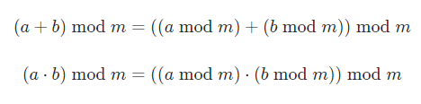

```
MOD = 1_000_000_007

// 加
(a + b) % MOD

// 减
(a - b + MOD) % MOD

// 乘
a * b % MOD

// 多个数相乘，要步步取模，防止溢出
a * b % MOD * c % MOD

// 除（MOD 是质数且 b 不是 MOD 的倍数）费马小定理
a * qpow(b, MOD - 2, MOD) % MOD
```


## 搜索

### BFS

```java
    static char[][] arr = new char[N][N];
    static int[][] vis = new int[N][N];
    static int[][] cen = new int[N][N];
    static int t,r,c;
    static int sx,sy,ex,ey;
    static int[] dx = {1,0,-1,0};
    static int[] dy = {0,1,0,-1};

   static void bfs() {
       for(int i=0;i<N;i++) {
           Arrays.fill(cen[i], INF);
           Arrays.fill(vis[i], 0);
       }

       Queue<PII> q = new LinkedList<>();
       //起点入队
       q.add(new PII(sx,sy));
       cen[sx][sy] = 0;
       vis[sx][sy] = 1;

       while(q.size()>0) {
           PII top = q.poll();
           int x = top.x, y = top.y;
           for(int i=0;i<4;i++) {
               int nx = x + dx[i],ny = y + dy[i];
               if(check(nx,ny)==1) {
                   q.add(new PII(nx,ny));
                   vis[nx][ny] = 1;
                   cen[nx][ny] = cen[x][y]+1;
                   ans++;//访问的不同节点个数
               }
           }
       }
       return cen[ex][ey];
   }
class PII{
	int x;
	int y;
	public PII(int x,int y) {
		this.x = x;
		this.y = y;
	}
}

    static int check(int x,int y) {
        if(x>=1 && x<=r && y>=1 && y<=c && vis[x][y]==0 && arr[x][y]=='.')
            return 1;
        return 0;
    }

    public static void main(String[] sss) {
            int ans = bfs();
            if(ans!=INF)
                System.out.println(ans);
            else 
                System.out.println("oop!");
    }
}

```

#### BFS遍历前k层所有节点的模板

就遍历k次，每一次初始时队列中元素的个数sz，让sz个

```java
    static int bfs(int u) {
        Queue<Integer> q = new LinkedList<Integer>();
        Arrays.fill(st, 0);
        q.add(u);
        st[u] = 1;
        int ans = 0;//答案不算起点

        for(int level = 0;level < k;level++) {//BFS最多k层
            int sz = q.size();//获得当前这一层的所有节点个数
            while(sz-->0) {//把当前这层的所有节点出队
                Integer top = q.poll();
                for(int i=h[top];i!=-1;i=ne[i]) {
                    int j = e[i];
                    if(st[j]==1) continue;
                    q.add(j);
                    st[j]=1;
                    ans++;
                }
            }
        }
        return ans;
    }
```


#### 枚举上下左右四个方向

	static int[] dx = {1,0,-1,0};
	static int[] dy = {0,1,0,-1};
	for(int i=0;i<4;i++){
		int nx = x + dx[i];
		int ny = y + dy[i];
	}
#### 枚举上下左右的八个方向

```
for(int i=x-1;i<=x+1;i++){
	for(int j=y-1;j<=y+1;j++) {
		if(i==x && j==y) continue;//去除中间元素本身
		//具体代码
	}
}
```


#### FloodFill

枚举每个位置，如果是水域，并且没有被标记过，那么就搜索这一整片池塘，搜索的过程可以是bfs，也可以是dfs，对于搜索过的每一块水域，都标记一下。

https://www.acwing.com/activity/content/code/content/6361986/


### DFS

#### 指数型枚举

O(2^n)

#### 组合型枚举

顺序限制的dfs

O（C(n,m)）

#### 排列型枚举

枚举数组ans的每个位置选什么

O（n!）

#### 剪枝

##### 可行性剪枝

当前轮次u时已经不满足题意，直接停止递归

##### 最优性剪枝

当前轮次u时，后续已经不可能超过当前最优解时，直接停止

##### 重复性剪枝

搜索时，有些方案会重复搜索，一般有两种方法：1.使用记忆数组进行标记 2.在枚举方案时控制

当前轮次u时，后续会出现两个相同的方案，在枚举方案选择时进行控制（顺序要求），从而达到减少递归次数的目的。参考：小猫爬山，具体的，当select[j] == select[j-1]时，当前选择与上一轮的选择值是相同的，那么就直接跳过。


##### 奇偶性剪枝

从起点走到终点需要的步数的奇偶性是确定的。如果让你判断T时刻是否能到达，判断起点终点颜色是否相同，如果相同，则必须走偶数步，如果T是奇数一定到不了。 每个格子的颜色用横坐标+纵坐标的奇偶性就能确定。

> 例题
>
> 有一个nxm大小的迷宫。其中字符S表示起点，字符D表示出口，字符X表示墙壁，字符.表示平地。你需要从S出发走到D，每次只能向上下左右相邻的位置移动，并且不能走出地图，也不能走进墙壁。每次移动消耗1时间，走过路都会塌陷，因此不能走回头路或者原地不动。现在已知出口的大门只会在T时间打开，T时间后就会关闭，判断在0时间从起点出发能否逃离迷宫。数据范围n,m<10,T<50。
>
> 也就是说，我们必须找到一个路径，使得到达这个路径时的时间刚好是T，如果找不到就是False。
>
> 正常做就是从起点dfs，最后到达终点，判断终点时间是否是T
>
> 剪枝1：如果步数超过了T就直接退出
>
> 剪枝2：如果到达了终点步数不是T就退出
>
> 剪枝3：如果起点（1,1）与终点（n,m）同色，如果T不是偶数，就一定到不了，退出；如果起点（1,1）与终点（n,m）不同色，如果T不是奇数，就一定到不了，退出；具体的，同色代表：(1+1)%2 == (n+m)%2

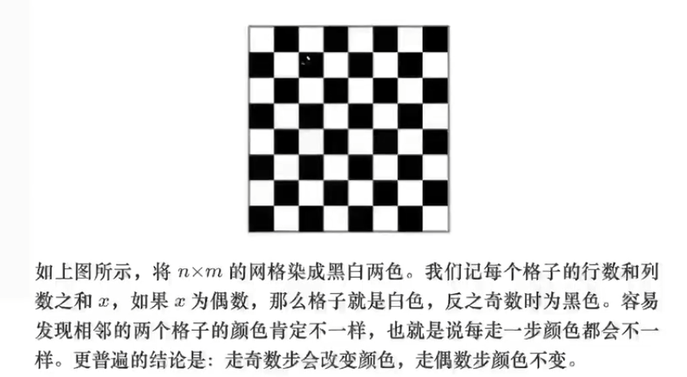


### 迭代加深

定义：每次限定一个maxdep最大深度，使搜索树的深度不超过maxdep

意义：防止在一个没有解的递归树中一路走到黑，导致浪费时间

方法：一层一层dfs，比如第一次就是最大深度是1，第二次深度是2。

模板：求最小步数

```
for(int maxdep=1;maxdep<=题目中给的最大步数;maxdep++){
	dfs(0,maxdep);//0为出入函数中当前步数，maxdep为传入的最大深度。
	if(success){
		//如果搜索成功则会在dfs函数中将success赋值为1。
		return maxdep;
		break;
	}
	
}
```

**使用范围:**

1.在有一定的限制条件时使用（例如本题中“如果能在15步以内（包括15步）到达目标状态，则输出步数，否则输出−1。“）。

2.题目中说输出所以解中的任何一组解。

**为什么能够降低时间复杂度：**

我们可能会在一个没有解（或解很深的地方无限递归然而题目中要求输出任何的一组解），所以我们限制一个深度，让它去遍历更多的分支，去更广泛地求解，(其实和BFS有异曲同工之妙)。


### 启发式搜索

- 估价函数

#### A*

启发式搜索


#### IDA*

> Iterative deepening A*
>
> https://blog.csdn.net/glorious_dream/article/details/123004027

IDA*是对结合**迭代加深**的DFS 的优化，加了个**评估函数**，用于预测可能的结果。`和A*算法一样，是启发式搜索`

现在就是要想一个比较好的估价函数（若估价函数不好的话，优化效率就并不高，例如若估价函数一直为0，那就是爆搜）。

例题：

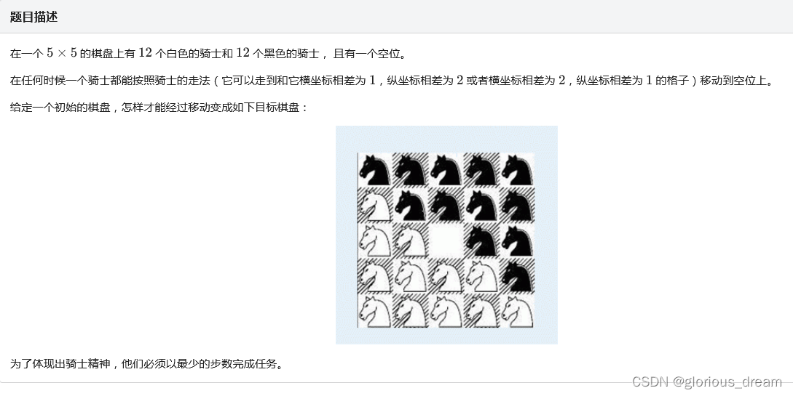

估价函数：当前情况下还剩多少个（cnt个）马需要被换

```
int evaluate(){
	int cnt=0;
	for(register int i(1) ; i<=5 ; i=-~i){
		for(register int j(1) ; j<=5 ; j=-~j){
			if(mp[i][j] != goal[i][j]) cnt++; //如果这两个点不相同
		}
	}
	return cnt; //返回最少理想情况下需要的次数
}

```

核心代码：

假设评估函数计算出：还有cnt个马，那么最优状态就是cnt步完成，那么最后就是dep+cnt > maxDep，那么就永不可能在madDep完成任务

```
void A_star(int dep,int x,int y,int maxdep){
	if(dep == maxdep){
		if(!evaluate()) success=1; //表示正好完全匹配
		return;
	}
	for(register int i(0) ; i<8 ; i=-~i){
		int xx = x + dx[i];
		int yy = y + dy[i]; //8个方向
		if(!pd(xx,yy)) continue; //不能走就跳过
		swap(mp[x][y],mp[xx][yy]); //把两个点的颜色交换
		int eva = evaluate(); //理想情况下的最少步数
		if(eva + dep <= maxdep) A_star(dep+1,xx,yy,maxdep); //如果有可能的话，接着往下搜
		swap(mp[x][y],mp[xx][yy]); //别忘了回溯
	}
}
signed main(){
	T=read();
	while(T--){
		success=0;
		flag=0; //别忘了先清零
		for(register int i(1) ; i<=5 ; i=-~i){
			for(register int j(1) ; j<=5 ; j=-~j){
				char ch;
				cin >> ch;
				if(ch == '*') mp[i][j] = 2,sx=i,sy=j; //这道题枚举那个空白好，因为次数少
				else mp[i][j] = ch-'0';
			}
		}
		if(!evaluate()) {printf("0\n");continue;}
		for(register int maxdep(1) ; maxdep<=15 ; maxdep=-~maxdep){ //限制最多次数
			A_star(0,sx,sy,maxdep);
			if(success) {printf("%d\n",maxdep);flag=1;break;} //如果能匹配
		}
		if(!flag) printf("-1\n"); //不能匹配
	}
	return 0;
}

```


#### A * 和IDA * 的区别


A∗是用于对BFS的优化；

IDA*是对结合迭代加深的DFS 的优化。

本质上只是在BFS和DFS上加上了一个估价函数。

何时使用因题而定。

现在就是要想一个比较好的估价函数（若估价函数不好的话，优化效率就并不高，例如若估价函数一直为0，那就是爆搜）。


## 图论

### 图的存储

#### 邻接表

```
static int[] dist = new int[N],st = new int[N];
static int[] h = new int[N],e = new int[M],ne = new int[M],w = new int[M];
static int idx;

static void init(){
	Arrays.fill(h,-1);
}
static void add(int a,int b,int c) {
	e[idx] = b;
	w[idx] = c;
	ne[idx] = h[a];
	h[a] = idx++;
}
```

#### 邻接表2

用来快速得到顶点的所有邻边条数

> leetcode中比较常见

```
ArrayList<Integer>[] g = new ArrayList[N];

//初始化
for(int i=0;i<n;i++)
    g[i] = new ArrayList<Integer>();
    
//顶点a,b中间添加一条边
g[a].add(b);
```


### Dijkstra

O (mlogn)

```java
	static int[] h = new int[N],e = new int[M],ne = new int[M],w = new int[M];
	static int idx;
	static int[] dist = new int[N],st = new int[N];
	static void add(int a,int b,int c) {
		e[idx] = b;
		w[idx] = c;
		ne[idx] = h[a];
		h[a] = idx++;
	}
	static int dijkstra() {
		Arrays.fill(dist, INF);
		PriorityQueue<PII> q = new PriorityQueue<PII>((a,b)->(a.dist-b.dist));//小根堆
		q.add(new PII(0,1));
		dist[1]=0;

		while(q.size()>0) {
			PII top = q.poll();
			//如果这个点的最短路确定了，那么直接跳过
			if(st[top.ver]==1) continue;
			st[top.ver]=1;
			
			for(int i=h[top.ver];i!=-1;i=ne[i]) {
				int j = e[i];
				if(dist[j]>dist[top.ver]+w[i]) {
					dist[j] = dist[top.ver]+w[i];
					q.add(new PII(dist[j],j));
				}
			}
		}
		return dist[n];
	}
}
class PII{
	int dist,ver;
	
	public PII(int dist,int ver) {
		this.dist = dist;
		this.ver = ver;
	}
}
```


### SPFA最短路

时间复杂度O（m*n）但是实际效率很高，用来替代朴素版的dijkstra

```java
		//st数组用来存储当前节点是否在队列中
		static int[] st = new int[N],dist = new int[N];

        static int spfa() {
            Arrays.fill(dist, INF);
            Queue<Integer> q = new LinkedList<Integer>();
            
            q.add(1);
            st[1] = 1;
            dist[1] = 0;
            
            while(q.size()>0) {
                Integer top = q.poll();
                st[top] = 0;//不在队列了，置为0
                for(int i=h[top];i!=-1;i=ne[i]) {
                    int j = e[i];
                    if(dist[j] > dist[top] + w[i]) {
                        dist[j] = dist[top] + w[i];
                        if(st[j]==0) {//不在队列中，就入队
                            st[j]=1;
                            q.add(j);
                        }
                    }
                }
            }
            return dist[n];
        }
```

### Floyd

- floyd算法只需要一个二维数组变量g[][]，运行前是一个邻接矩阵，运行后是一个记录最短路的dist数组，g [ i ] [ j ]表示i到j的最短路
- 这个算法用邻接矩阵存储（朴素dijkstra用邻接矩阵，堆优化用邻接表，spfa用邻接表，floyd用邻接矩阵）
- 初始化，对于所有的i!=j的位置，g数组初始化成INF。

```java
    static int floyd(int[][] g) {
        for(int k=1;k<=n;k++) 
            for(int i=1;i<=n;i++) 
                for(int j=1;j<=n;j++) 
                    g[i][j] = Math.min(g[i][j], g[i][k]+g[k][j]);
        return g[1][n];
    }

    //初始化，在输入之前
    for(int i=0;i<n;i++) {
        Arrays.fill(g[i], INF);
        tie[i][i] = gon[i][i] = 0;  //自己到自己的距离为0      
    }

	//最短距离
	g[1][n];//表示从顶点1到顶点n的最短路径
```

### Kruskal


```java

    static int[] p = new int[N];
    static Edge[] edges = new Edge[M];

    static int kruskal() {
        Arrays.sort(edges,1,m+1);
        int cnt = 0,ans = 0;

        for(int i=1;i<=m;i++) {
            int x = edges[i].x;
            int y = edges[i].y;
            int w = edges[i].w;
            int a = find(x),b = find(y);
            if(a!=b) {
                p[a] = b;
                cnt++;
                ans += w;
            }
        }
        return cnt==n-1?ans:INF;
    }

	class Edge implements Comparable<Edge>{
        int x,y,w;
        public Edge(int x,int y,int w) {
            this.x = x;
            this.y = y;
            this.w = w;
        }
        @Override
        public int compareTo(Edge o) {
            return Integer.compare(w, o.w);
        }
    }

    static int find(int x) {
        if(x==p[x]) return x;
        return p[x] = find(p[x]);
    }
```


### bellmanFord求最多k条边的最短路

> 应用场景：求边数最大是k的最短路

循环k次，每一次只用上一轮的dist数组更新，所以在循环边时把dist保存为tmp，防止本轮使用了这一轮的dist值

```java
	static Edge[] edges = new Edge[N];
    static int[] dist = new int[N],tmp = new int[N];
	static void bellmanFord() {
            Arrays.fill(dist,INF);
            dist[1]=0;
            for(int i=0;i<k;i++) {//循环k次,代表
            	//复制当前的dist，表示上一轮的dist结果，这样才能找到边数<=k的
                tmp = dist.clone();
                for(int j=0;j<m;j++) {
                    Edge e = edges[j];
                    dist[e.b] = Math.min(dist[e.b], tmp[e.a]+e.c);
                }
            }
        }
    class Edge{
        int a,b,c;
        public Edge(int a,int b,int c) {
            this.a = a;
            this.b = b;
            this.c = c;
        }
    }
```

### 拓扑排序

> 只有有向无环图才有拓扑序列，图不一定要连通

```
1.所有入度为0的结点入队
2.当队列（栈）不为空时循环
    2.1取队头,出队,记录序列
    2.2遍历队头顶点指向的顶点，使该顶点入度-1
    2.3入度为0时入队
```
时间复杂度 O（V+E）
注意： 

- cnt用来存储已经输出的顶点的个数
- 只有有向无环图才有拓扑序列  
- 如果一个图有环，最后终止循环时的cnt一定是小于n的
- 所以只需判断cnt==n? 如果相等，就有拓扑序列，否则就不存在

```java

	int[] d = new int[N];//存放入度
	int[] print = new int[N];//记录答案
	int cnt;
	
	static boolean topSort() {
		Queue<Integer> q = new LinkedList<Integer>();
		for(int i=1;i<=n;i++) {
			if(d[i]==0)
				q.add(i);
		}
		while(q.size()>0) {
			Integer top = q.poll();
			print[cnt++] = top;
			for(int i=h[top];i!=-1;i=ne[i]) {
				int j = e[i];
				d[j]--;
				if(d[j]==0) {
					q.add(j);
				}
			}
		}
		return n==cnt;
	}
	public static void main(String[] args) {
		Scanner sc = new Scanner(System.in);
		
		n = sc.nextInt();
		m = sc.nextInt();
		for(int i=1;i<=m;i++) {
			int a = sc.nextInt();
			int b = sc.nextInt();
			int w = sc.nextInt();
			add(a,b,w);
            d[b] += 1;
		}
	}
```

### 染色法判定二分图

- 二分图概念：
  - 二分图：图中点通过移动能分成左右两部分，左侧的点只和右侧的点相连，右侧的点只和左侧的点相连。
  - 一个图是二分图的充要条件是：当且仅当图中不含有奇数环
  - 奇数环：由奇数条边形成的一个环

- 应用：判断图是否是二分图
- 时间复杂度O（n）
- 染色法思路：

1. 开始对任意一未染色的顶点染色。

2. 判断其相邻的顶点中，若未染色则将其染上和相邻顶点不同的颜色。

3. 若已经染色且颜色和相邻顶点的颜色相同则说明不是二分图，若颜色不同则继续判断。

4. bfs和dfs可以搞定！

```java
		static int[] color = new int[N];

		//U是节点编号，c是节点u应该变成的颜色
        static boolean dfs(int u,int c) {
            color[u] = c;
            for(int i=h[u];i!=-1;i=ne[i]) {
                int j = e[i];
                if(color[j]==0) {
                    //return dfs(j,c==1?2:1);//这么写会WA
                    boolean res = dfs(j,c==1?2:1);
                    if(res==false) return false;//只有当返回false的时候，才能得到：不是二分图的结论，如果返回true不能返回值，而要继续搜索
                }else if(c==color[j])
                    return false;
            }
            return true;
        }

		int flag = 1;
        for(int i=1;i<=n;i++) {
            if(color[i]==0) {
                boolean res = dfs(i,1);
                if(res==false) {
                    flag = 0;
                    break;
                }
            }
        }
		if(flag==1) System.out.println("Yes");
        else System.out.println("No");

```

### 匈牙利算法

二分图最大匹配问题

>  https://www.acwing.com/activity/content/code/content/6469504/

- 应用：匈牙利算法解决二分图的最大匹配问题
- 思路：
  - 类比：一张桌左右两旁分别有n1个男生,n2个妹子。图中的边是暧昧的对象。然后看看最多能有多少对在一起。
  - 枚举左边的所有节点，依次判断当前左边节点的所有右边暧昧对象，如果右边的暧昧对象没有对象，那么就直接在一起；否则如果暧昧对象已经有对象了，那么就找到这个妹子的对象，他在他的暧昧对象中重新去找，看看他能不能找到一个其他的暧昧对象，如果能够找到一个，那就让他们在一起，从而这个妹子就是我的了。

- 时间复杂度O（m*n）,但是实际的执行效率高很多
- 模板

```java
		//match[i]=j表示右半边节点i当前匹配的是左半边的节点j
		//st是临时预定数组，st[i]表示当前轮次的右半边节点i是否被标记过
		static int[] match = new int[N],st = new int[N];
		
		//find函数：左边节点u向右边匹配，返回值为是否能够匹配成功
		//返回值：如果加入x来参与模拟配对,会不会使匹配数增多
		static boolean find(int u) {
			for(int i=h[u];i!=-1;i=ne[i]) {
				int j = e[i];
				if(st[j]==0) {//如果在这一轮模拟匹配中,这个女孩尚未被预定
					st[j] = 1;//那u就预定这个女孩了
					//如果女孩j没有男朋友，或者她原来的男朋友能够预定其它喜欢的女孩。配对成功,更新match
					if(match[j]==0 || find(match[j])) {
						match[j] = u;
						return true;
					}
				}
			}
			//自己中意的全部都被预定了。配对失败。
			return false;
		}

		//枚举所有男生，依次进行匹配
        for(int i=1;i<=n1;i++) {
            //因为每次模拟匹配的预定情况都是不一样的所以每轮模拟都要初始化
            Arrays.fill(st,0);//每一轮都进行匹配
            if(find(i)) ans++;
        }
```


### LCA（最近公共祖先）

> 先看ST表
>
> ST表是在线性表上做倍增，维护的是具体区间的实际值，不需要维护位置，因为位置可以O（1）算
>
> 而LCA是在树上倍增，默认维护的是节点编号，也可以再增加一维`dp[i][j]`表示路径上的选法集合（见lqb真题：）

- depth[i] = j表示节点i的层数（深度）是j

- `fa[u][i]`表示u向上跳2^i层的祖先节点，第二维开多大取决于节点个数最大值，比如节点有5e5，那么第二维就开到20，因为2^20 = 1e6，最大指数就是19

- 节点编号是从1开始，0会作为超出边界的哨兵

- 思路

  - 1.预处理st表（倍增）

    从小到大枚举，`fa[u][i] = fa[fa[u][i-1]][i-1]	`

  - 2.lca查询（二进制拆分）从大到小枚举

    - 1.把a,b跳到同一层
    - 2.a,b同时向上跳

```java
		static int[] depth = new int[N];//存储节点的层数
		static int[][] fa = new int[N][20];//最大2^19次方
		static int n,m,start;
		//st表预处理（计算倍增数组）O（nlogn）
		static void dfs(int u,int father) {
			depth[u] = depth[father]+1;
			fa[u][0] = father;
			for(int i=1;i<=19;i++) //递推
				fa[u][i] = fa[fa[u][i-1]][i-1];//先跳2^i-1,再跳2^i-1

			for(int i=h[u];i!=-1;i=ne[i]) {
				int j = e[i];
				if(j==father) continue;
				dfs(j,u);
			}
		}
		
		//lca求公共祖先O（logn）
		static int lca(int a,int b) {
			if(depth[a]<depth[b]) {
				int t = a;
				a = b;
				b = t;
			}
			//1.把a和b移到同一层
			for(int i=19;i>=0;i--) 
                //如果跳2^i层还是在b的下面，就跳到这个位置
				if(depth[fa[a][i]]>=depth[b])
					a = fa[a][i];
			if(a==b) return b;
			//2.a和b同时向上找到最近公共祖先的下一层节点
			for(int i=19;i>=0;i--) {
                //如果a和b跳上去不是同一个节点（这里的条件舍去了跳出边界的情况）
				if(fa[a][i] != fa[b][i]) {
					a = fa[a][i];
					b = fa[b][i];
				}	
			}
			return fa[a][0];//再向上走1层就到了lca节点了
		}
		
		//主函数
        dfs(start,0);//不能是-1，因为father要用到depth
        m = sc.nextInt();
        while(m-->0) {
            int x = sc.nextInt();
            int y = sc.nextInt();
            int ans = lca(x,y);
            if(ans==x) System.out.println(1);
            else if(ans==y) System.out.println(2);
            else System.out.println(0);
        }
```

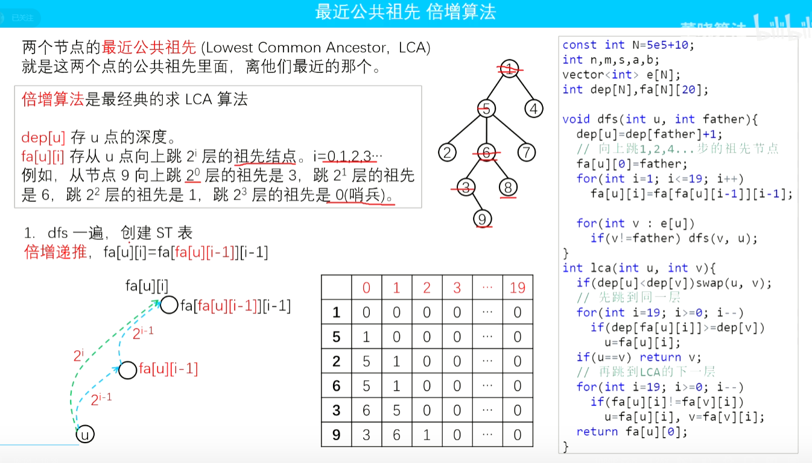

- 例题
  - AcWing 1171. 距离（顶点距离）
  - AcWing 4962. 景区导游（顶点距离）


### 树上差分

差分数组是可以用O（1）将区间内元素+c，最后只需O（n）遍历数组。树上差分用于高效解决树上的将区间内元素+c。

#### 按点差分

定义树上差分数组p，`p[i]+=c`表示将树中根节点向节点i的路径上的所有边的值都+c,所以怎么将树中两个节点a,b路径上的所有节点都+c呢，操作就是:

```
p[a]+=c;
p[b]+=c;
p[lca]-=c;
p[fa[lca][0]]-=c
```

其中lca表示a,b的最近公共祖先,`fa[lca][0]`表示的是节点lca的父节点

 

**拓展**：树上顶点间的距离

```java
距离公式：
	顶点a到顶点b的距离 =  dist[a] + dist[b] - 2*dist[lca]
	
	新增一个数组dist，表示顶点到起点的距离
	
	dist更新的方式如下：
	static void dfs(int u,int father) {
        dep[u] = dep[father]+1;
        fa[u][0] = father;
        for(int i=1;i<19;i++)
            fa[u][i] = fa[fa[u][i-1]][i-1];
        for(int i=h[u];i!=-1;i=ne[i]) {
            int j = e[i];
            if(j==father) continue;
            dist[j] = dist[u] + w[i];
            dfs(j,u);
        }
    }
```


#### 按边差分

如果要维护边的差分数组，比如对树上a,b路径上的所有边都+c，操作就是:

```
p[a]+=c;
p[b]+=c;
p[lca(a,b)]-=2*c
```

这里是将**边下放到节点**，比如p[a] = b，表示顶点a为下边界时的那条边

最后从根节点向下遍历整张图中所有节点，先递归子节点，再将节点从下向上更新前缀和数组（差分的求和），板子如下

```
    //先递后归
	static void dfs(int u,int father) {
		for(int i=h[u];i!=-1;i=ne[i]) {
			int j = e[i];
			if(j==father) continue;
			dfs(j,u);
			chafen[u] += chafen[j];
			//如果要在这判断边，是使用chafen[j]这条边，因为这条边的值已经确定，而chafen[u]还没确定
		}
	}
```

需要注意的是，树上差分算法涉及到LCA，如果是用倍增求LCA，那么每一个求lca是O（logn）的复杂度；如果是用Tarjan求LCA，那么预处理后每一个求lca是O（1）的

- 例题
  - AcWing 352. 闇の連鎖（边的树上差分）
  - luogu P3258 松鼠的新家（顶点的树上差分）
  - 


## 排序算法

### 快速排序

时间复杂度O（nlogn）

> 递归树的高度是logn，每一层的元素和还是n，所以nlogn

```java
        static void quickSort(int[] arr,int l,int r) {
            if(l>=r) return ;
            int x = arr[l],i = l-1,j = r+1;
            while(i<j) {
                while(arr[++i] < x);
                while(arr[--j] > x);
                if(i<j) {
                    int t = arr[i];
                    arr[i] = arr[j];
                    arr[j] = t;
                }
            }
            quickSort(arr, l, j);
            quickSort(arr, j+1, r);
        }
```

> 快排可以求第k大的数

### 归并排序

```java
		static int[] tmp = new int[N];//临时数组
        static void mergeSort(int[] a,int l,int r) {
            if(l>=r) return;
            int mid = l + r>>1;
            mergeSort(a, l, mid);
            mergeSort(a, mid+1, r);
            int k=0;//临时数组tmp的下标计数
            int i=l,j=mid+1;
            while(i<=mid && j<=r) {
                if(a[i]<=a[j]) tmp[k++] = a[i++];
                else tmp[k++] = a[j++];
            }
            while(i<=mid) tmp[k++] = a[i++];
            while(j<=mid) tmp[k++] = a[j++];

            for(i=l,j=0;i<=r && j<k;i++,j++) {
                a[i] = tmp[j];
            }
        }
```

> 归并排序可以用来求逆序对的数量

#### 逆序对的数量

分治的思想，用O（nlogn）的时间复杂度，求出一个数列中逆序对的个数，修改归并排序的代码

```java

        //返回区间内元素的逆序对的个数
        static long getNixudui(int[] q,int l,int r) {
            if(l>=r) return 0;
            int mid = l+r>>1;
            long res = getNixudui(q, l, mid) + getNixudui(q, mid+1, r);

            int i = l, j = mid+1;
            int k = 0;
            while(i<=mid && j<=r) {
                if(q[i]<=q[j]) tmp[k++] = q[i++];
                else {
                    res += mid - i +1;//当前j的逆序对的个数
                    tmp[k++] = q[j++];
                }
            }
            while(i<=mid) tmp[k++] = q[i++];
            while(j<=r) tmp[k++] = q[j++];
            for(i = l,j = 0;i<=r;i++,j++)
                q[i] = tmp[j];
            return res;
        }

链接：https://www.acwing.com/activity/content/code/content/5530302/
```

> 注意这里只能固定j，如果固定i找右边比它小的，会找不全


也可以用树状数组

```java
        Node[] arr = new Node[N];
        int[] lisanhua = new int[N];
		//离散化
        for(int i=1;i<=n;i++){
            arr[i] = new Node(nums[i],i);
        }
        Arrays.sort(arr,1,n+1,(a,b)->a.val-b.val);
        for(int i=1;i<=n;i++)
            lisanhua[arr[i].id] = i;
		//记录个数
        int cnt = 0;
        for(int i=n;i>0;i--){//从后向前枚举
            cnt += query(lisanhua[i]-1);//找到小于lisanhua[i]的个数
            // System.out.println(query(lisanhua[i]-1));
            add(lisanhua[i],1);
        }
        return cnt;
```


## 博弈论

> 董晓入门
>
> 左神讲的细：https://www.bilibili.com/video/BV1N94y1T7Mb/?spm_id_from=333.999.0.0&vd_source=9df13446957cfa1b1efd5650c5e3a393

- 基本概念
  -  先手必胜状态：先手进行某一个操作，留给后手是一个必败状态时，对于先手来说是一个必胜状态。即先手可以走到某一个必败状态。
  - 先手必败状态：先手无论如何操作，留给后手都是一个必胜状态时，对于先手来说是一个必败状态。即先手走不到任何一个必败状态。

- 细节：

  - 下面的例子的最终态都是必败态，并且这个最终态都是无求可拿，没有任何选择时就输

    - 如果告诉了必败态不是没有选择的情况时，那就控制初始值

      例题：lqb真题：取球游戏

    - 如果题目告诉了必胜态的情况，要转换成必败态去做。

      例题：剪纸游戏

### Nim游戏：石子

- 题意：给定 n 堆石子，两位玩家轮流操作，每次操作可以从任意一堆石子中拿走任意数量的石子（可以拿完，但不能不拿），最后无法进行操作的人视为失败。

- 结论：

  

- 证明


- 拓展

  本题还可以求出如果先手必胜，那么输出先手的第一次选择。代码如下

  

### Nim游戏：台阶

其实阶梯博弈经过转换可以变为Nim..把所有奇数阶梯看成N堆石子..做nim..把石子从奇数堆移动到偶数堆可以理解为拿走石子..就相当于几个奇数堆的石子在做Nim

- 结论：奇数项异或和不等于0就是先手必胜

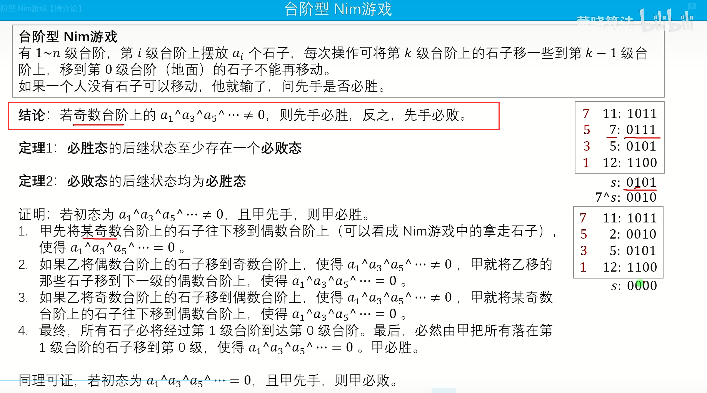

- 拓展

  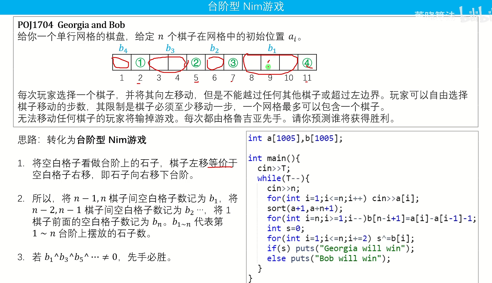

### SG函数概念

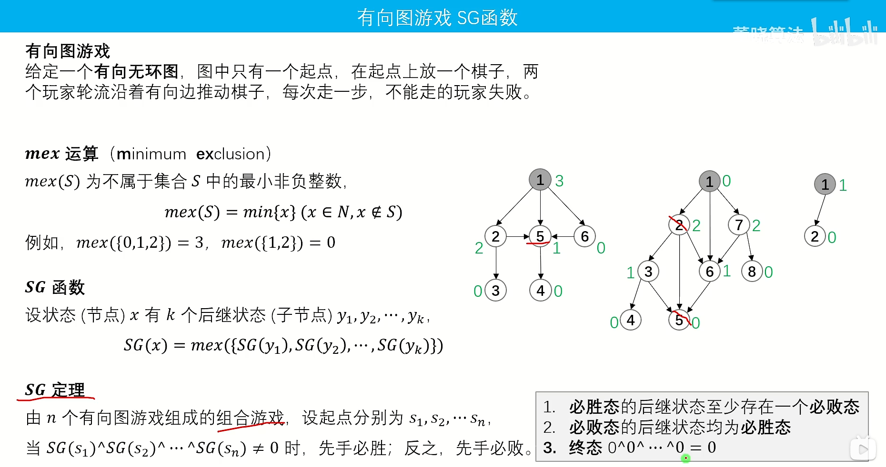

- SG函数理论：**多个独立局面的SG值，等于这些局面SG值的异或和。**

- SG定理的最终状态是必败态，SG(x) = 0 表示x是必败态

- SG函数**打表找规律**，找不到规律就保留代码

  因为SG函数能存，每个状态具体的值，看谁是0

  如果没有SG函数，不用SG函数，可以用普通的线性DP，找到一种必败态，然后返回True False
  如果是多个独立的事件：先推SG函数的规律，再求异或的规律（什么情况下异或值等于0：所有情况的sg函数相同）

- 博弈论的问题本质是线性DP的问题，所以可以不算SG函数，直接用DP即可，那么SG函数的作用是什么？

  因为SG函数能存，每个状态具体的值，看谁是0，从而找规律，而DP的状态只有0和1，不方便找规律

- 如果暴力用DP做最好写记忆化搜索的写法，而不要写递推的写法

  因为记忆化搜索实现了：用到谁再算谁，而递推太耗时间

### SG函数模板

计算每堆石子的所有变化情况：sg函数，再异或

```java
		static int[] sg = new int[N];//sg函数值
		
		//sg函数初始化
		Arrays.fill(sg,-1);//初始化成负数
		
		//计算节点x的sg函数（记忆化搜索）
		static int calSg(int x) {
			if(sg[x]!=-1) return sg[x];
			HashSet<Integer> se = new HashSet<Integer>();
			
			//具体的逻辑，会变
			for(int i=1;i<=k;i++) {
				if(x>=set[i])
					se.add(calSg(x-set[i]));
			}
			//计算mex（不在se中的最小的非0元素）
			for(int i=0;;i++) {
				if(!se.contains(i)) {
					return sg[x] = i;
				}
			}
		}
		
		//答案：
		for(int i=1;i<=n;i++) {
			int x = sc.nextInt();
			res ^= calSg(x);
		}
		if(res!=0) System.out.println("Yes");
		else System.out.println("No");
```


> sg函数的例子，如下：集合。

### SG函数：有向图游戏

计算k枚棋子的sg值，再异或，记忆化搜索

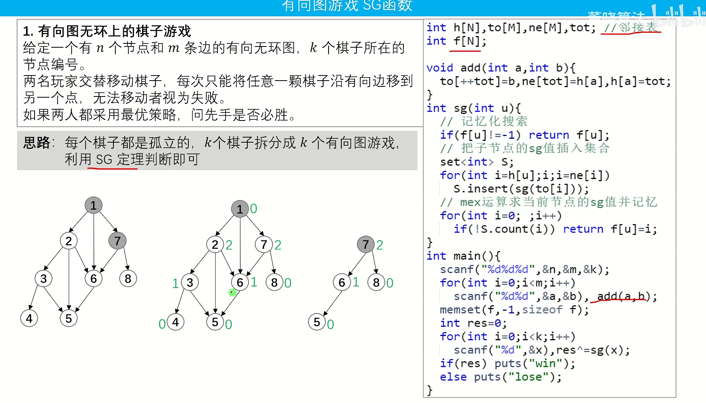

### SG函数：集合

计算sg函数时，枚举整个集合，不需要真的建图

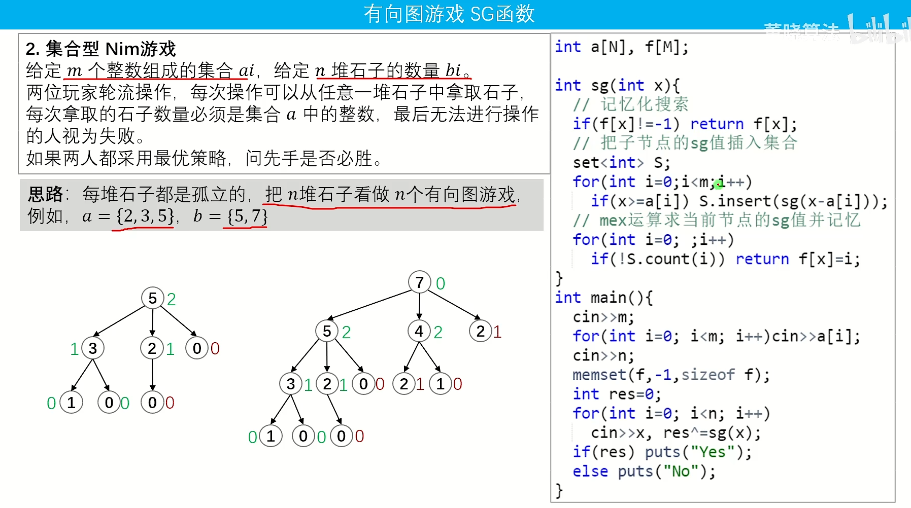


### Nim是Sg定理的特例

- 普通的Nim定理其实就是Sg定理的特例，在普通的Nim中，sg(x)=x，所以不同算每个节点x的sg值了，因为就是x，所以就相当于所有值的异或。

  > 在Nim中，有n堆石子，分别画出n棵树，根节点分别是石子的值，下面的子节点都是一次操作，计算n个根节点的sg值，最后异或起来，如果非0就是先手必胜

  
  
  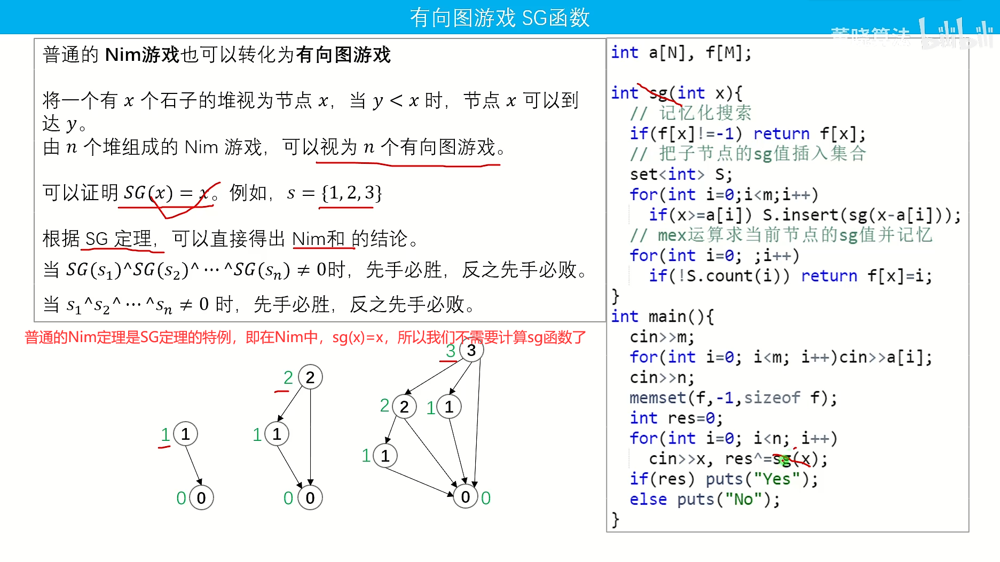

### SG函数：二维子节点的sg值

- 题意：有N堆石子，选择一堆石子（个数是x），把他拿走，然后再添加两堆石子，这两堆石子，每堆石子的最大值是x-1，最小值是0。
- 思路：这是sg函数的题，关键点在于：一堆石子x可以转移很多个子节点状态，每个子节点又是二维的，因为有两堆，表示为(i,j)，需要计算这个二维子节点的sg值，又相当于一个局面拆分成了两个局面，由SG函数理论，多个独立局面的SG值，等于这些局面SG值的异或和。即sg(i,j) = sg(i)^sg(j)

- 题解：https://www.acwing.com/activity/content/code/content/6473987/

### SG函数：剪纸游戏

> 本题是更复杂的二维情况，根节点节点是二维的，每个子节点是两个二维节点

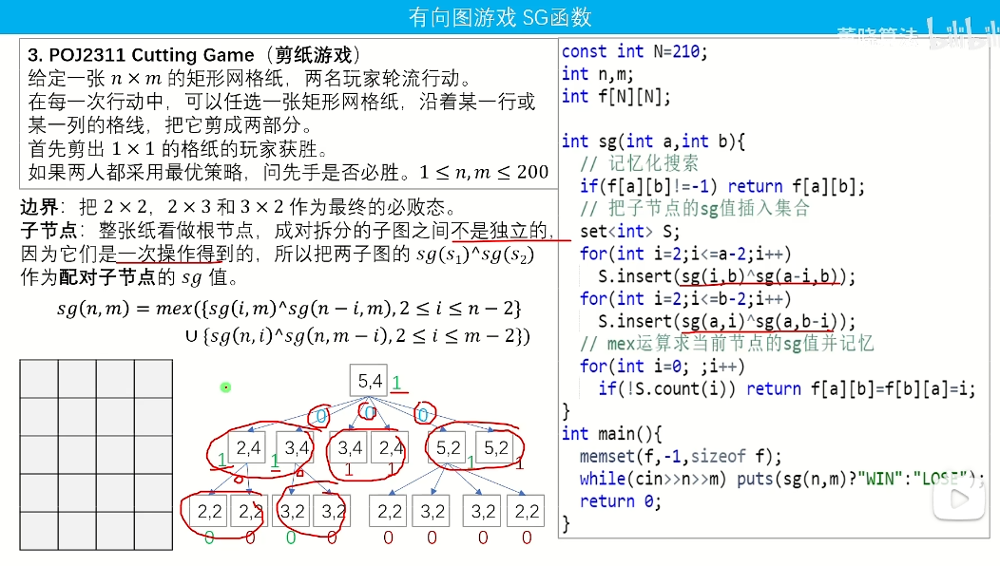

博弈论例题：

- lqb真题：分石头（sg函数）

  https://www.lanqiao.cn/problems/2241/learning/?page=1&first_category_id=1&sort=students_count&tags=%E5%8D%9A%E5%BC%88%E8%AE%BA

- lqb真题：取数游戏（sg函数+集合）


## 贪心

- 区间的贪心问题，一般都是上来先按左端点或者右端点排序，方法：考虑区间a被区间b包含的情况，比如区间选点问题，此时就选择小的区间a，再画图对比一下，就知道选择按照右端点；比如区间覆盖问题，此时选择区间大的区间b，就是左端点排序。

### 区间选点

- 题意：给定 N个闭区间 [ai,bi]，请你在数轴上选择尽量少的点，使得每个区间内至少包含一个选出的点。输出选择的点的最小数量。

- 贪心策略：根据右端点升序

- 算法思路：r是等到ans++修改后才更新

  ```
  			Arrays.sort(arr,1,n+1,(a,b)->(a.b-b.b));
              int ans = 1;
              int r = arr[1].b;
              for(int i=2;i<=n;i++) {
                  if(arr[i].a > r) {
                      ans ++;
                      r = arr[i].b;
                  }
              }
  ```

### 最大不相交区间数量

> 最大不相交区间数==最少覆盖区间点数

- 题意：给定 N个闭区间 [ai,bi]，请你在选择若干区间，使得选中的区间之间互不相交。输出可选取区间的最大数量。

- 贪心策略：根据右端点升序

- 算法思路：r是等到ans++修改后才更新

  ```
  本题代码和区间选点代码完全一样
  ```

### 区间覆盖

- 题意：给定 N个闭区间 [ai,bi]，以及一个线段区间[s,t]。请你在选择尽量少的区间，将指定线段区间完全覆盖。

- 贪心策略：根据左端点升序

- 算法思路：双指针找到区间左端点在s前面，右端点的最大值，然后就选择该区间，下一轮的s就变成了当前区间右端点

  ```
  			for(int i=1;i<=n;i++) {
                  int j = i,r = -0x3f3f3f3f;//r是右端点最大值
                  //找到右端点的最大值
                  while(j<=n && arr[j].l<=start) {
                      r = Math.max(r,arr[j].r);
                      j++;
                  }
                  //如果最大值还是到不了下一次覆盖的起点，就直接返回
                  if(r<start) {
                      break;
                  }
                  ans++;
                  start = r;
                  if(r>=end) {
                      flag = 1;
                      break;
                  }
                  i = j-1;//下一轮指定
              }
  
  作者：weiambt
  链接：https://www.acwing.com/activity/content/code/content/6481372/
  来源：AcWing
  著作权归作者所有。商业转载请联系作者获得授权，非商业转载请注明出处。
  ```

### 区间分组

- 题意：给定 N个闭区间 [ai,bi]，请你将这些区间分成若干组，使得每组内部的区间两两之间（包括端点）没有交集，并使得组数尽可能小

- 贪心策略：根据左端点升序

- 算法思路：堆维护所有组的右端点最小值。

- 解释：使用小根堆维护所有组的右端点的最小值
              在已经存在的组中，没有右端点比当前区间的左端点小的，那么就新开一个组
              //                               有右端点比当前区间的左端点小的，那么就加到这个组中
              //用堆的原因：只需要判断所有组中是否存在一个组的右端点比它小，所以直接维护右端点的最小值即可

  ```
  		PriorityQueue<Integer> q = new PriorityQueue<Integer>((a,b)->(a-b));
          for(int i=1;i<=n;i++) {
          	PII now = arr[i];
              //当前所有组的右端点最小值比左端点大，那么就新建组
              if(q.size()==0 || q.peek()>=now.l) {
              	q.add(now.r);
              	ans++;
              }else {//否则就加入到右端点最小的组中（这里其实加到哪一组都是一样的，为了方便加入到最小的组中）
              	q.poll();
              	q.add(now.r);
              }
  ```

### 绝对值不等式

- 题意：在一条数轴上有N个点,A1~AN。寻找一个点，使得n个点到该点的距离和最小

- 不等式：|x-a|+|x-b|>=|a-b|(当且仅当x在线段ab上时取等)

  推广：

  ```
    |x-a1|+|x-a2|+...|x-an|
  
  =(|x-a1|+|x-an|)+(|x-a2|+|x-an-1|)+...  
  
  >=|a1-an|+|a2-an-1|+...(每一个等号成立的条件都是x在范围之间)
  ```

  所以得出结论：

  当n为奇数时，x为n的中位数，即(n+1)/2

  当n为偶数时，x取中间两个数之间任意数都可，[n/2，n/2+1]	，方便写代码，这里也可以取(n+1)/2

- 思路：升序排列，一次计算和中间值的差值

### 耍杂技的牛

> 推公式：https://www.acwing.com/activity/content/code/content/6500568/

- 贪心推公式的思路：要想到贪心，画表格，相邻两个数，交换前、交换后的值，设定大小关系，使得交换前的最优

## 快读快写

```java
class FastRead {
    StreamTokenizer streamTokenizer;  //读取数字
    BufferedReader bufferedReader;  //读取字符串
    PrintWriter out;//输出时要sc.out.flush();

    public FastRead() {
        streamTokenizer = new StreamTokenizer(new BufferedReader(new InputStreamReader(System.in)));
        bufferedReader = new BufferedReader(new InputStreamReader(System.in));
        out=new PrintWriter(new BufferedWriter(new OutputStreamWriter(System.out)));
    }

    int nextInt() throws IOException {
        streamTokenizer.nextToken();
        return (int) streamTokenizer.nval;
    }

    long nextLong() throws IOException {
        streamTokenizer.nextToken();
        return (long) streamTokenizer.nval; 
    }

    double nextDouble() throws IOException {
        streamTokenizer.nextToken();
        return streamTokenizer.nval;
    }

    String nextLine() throws IOException {
        return bufferedReader.readLine();
    }

    void println(String s) throws IOException{
        out.println(s);
    }

    void println(int s) throws IOException{
        out.println(s);
    }

    void println(long s) throws IOException{
        out.println(s);
    }

    void println(double s) throws IOException{
        out.println(s);
    }

    void println(BigInteger s) throws IOException{
        out.println(s);
    }
}

作者：weiambt
链接：https://www.acwing.com/activity/content/code/content/5436562/
来源：AcWing
著作权归作者所有。商业转载请联系作者获得授权，非商业转载请注明出处。
```

下面这个板子不行（在蓝桥杯里没用）

```java
Scanner sc = new Scanner(new BufferedReader(new InputStreamReader(System.in)));
```

## 基础模型

### 计算数组的一个区间的值

秦九韶

```java
static int cal(int l,int r) {
	int res = 0;
	while(l<=r) {
		res = res * 10 + num[l];
		l++;
	}
	return res;
}
```

### 枚举数位

```java
int num;//一个数
int n;//num的数位长度
//从高位枚举
for(int i=n-1;i>=0;i--)
{
    int u=x>>i&1; //拿到这一位的值
    
    res += 1<<i;//这一位对于十进制答案的贡献就是2^i
}
```

